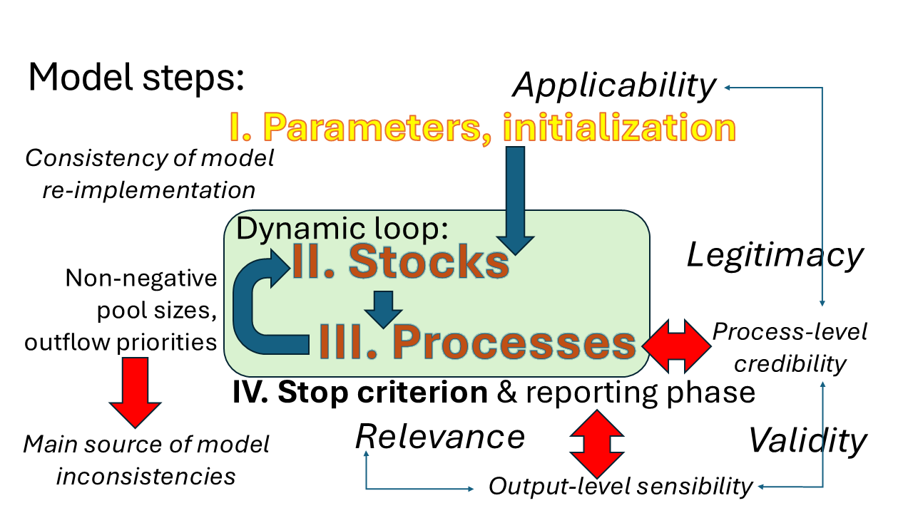
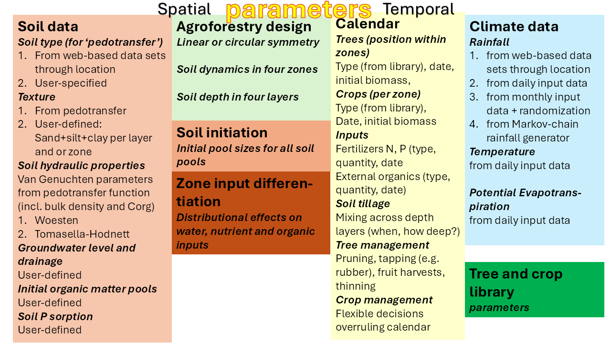
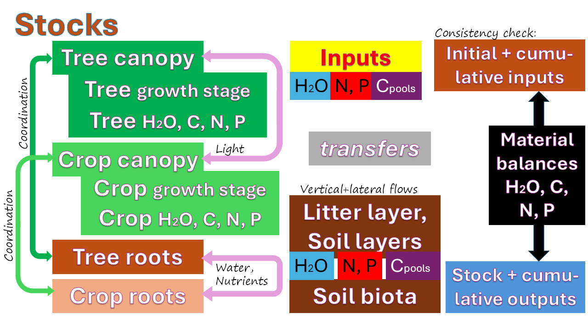
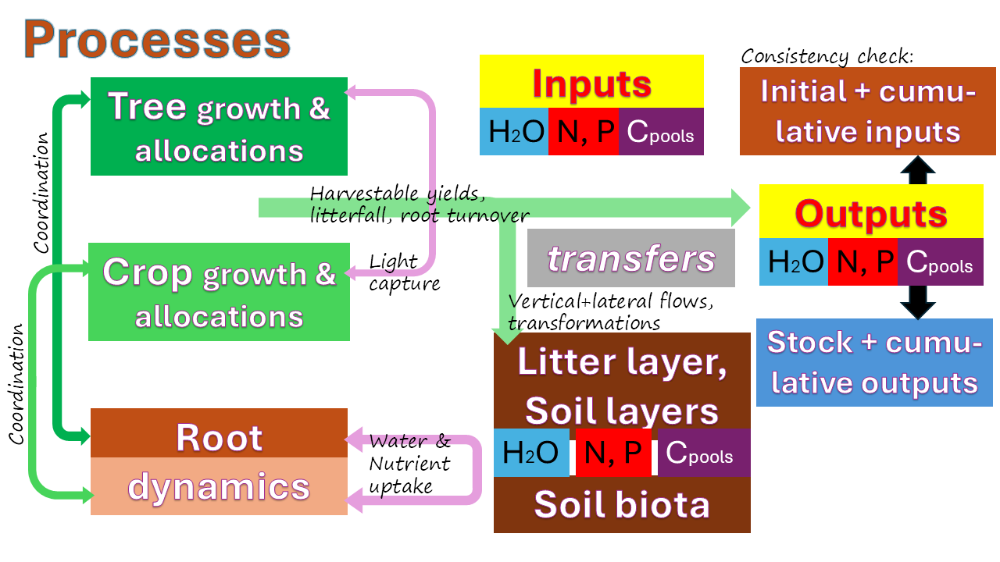

Welcome to the official documentation site for WaNuLCAS 5.0. This site provides comprehensive information on how to understand, configure, and run simulations within the application.

## Documentation Sections

Please explore the following sections to learn more:

* **[About](https://degi.github.io/wanulcas/about/)**: General information regarding the tool authors, methodology, and the software library powering WaNuLCAS.
* **[User Manual](https://degi.github.io/wanulcas/manual/)**: A step-by-step guide on how to navigate the WaNuLCAS interface, configure input parameters, and run model scenarios.
* **[Background](https://degi.github.io/wanulcas/background/)**: Contextual information about agroforestry systems and the scientific principles behind the simulation.
* **[Overview](https://degi.github.io/wanulcas/overview/)**: A detailed technical overview of the model features, including water and nutrient balances, plant growth, and soil dynamics.
* **[Appendix](https://degi.github.io/wanulcas/appendix/)**: Supplementary data, formulas, and advanced technical details supporting the model.

## Introduction to the Application

The WaNuLCAS application itself is divided into several main sections accessible via its navigation bar:

- **Home**: Main landing page
- **Input Parameters**: Define the characteristics of your system (Soil, Climate, Plants, etc.)
- **Simulation**: Run scenarios and analyze outcomes
- **About**: View tutorials, libraries, and references

The following presentation slides provide an overview of the application:

*Figure 1. WaNuLCAS Model Overview*  
This figure provides an overview of the model development. The main concept is built upon a continuous, dynamic loop connecting resource stocks and simulated processes to evaluate complex agroforestry systems.
  

*Figure 2. Parameters Required for WaNuLCAS*  
The model simulation requires input parameters structured into biological and physical categories, which are further divided into spatial and temporal types. Spatial parameters include soil data, agroforestry design, and zone input differentiation, while temporal parameters consist of calendar events, climate data, and tree and crop library configurations.
  

*Figure 3. Logic Flow of the WaNuLCAS Model*  
The simulation operates on a system of stock and flow dynamics, calculating daily changes to essential resources. It quantifies "stocks" of water, nitrogen, phosphorus, and organic matter, and calculates the daily "flows" (such as plant uptake, leaching, and decomposition) that dictate plant growth patterns and limitations over time.
  

*Figure 4. Logic Flow: A Processes Perspective*  
From a processes perspective, WaNuLCAS tracks the lifecycle of resources as they interact across biological and physical thresholds. The model calculates the sequence of events such as rainfall infiltration, canopy interception, biomass decay, nutrient mineralization, and competitive root uptake to project the ultimate yield and ecological footprint of the simulated agroforestry system.
