

Welcome to the WaNuLCAS 5.0 User Manual. This web application provides a comprehensive interface for simulating agroforestry scenarios.

## Running the Application

There are several ways to access and run the WaNuLCAS Shiny application:

### 1. Online Access (Easiest)
You can directly access the application online without any installation at:
[https://wanulcas.agroforestri.id/](https://wanulcas.agroforestri.id/)

### 2. Run Directly from GitHub
To run the application locally without cloning the repository, open your R console or RStudio and run:

```r
# Install shiny if you haven't already
if (!require("shiny")) install.packages("shiny")

# Run the application from the GitHub repository
shiny::runGitHub("wanulcas", "degi")
```

### 3. Run Locally (Clone/Download)
If you prefer to have the source code on your machine:
1. Clone the repository: `git clone https://github.com/degi/wanulcas.git`
2. Open the project in RStudio or set your working directory to the downloaded folder.
3. Open `app.R` (or `ui.R`/`server.R`) and click **Run App** in RStudio, or run `shiny::runApp()` in your R console.

## 1. Introduction
WaNuLCAS simulates the balance of water, nutrients, and light capture in agroforestry systems dynamically over time. The application is divided into several main sections accessible via the navigation bar:
- **Home**: Main landing page
- **Input Parameters**: Define the characteristics of your system (Soil, Climate, Plants, etc.)
- **Simulation**: Run scenarios and analyze outcomes
- **About**: View tutorials, libraries, and references

Figure 1.1: Home page
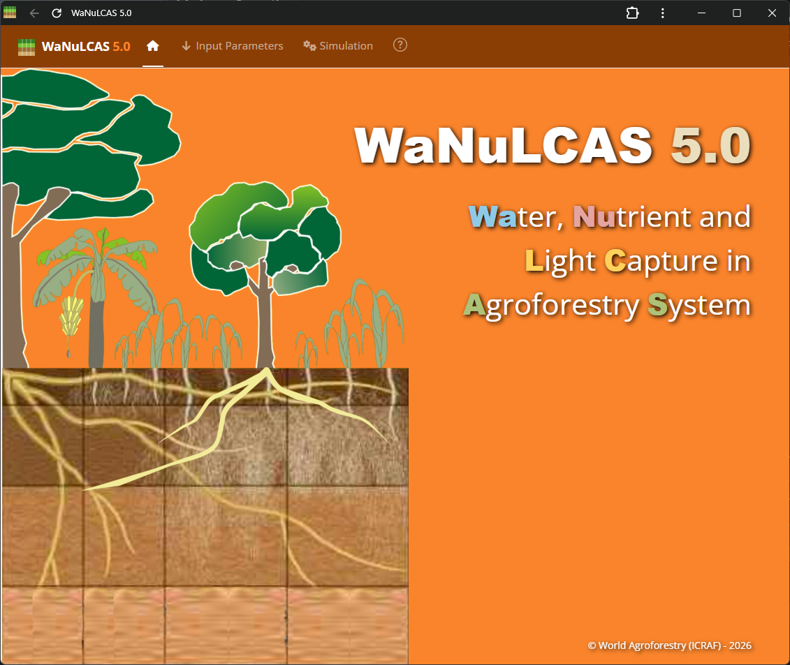
*Provides a simple and welcoming entry to the WaNuLCAS application. From here, you can use the navigation bar to configure parameters, run simulations, or find out more information.*

## 2. Input Parameters

The **Input Parameters** section is where you specify all the necessary conditions for your simulation. Parameters are logically grouped into categories:

### 2.1. Agroforestry System
    
Figure 2.1.1: Agroforestry design
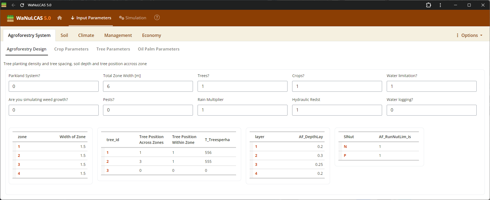
*This subpanel allows you to configure essential design features of the agroforestry plot such as tree spacing, zone allocation, and whether to include trees (`AF_AnyTrees?`), crops (`AF_AnyCrops?`), or weeds (`AF_SimulateWeeds?`). As noted in WaNuLCAS 4.0, the simulation relies on a 4-zone basic design (Zone 1 to 4) originating from the tree line, which allows the model to calculate the spatial distribution of light, water, and nutrient competition between tree and crop root systems over radial distance.*

- **Crop, Tree, and Oil Palm**, and **Weed** parameters have interactive libraries.

Figure 2.1.2: Crop selection
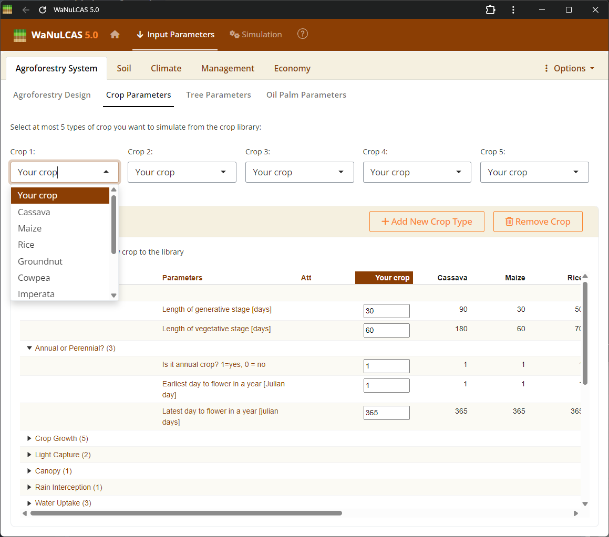
*Choose at most 5 predefined options or custom species from this list to simulate multi-species cropping structures. The selected crop type (`Ca_CType[Zone]`) will determine physiological parameters linked to the model.*

Figure 2.1.3: Crop parameters
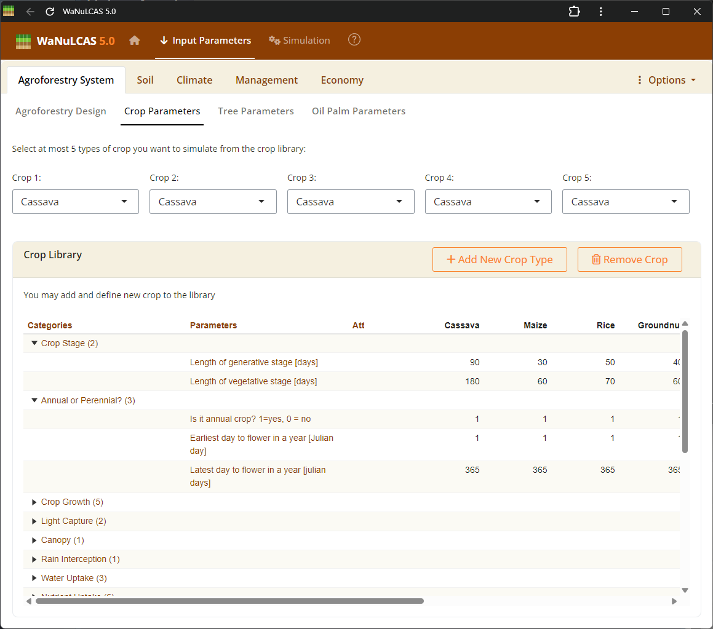
*Within the species parameter panel, users can examine and edit physiological properties specific to the crop, including structural characteristics across growth stages. For instance, Specific Leaf Area (`Cq_SLA`, in m² g⁻¹) translates leaf biomass into canopy leaf area to calculate light interception. The Leaf Weight Ratio (`Cq_LWR`) determines the fraction of dry matter allocated to leaves, while canopy limits (`C_CanUp`, `C_CanLow`) define the vertical space occupied by the crop to simulate shading effects.*

Figure 2.1.4: Tree parameters
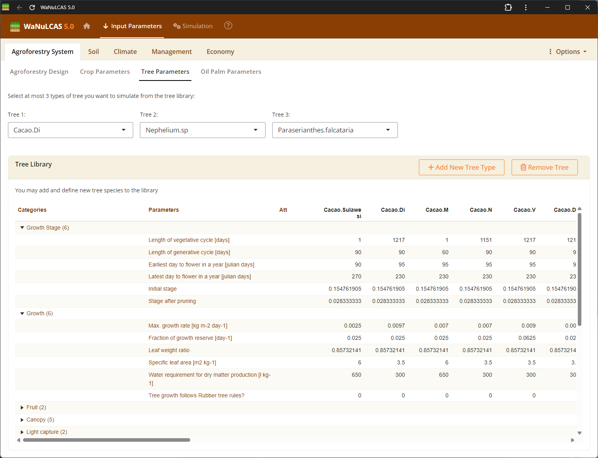
*Similarly to crop parameters, define biological tree properties for up to 3 different tree types simultaneously. Fields include light capture indicators (`T_SLA`, `T_LWR`) used to calculate the Tree Leaf Area Index. You can also define rooting strategies (`Rt_ATType`) to dictate how tree root length density is distributed across soil profiles over time, influencing spatial competition for water (`TW_Uptake`) and nutrients (`TN_Uptake`).*

Figure 2.1.5: Oil Palm parameters
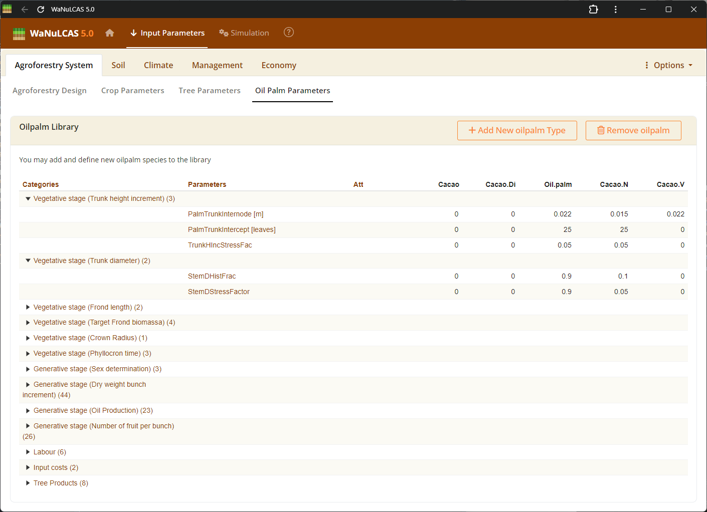
*Specific parameters required for oil palm simulations, enabling the modeling of oil palm growth, fruit biomass, and yield.*

- You can **Add** or **Remove** species directly within the library subpanels prior to simulating.

Figure 2.1.6: Adding a new crop
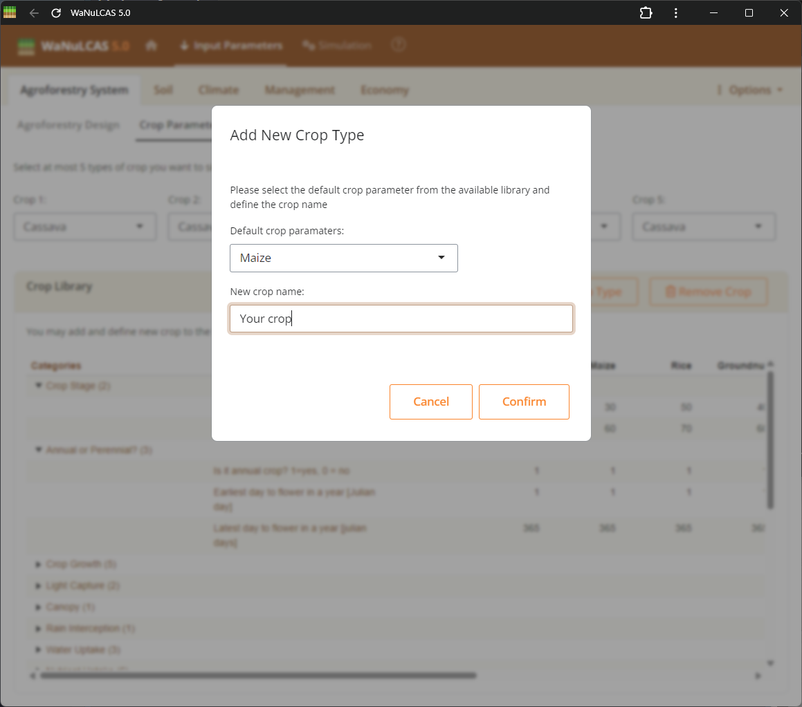
*Expand the provided datasets by defining completely new crop types. Fill out all required fields like physiology, biophysics, and parameters to incorporate it into your simulation library for crop intercropping interactions beyond the basic predefined 5 crop types.*

Figure 2.1.7: Editing a crop
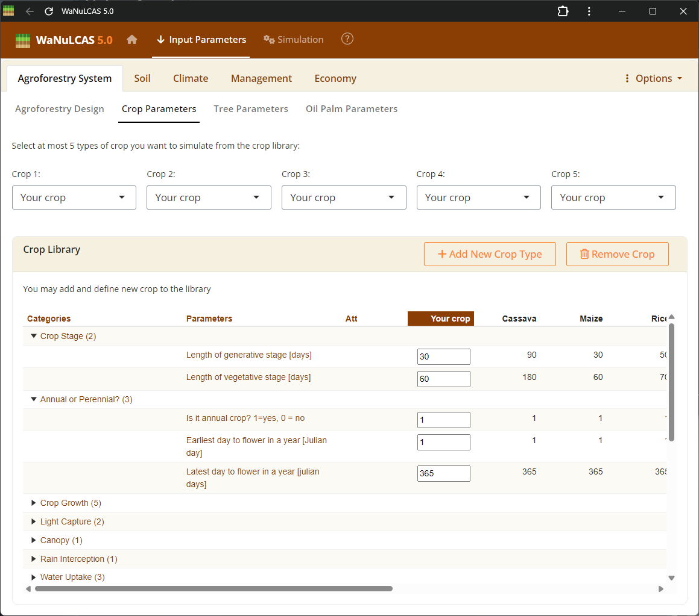
*This is the interactive UI for editing crop species parameters. By clicking directly on the cells within this table, you can modify numerical values representing various physiological and morphological traits (e.g., specific leaf area, harvest index) directly in the database, allowing you to fine-tune the growth and responses of the crop in the simulation.*

Figure 2.1.8: Light Capture

Light capture is calculated on the basis of the leaf area index of the tree(s) and crop (T_LAI\[tree\] and C_LAI) for each zone, and their relative heights. In each zone the parameters T_CanLow\[tree\], T_CanUp\[tree\], C_CanLow, C_CanUp indicate lower and upper boundaries of crop and tree canopy, respectively. LAI is assumed to be homogeneously distributed between these boundaries.
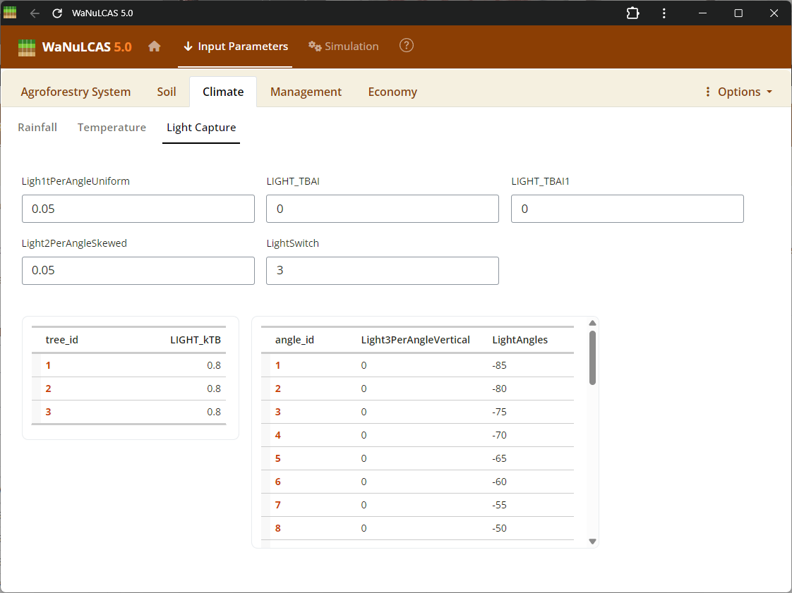
*Adjust light capture interactions between different system components. You can modify the light extinction coefficients for leaves (`kLLight`) and woody biomass (`kBLight`). In the WaNuLCAS model, these coefficients govern how effectively the plant canopy intercepts incoming solar radiation based on its Leaf Area Index (LAI), directly driving potential transpiration and photosynthesis rates.*

Figure 2.1.9a: Root parasitism
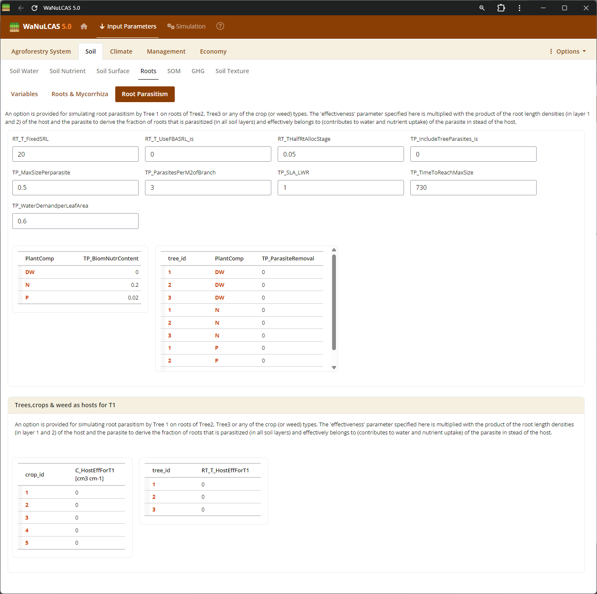
*Biological Interactions (Root Parasitism, Pest, Mycorrhiza) - Root parasitism. Configure the extent of biological constraints and interactions. For instance, you can set the fraction of root intersections infected by mycorrhiza (`Rt_MCInfFrac` for crops and `Rt_MTInfFrac` for trees), which in the simulation increases the effective root length for phosphorus uptake by extending the depletion zone. You can also include pests (`PD`) impacting aboveground biomass.*

Figure 2.1.9b: Pest
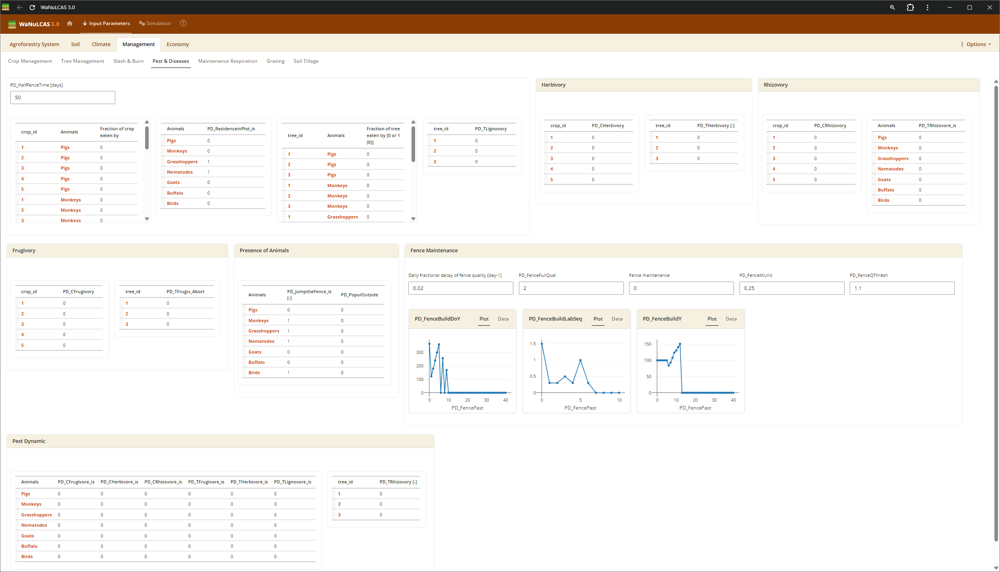
*Biological Interactions (Root Parasitism, Pest, Mycorrhiza) - Pest. Configure the extent of biological constraints and interactions. For instance, you can set the fraction of root intersections infected by mycorrhiza (`Rt_MCInfFrac` for crops and `Rt_MTInfFrac` for trees), which in the simulation increases the effective root length for phosphorus uptake by extending the depletion zone. You can also include pests (`PD`) impacting aboveground biomass.*

Figure 2.1.9c: Mycorrhiza
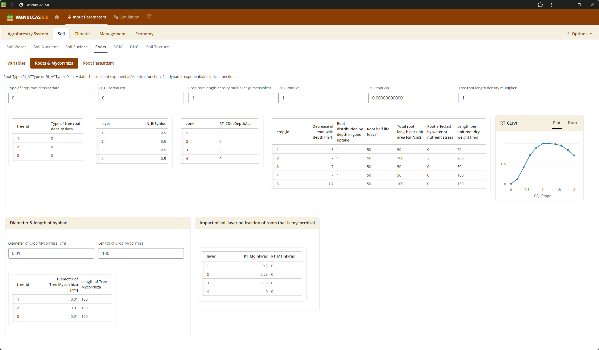
*Biological Interactions (Root Parasitism, Pest, Mycorrhiza) - Mycorrhiza. Configure the extent of biological constraints and interactions. For instance, you can set the fraction of root intersections infected by mycorrhiza (`Rt_MCInfFrac` for crops and `Rt_MTInfFrac` for trees), which in the simulation increases the effective root length for phosphorus uptake by extending the depletion zone. You can also include pests (`PD`) impacting aboveground biomass.*

### 2.2. Soil
Set soil depth properties, water retention, organics, surface conditions, roots, etc.

Figure 2.2.1a: Soil texture
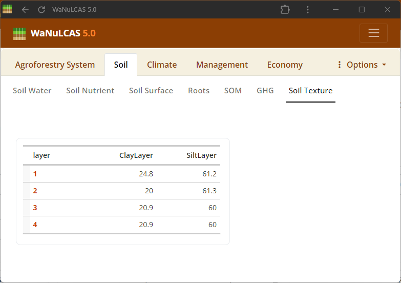
*Soil Texture and Pedotransfer - Soil texture. Set basic soil texture (Sand, Silt, Clay) and Bulk Density for each of the 4 soil layers. The Pedotransfer section automatically calculates parameters of a Van Genuchten equation linking volumetric water content (`W_PhiTheta`) with potential head (`W_Ptheta`) and providing the saturated hydraulic conductivity (`Ksat`), representing how easily water drains out of soil voxels.*

Figure 2.2.1b: Pedotransfer
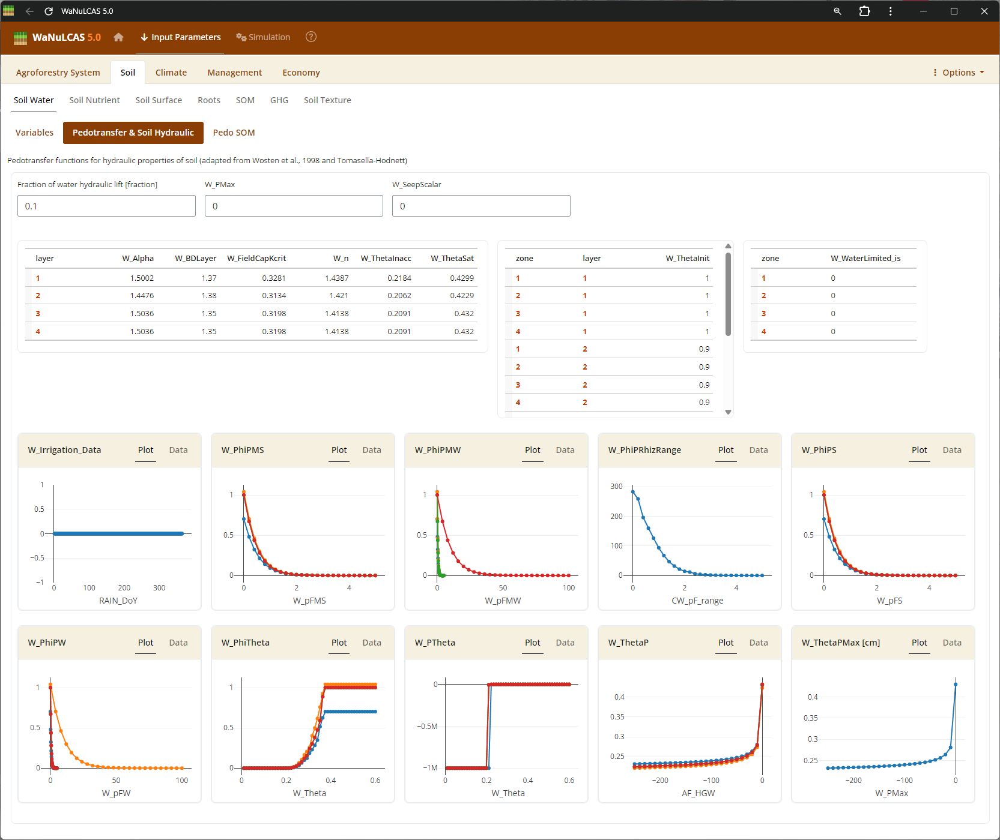
*Soil Texture and Pedotransfer - Pedotransfer. Set basic soil texture (Sand, Silt, Clay) and Bulk Density for each of the 4 soil layers. The Pedotransfer section automatically calculates parameters of a Van Genuchten equation linking volumetric water content (`W_PhiTheta`) with potential head (`W_Ptheta`) and providing the saturated hydraulic conductivity (`Ksat`), representing how easily water drains out of soil voxels.*

Figure 2.2.2a: Soil structure
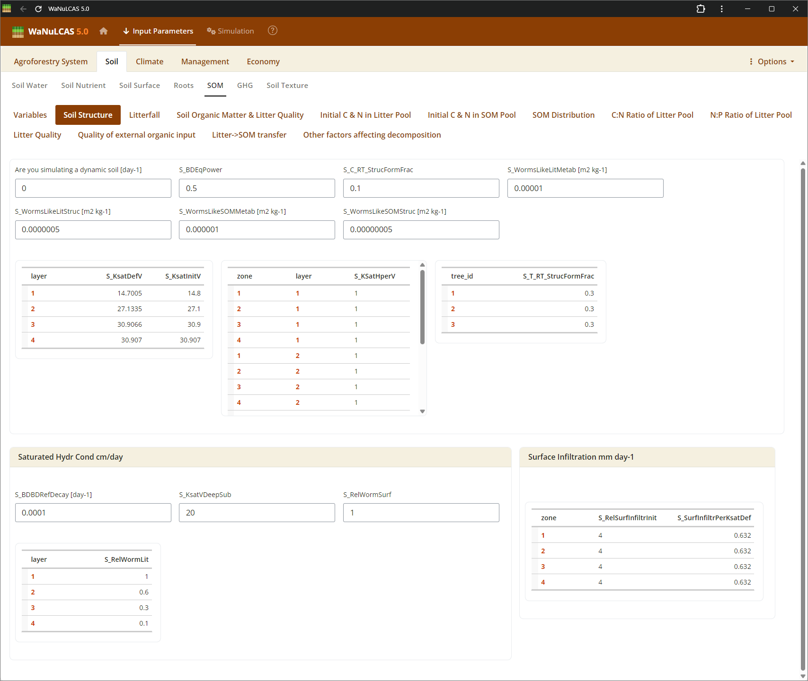
*Soil Structure and Surface - Soil structure. Adjust physical arrangements such as soil structure decay (`S_KStructDecay`). In the simulation, setting this parameter (e.g., to 0.001) governs the rate at which conductivity approaches the default structurally degraded state over time. You can also define surface soil pooling constraints and macroporosity paths recreated by soil fauna.*

Figure 2.2.2b: Soil surface
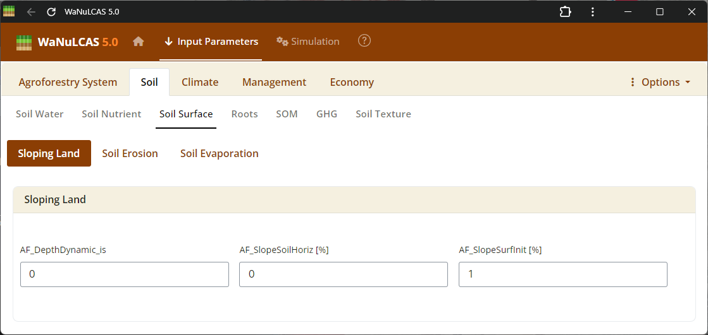
*Soil Structure and Surface - Soil surface. Adjust physical arrangements such as soil structure decay (`S_KStructDecay`). In the simulation, setting this parameter (e.g., to 0.001) governs the rate at which conductivity approaches the default structurally degraded state over time. You can also define surface soil pooling constraints and macroporosity paths recreated by soil fauna.*

Figure 2.2.3a: Soil water
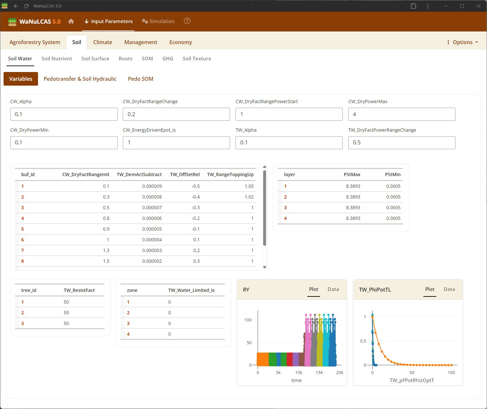
*Soil Water and Evaporation - Soil water. Define the initial soil water content (`W_InitVol`) compared to maximum Field Capacity (`W_FieldCap1`), and adjust potential surface evaporation dynamics.*

Figure 2.2.3b: Soil evaporation
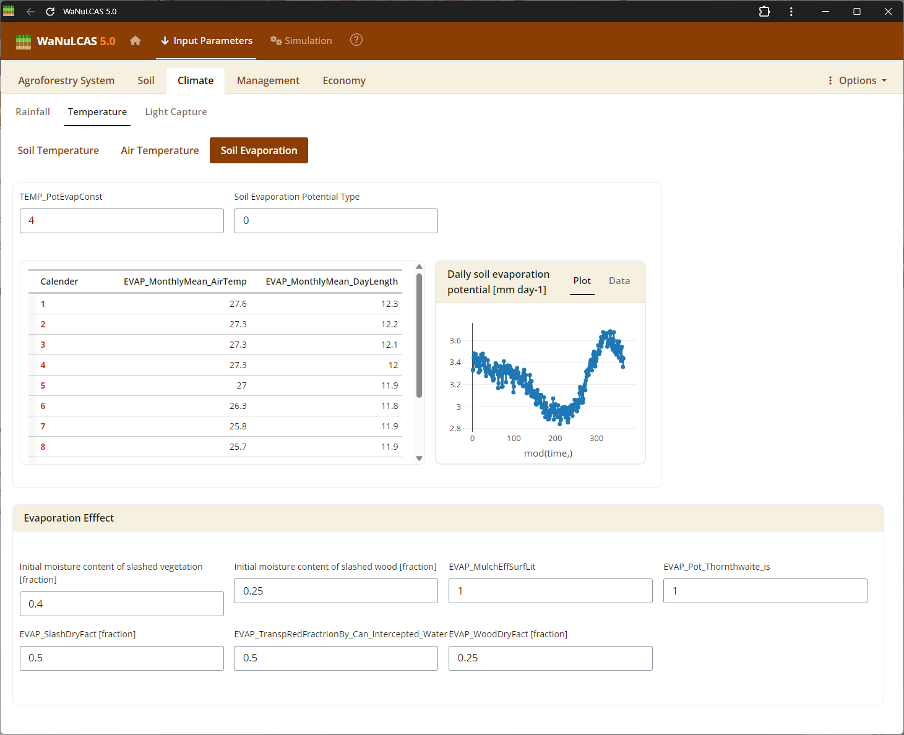
*Soil Water and Evaporation - Soil evaporation. Define the initial soil water content (`W_InitVol`) compared to maximum Field Capacity (`W_FieldCap1`), and adjust potential surface evaporation dynamics.*

Figure 2.2.4a: Soil nutrient
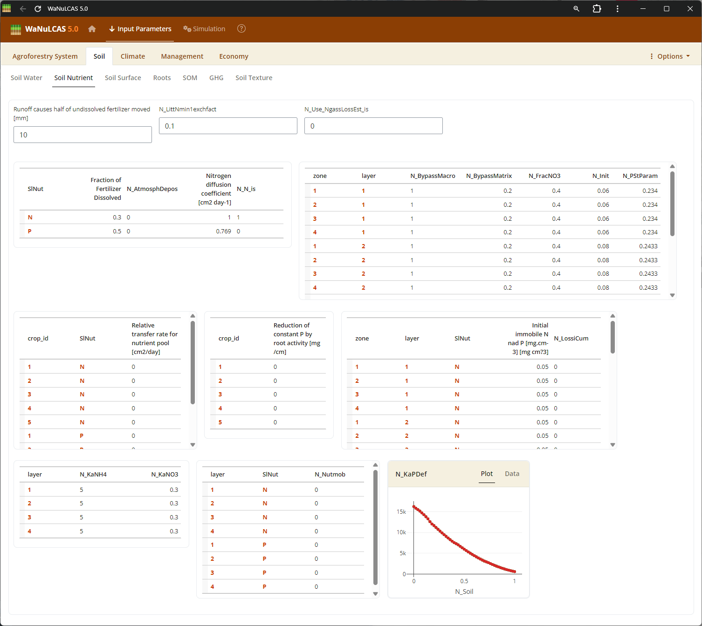
*Soil Dynamics (Nutrient, Temperature, Erosion) - Soil nutrient. Configure initial nutrient stocks like Nitrogen (`N_Init`) and Phosphorus (`P_Init` derived from `P_Bray`). The model simulates how these stocks mineralize or become adsorbed (governed by adsorption constant `Ka_P`). You also calibrate soil temperature (`S_Temp`) driving decomposition, and erosion limits (`E` module).*

Figure 2.2.4b: Soil temperature
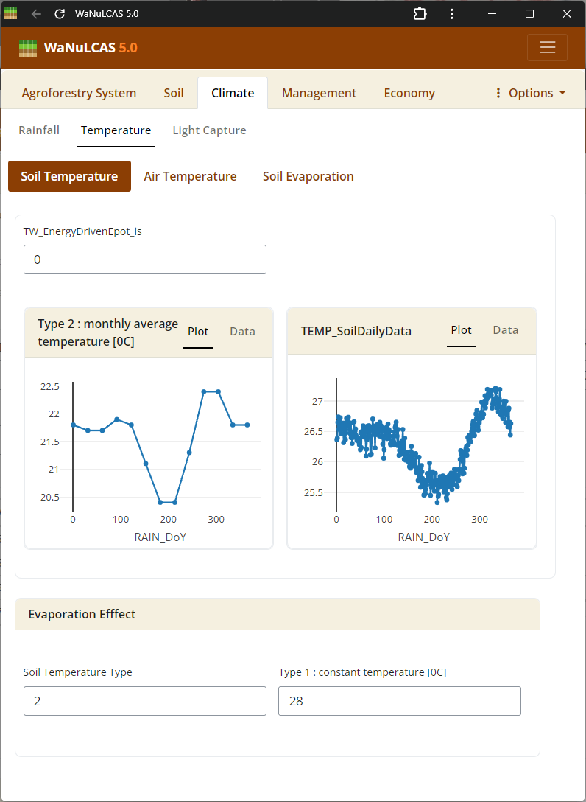
*Soil Dynamics (Nutrient, Temperature, Erosion) - Soil temperature. Configure initial nutrient stocks like Nitrogen (`N_Init`) and Phosphorus (`P_Init` derived from `P_Bray`). The model simulates how these stocks mineralize or become adsorbed (governed by adsorption constant `Ka_P`). You also calibrate soil temperature (`S_Temp`) driving decomposition, and erosion limits (`E` module).*

Figure 2.2.4c: Soil erosion
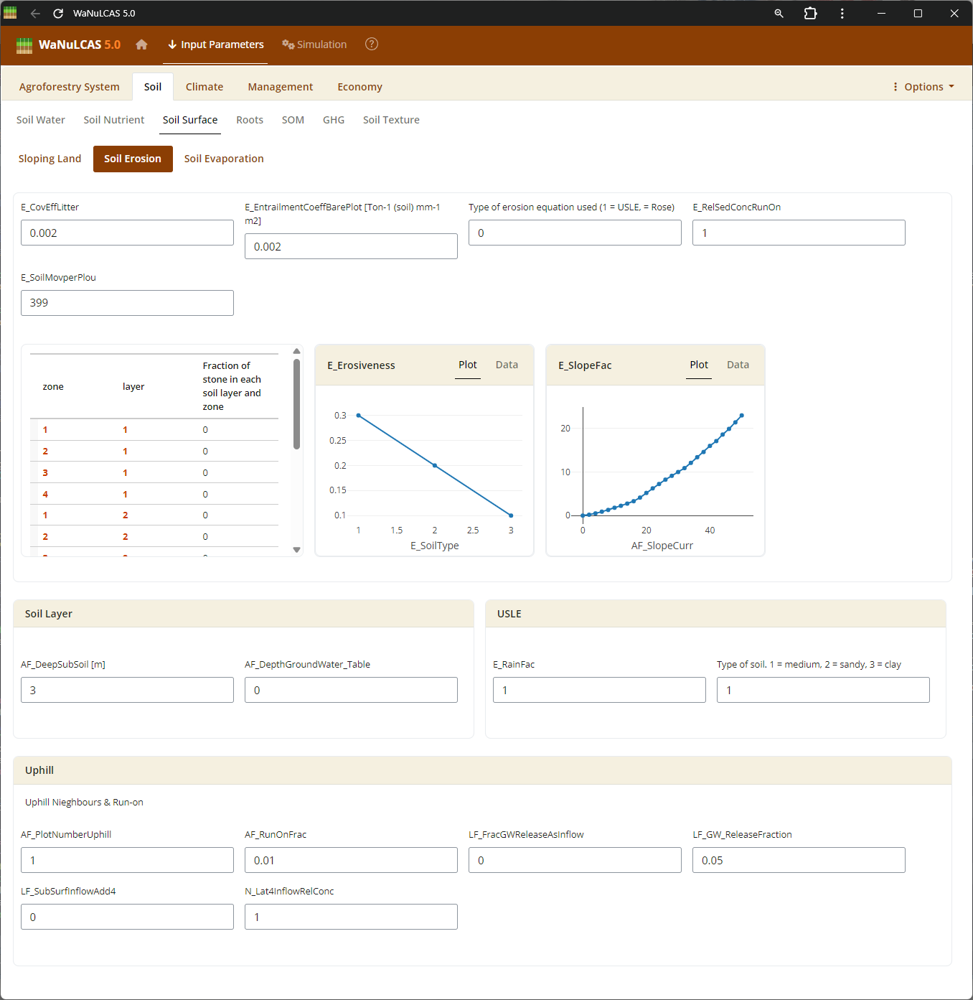
*Soil Dynamics (Nutrient, Temperature, Erosion) - Soil erosion. Configure initial nutrient stocks like Nitrogen (`N_Init`) and Phosphorus (`P_Init` derived from `P_Bray`). The model simulates how these stocks mineralize or become adsorbed (governed by adsorption constant `Ka_P`). You also calibrate soil temperature (`S_Temp`) driving decomposition, and erosion limits (`E` module).*

Figure 2.2.5: Roots
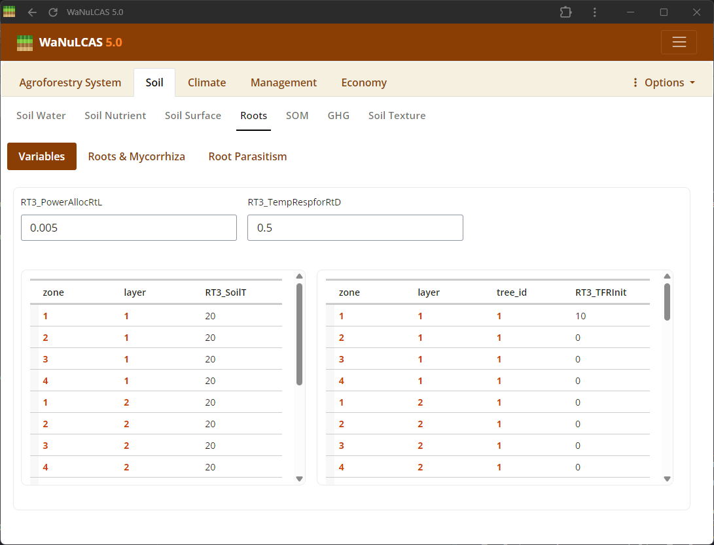
*Set root length densities (`Lrv`) distribution and dynamics over time across the 4 zones and 4 soil layers for different plant components.*

Figure 2.2.6a: SOM
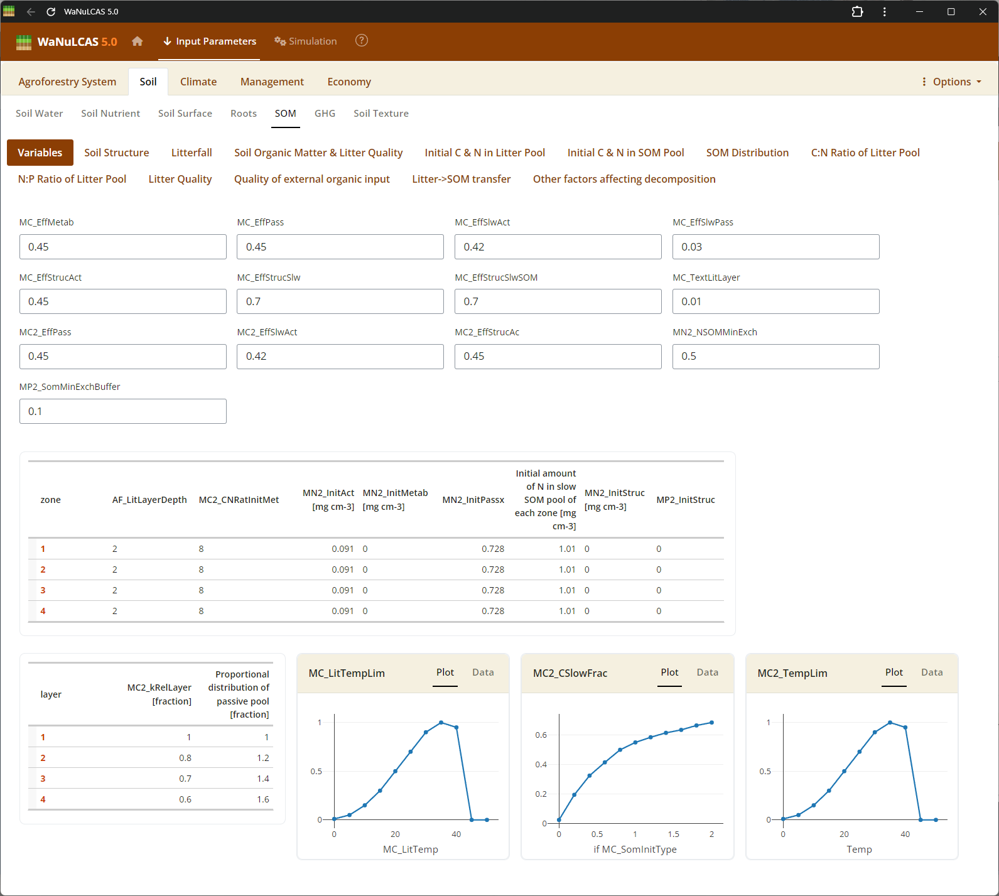
*Soil Organic Matter (SOM) - SOM. Configure Soil Organic Matter using approaches based on the Century model. You can specify SOM by selecting an initialization type (`MC_SOMInitType`, such as ratio of organic to reference C), defining carbon pools for different decomposition timescales (active, slow, passive, structural, metabolic), and fine-tuning continuous or seasonal transfer fractions between these reservoirs during mineralization.*

Figure 2.2.6b: SOM distribution
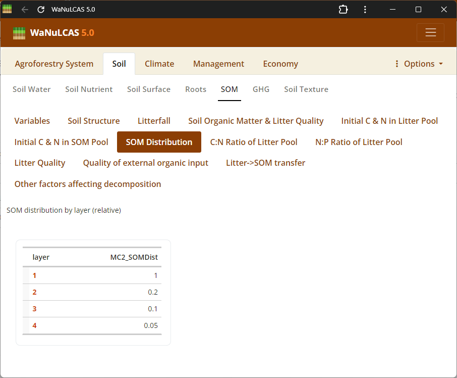
*Soil Organic Matter (SOM) - SOM distribution. Configure Soil Organic Matter using approaches based on the Century model. You can specify SOM by selecting an initialization type (`MC_SOMInitType`, such as ratio of organic to reference C), defining carbon pools for different decomposition timescales (active, slow, passive, structural, metabolic), and fine-tuning continuous or seasonal transfer fractions between these reservoirs during mineralization.*

Figure 2.2.6c: SOM pools
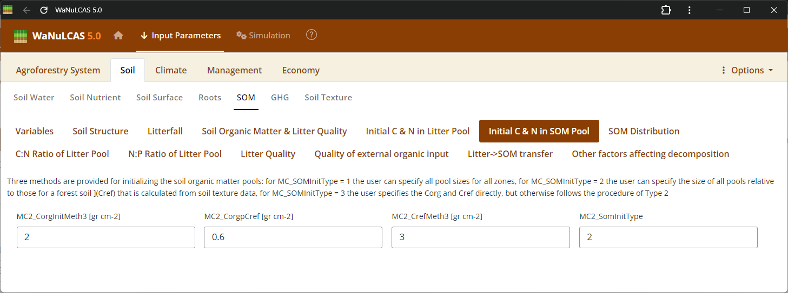
*Soil Organic Matter (SOM) - SOM pools. Configure Soil Organic Matter using approaches based on the Century model. You can specify SOM by selecting an initialization type (`MC_SOMInitType`, such as ratio of organic to reference C), defining carbon pools for different decomposition timescales (active, slow, passive, structural, metabolic), and fine-tuning continuous or seasonal transfer fractions between these reservoirs during mineralization.*

Figure 2.2.6d: SOM transfer
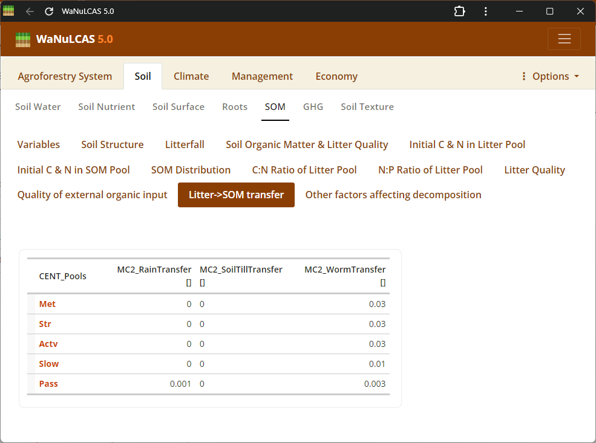
*Soil Organic Matter (SOM) - SOM transfer. Configure Soil Organic Matter using approaches based on the Century model. You can specify SOM by selecting an initialization type (`MC_SOMInitType`, such as ratio of organic to reference C), defining carbon pools for different decomposition timescales (active, slow, passive, structural, metabolic), and fine-tuning continuous or seasonal transfer fractions between these reservoirs during mineralization.*

Figure 2.2.7a: Decomposition
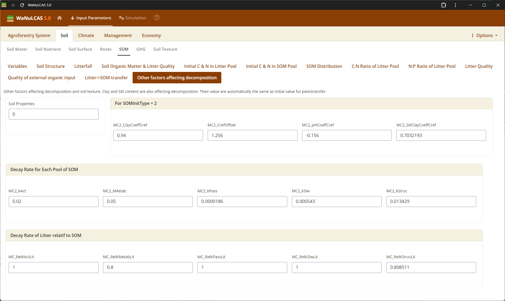
*SOM Processing (Decomposition, Respiration, GHG) - Decomposition. Set rates of organic decomposition, carbon respiration fractions, and greenhouse gas (GHG) emissions (e.g., N2O and CH4 fluxes) from soil organic matter and litter pools.*

Figure 2.2.7b: Respiration
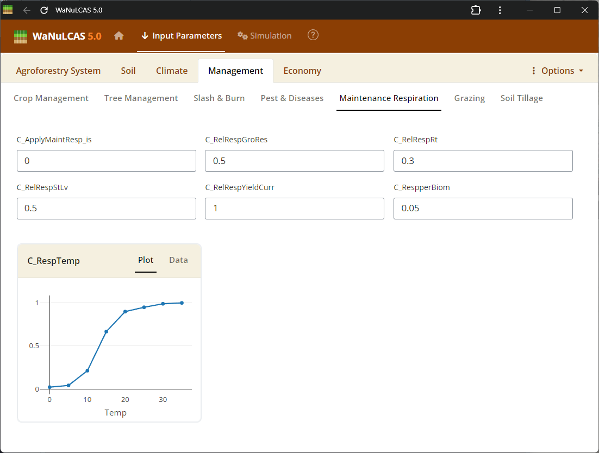
*SOM Processing (Decomposition, Respiration, GHG) - Respiration. Set rates of organic decomposition, carbon respiration fractions, and greenhouse gas (GHG) emissions (e.g., N2O and CH4 fluxes) from soil organic matter and litter pools.*

Figure 2.2.7c: GHG
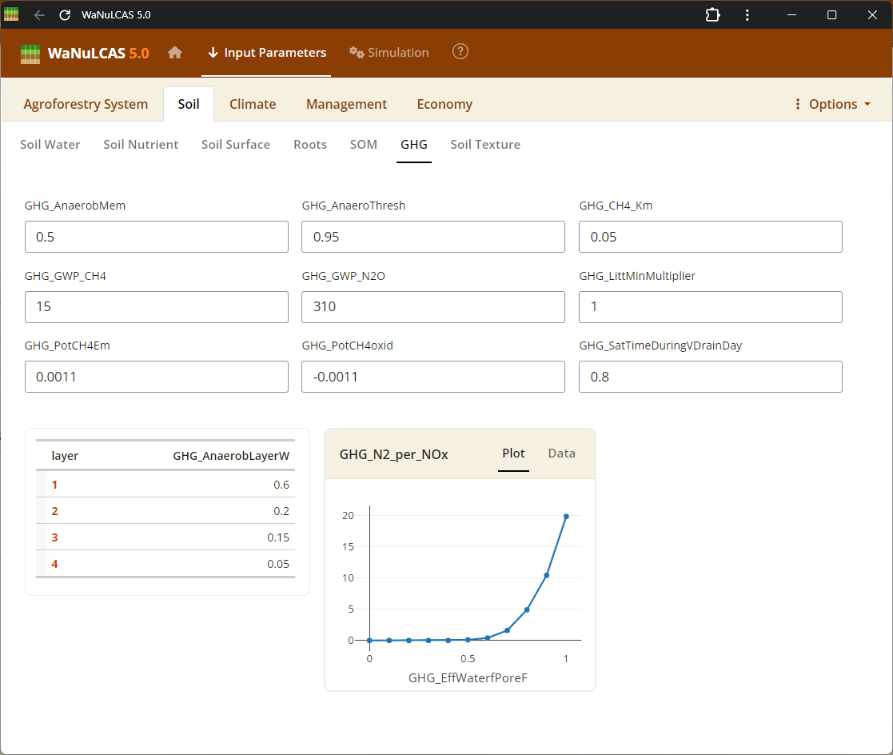
*SOM Processing (Decomposition, Respiration, GHG) - GHG. Set rates of organic decomposition, carbon respiration fractions, and greenhouse gas (GHG) emissions (e.g., N2O and CH4 fluxes) from soil organic matter and litter pools.*

Figure 2.2.8a: Litter pool

*Litter Pools and Quality - Litter pool. Define properties of accumulated surface litter layers, rates of continuous or seasonal litterfall, and litter quality indicators (decomposition rates) to regulate carbon and nutrient flows.*

Figure 2.2.8b: Litterfall
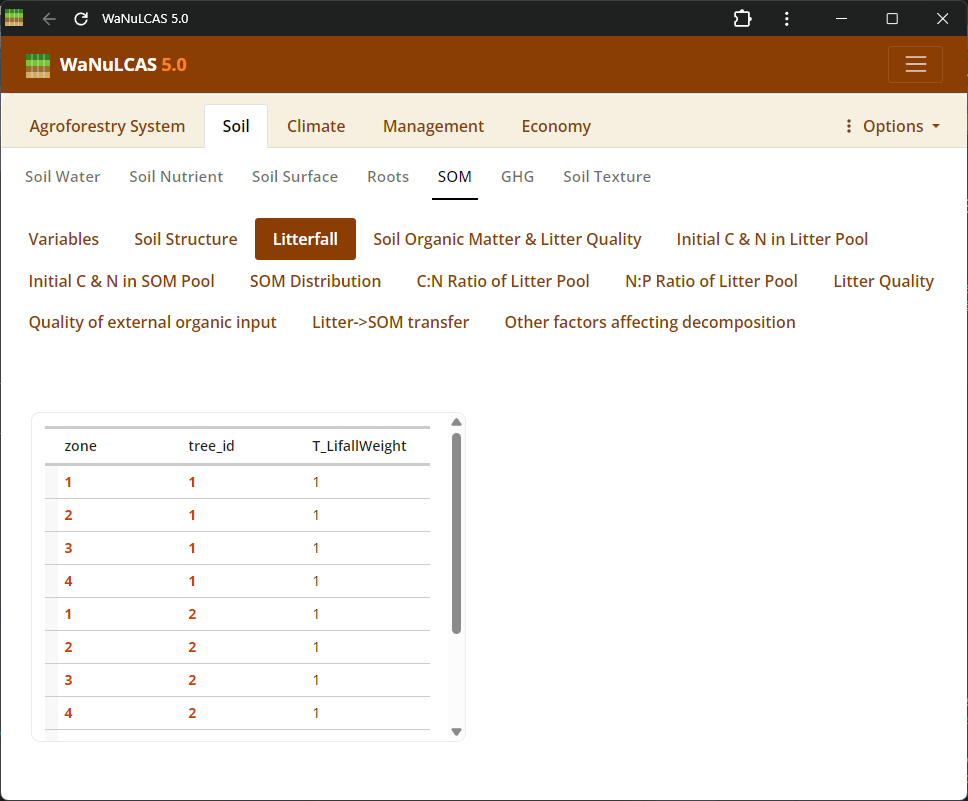
*Litter Pools and Quality - Litterfall. Define properties of accumulated surface litter layers, rates of continuous or seasonal litterfall, and litter quality indicators (decomposition rates) to regulate carbon and nutrient flows.*

Figure 2.2.8c: Litter quality
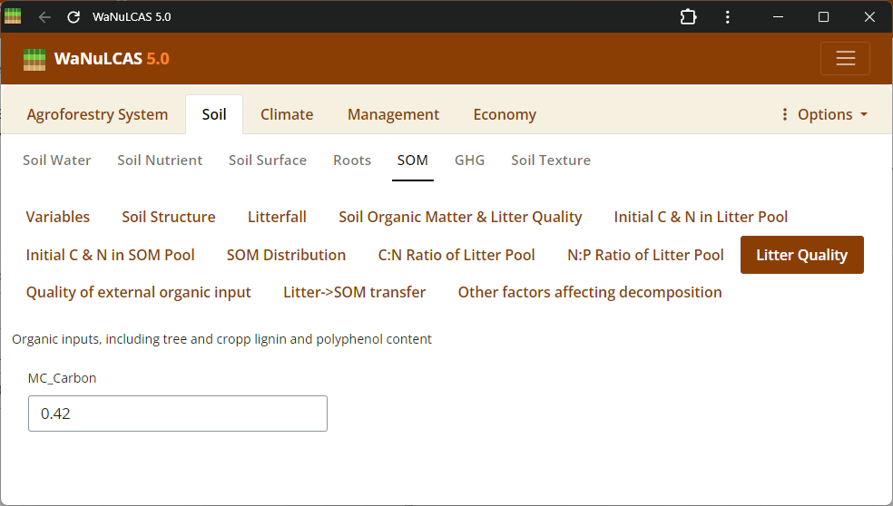
*Litter Pools and Quality - Litter quality. Define properties of accumulated surface litter layers, rates of continuous or seasonal litterfall, and litter quality indicators (decomposition rates) to regulate carbon and nutrient flows.*

Figure 2.2.9a: C/N ratio
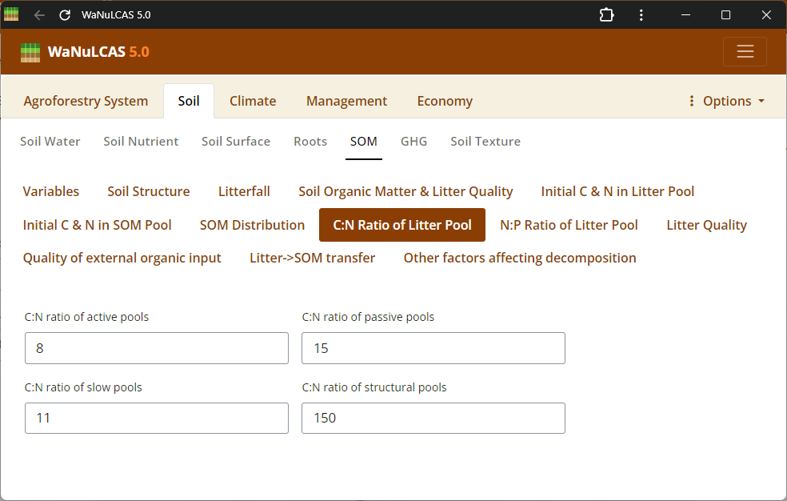
*Elemental Ratios (C/N, N/P) - C/N ratio. Specify nutrient ratios (e.g., C/N and N/P ratios) defining the quality and decomposability of soil and litter organics, which govern nutrient mobilization and immobilization.*

Figure 2.2.9b: N/P ratio
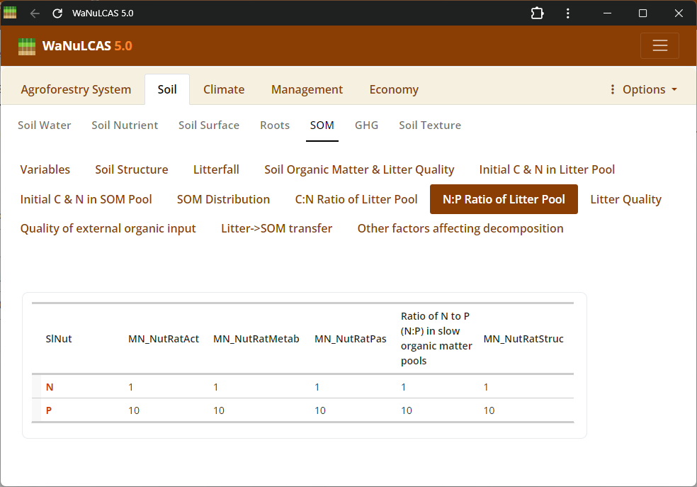
*Elemental Ratios (C/N, N/P) - N/P ratio. Specify nutrient ratios (e.g., C/N and N/P ratios) defining the quality and decomposability of soil and litter organics, which govern nutrient mobilization and immobilization.*

### 2.3. Climate
Set daily or monthly variables like rainfall, temperature, and light conditions.

Figure 2.3.1a: Rainfall
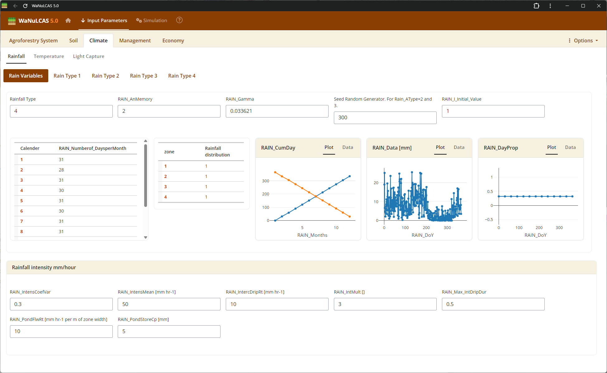
*Rainfall Parameters - Rainfall. Configure climate input data ranging from periodic to specific daily rainfall inputs (`Rain_Data`). For regions without complete records, use the integrated rainfall simulator based on Markov chains determining conditional probability for rainy days (e.g., `P(W|D)`, `P(W|W)`) paired with distribution models to simulate localized storm intensities and calculate seasonal hydrology patterns (`W_Drain`, percolation).*

Figure 2.3.1b: Rain 1
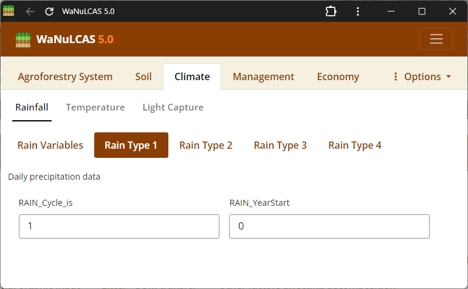
*Rainfall Parameters - Rain 1. Configure climate input data ranging from periodic to specific daily rainfall inputs (`Rain_Data`). For regions without complete records, use the integrated rainfall simulator based on Markov chains determining conditional probability for rainy days (e.g., `P(W|D)`, `P(W|W)`) paired with distribution models to simulate localized storm intensities and calculate seasonal hydrology patterns (`W_Drain`, percolation).*

Figure 2.3.1c: Rain 2
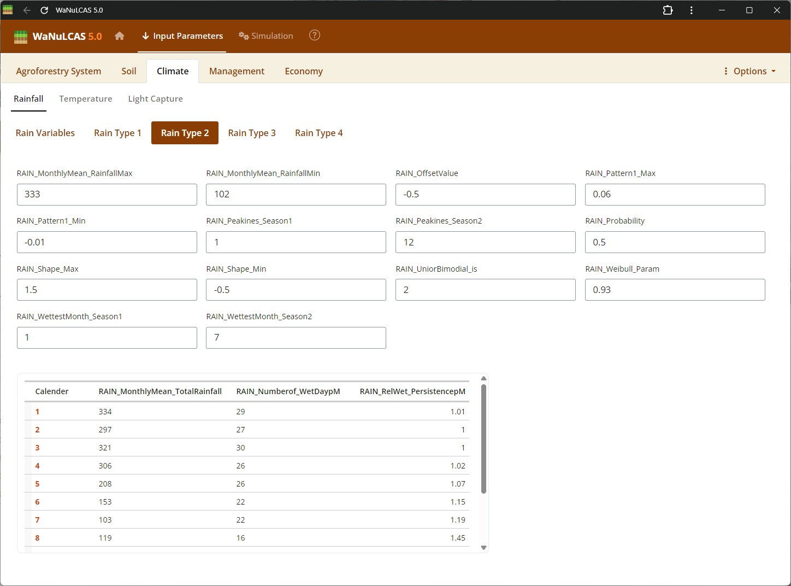
*Rainfall Parameters - Rain 2. Configure climate input data ranging from periodic to specific daily rainfall inputs (`Rain_Data`). For regions without complete records, use the integrated rainfall simulator based on Markov chains determining conditional probability for rainy days (e.g., `P(W|D)`, `P(W|W)`) paired with distribution models to simulate localized storm intensities and calculate seasonal hydrology patterns (`W_Drain`, percolation).*

Figure 2.3.1d: Rain 3
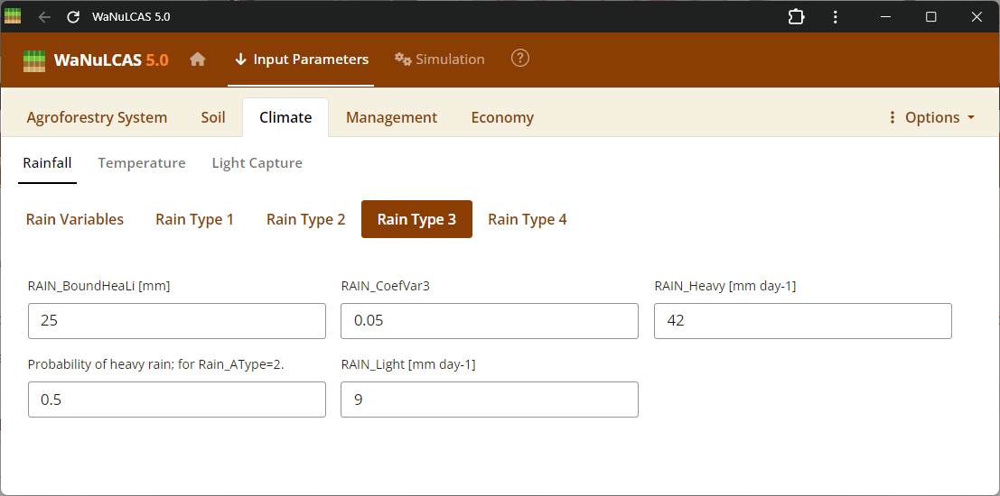
*Rainfall Parameters - Rain 3. Configure climate input data ranging from periodic to specific daily rainfall inputs (`Rain_Data`). For regions without complete records, use the integrated rainfall simulator based on Markov chains determining conditional probability for rainy days (e.g., `P(W|D)`, `P(W|W)`) paired with distribution models to simulate localized storm intensities and calculate seasonal hydrology patterns (`W_Drain`, percolation).*

Figure 2.3.1e: Rain 4
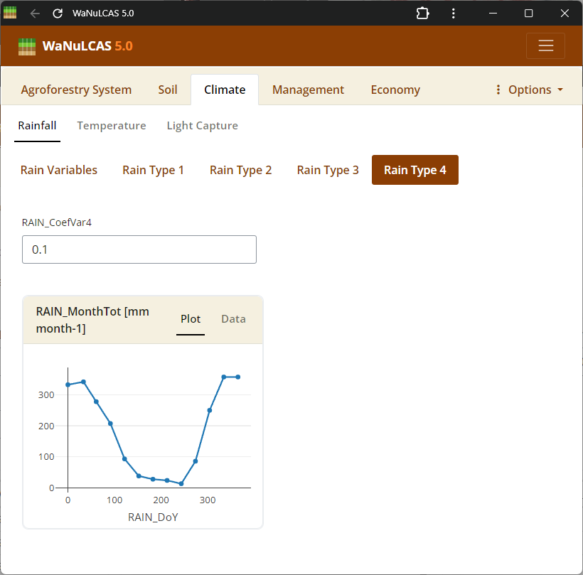
*Rainfall Parameters - Rain 4. Configure climate input data ranging from periodic to specific daily rainfall inputs (`Rain_Data`). For regions without complete records, use the integrated rainfall simulator based on Markov chains determining conditional probability for rainy days (e.g., `P(W|D)`, `P(W|W)`) paired with distribution models to simulate localized storm intensities and calculate seasonal hydrology patterns (`W_Drain`, percolation).*

Figure 2.3.2: Air Temperature
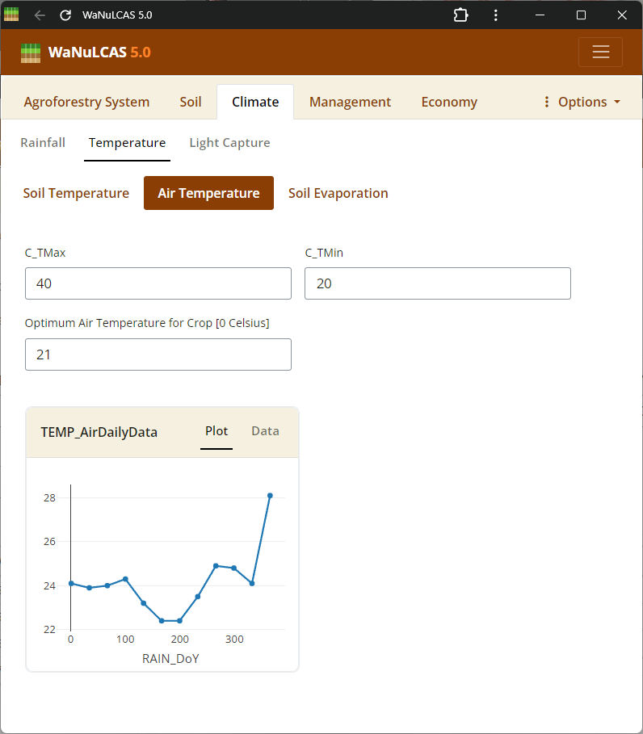
*Set average, maximum, and minimum ranges for air temperature (`Temp_DailyData`), which influences potential evaporation (`Temp_DailyPotEvap`) and plant growth.*

### 2.4. Management

Apart from yield effects of agroforestry, labour requirements have a strong impact on profitability, and for this one should compare additional labour use (eg. tree pruning) and labour saving aspects (eg. weed control). Complementarity of resource use can be based on a difference in timing of tree and crop resource demand. If the tree picks up the 'left overs' from the cropping period, as occurs with water in the *Grevillea* maize systems in Kenya (Ong; *pers. comm.*) and transforms these resources into valuable products, a considerable degree of competition during the temporal overlap may be acceptable to the farmer. If tree products have no direct value, agroforestry systems may only be justified if F_(noncomp) \> C_(nonrecycl). With increasing direct value of the tree products, the requirements for complementarity decrease.
Timetables and events including crop planting schedules, slashing & burning tasks, fertilizer inputs, tillage, and harvesting records.

Figure 2.4.1: Crop Management
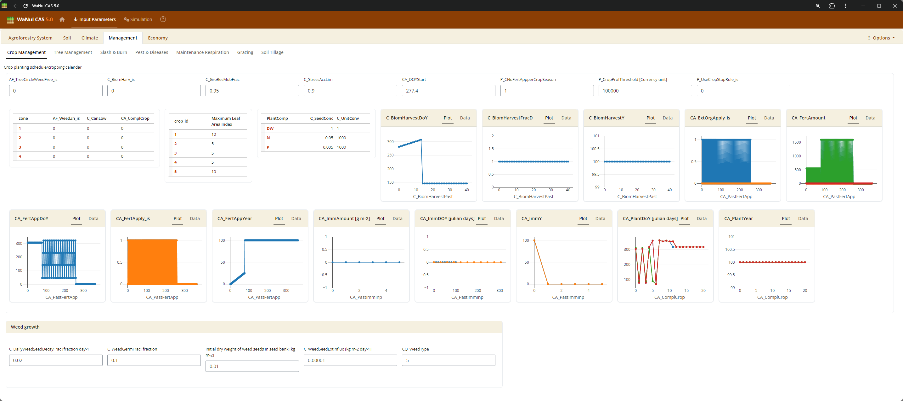
*Schedule cropping cycles by defining planting years (`Ca_PlantYear[Zone]`) and day of year (`Ca_PlantDoY[Zone]`). The current simulation year is defined as Year 0.*

Figure 2.4.2a: Tillage
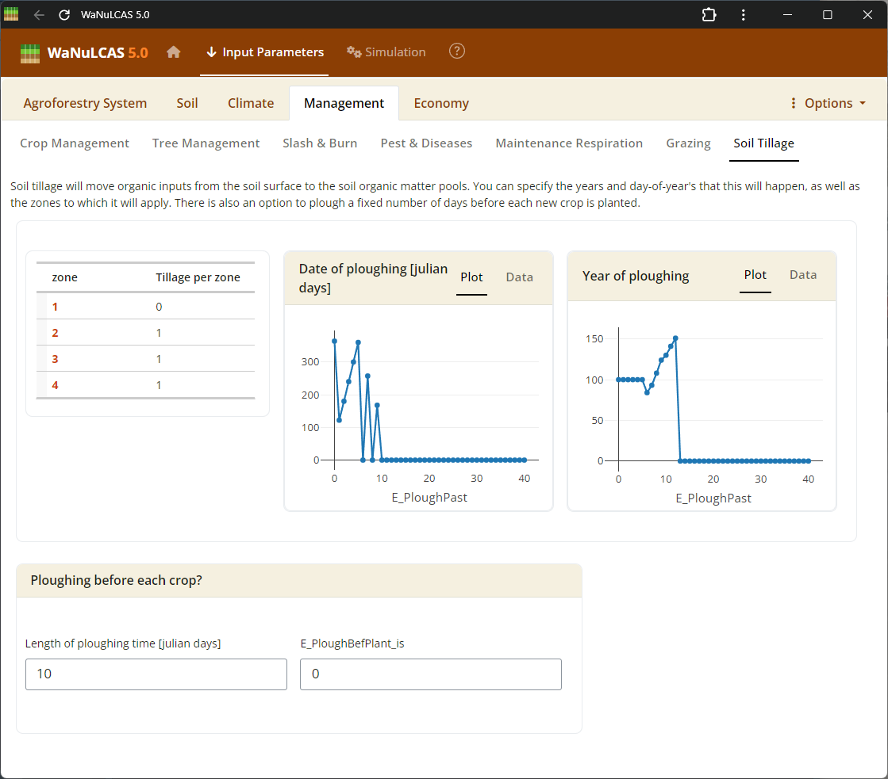
*Tillage and Grazing - Tillage. Input events and impacts related to mechanical tillage or animal grazing, including stocking rates (`G_StockrateperHa`), animal daily demand (`G_DayDemperDayKg`), and specific standard livestock units (`G_SLU`).*

Figure 2.4.2b: Grazing
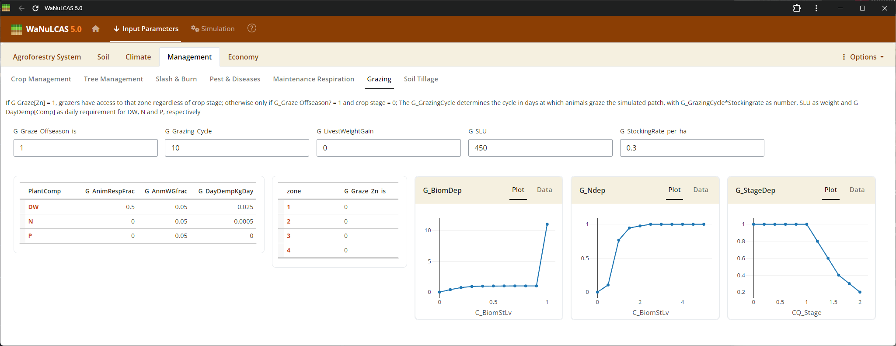
*Tillage and Grazing - Grazing. Input events and impacts related to mechanical tillage or animal grazing, including stocking rates (`G_StockrateperHa`), animal daily demand (`G_DayDemperDayKg`), and specific standard livestock units (`G_SLU`).*

Figure 2.4.3a: Slashing
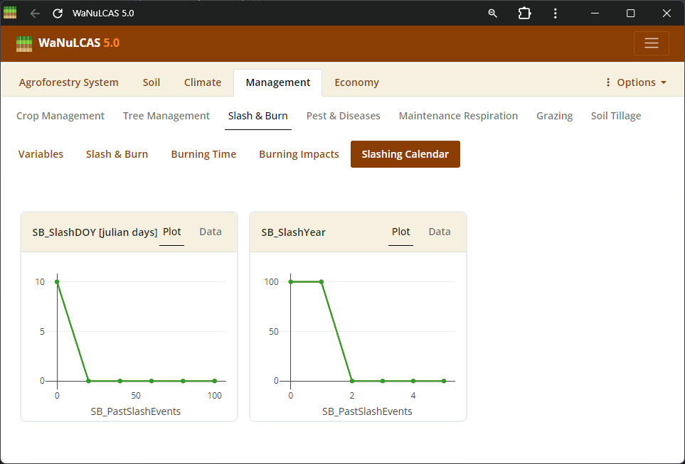
*Slashing and Killing Trees - Slashing. Schedule thinning, slashing (`S&B_SlashYear`, `S&B_SlashDOY`), or tree clearing events to manage specific tree components before burning or removal.*

Figure 2.4.3b: Killing trees
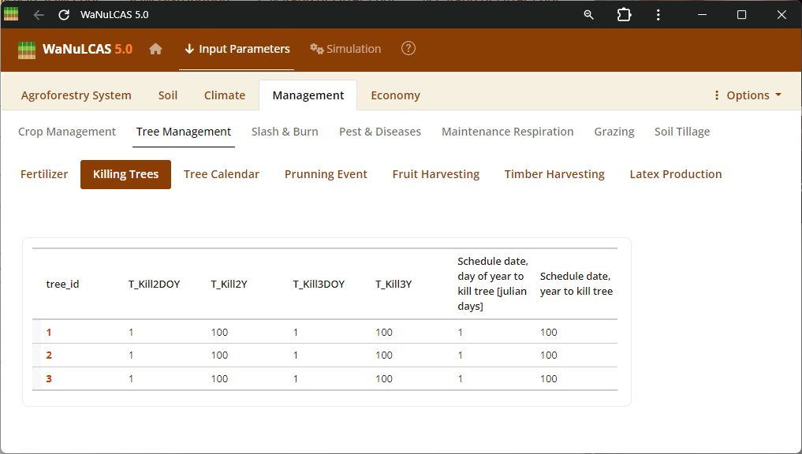
*Slashing and Killing Trees - Killing trees. Schedule thinning, slashing (`S&B_SlashYear`, `S&B_SlashDOY`), or tree clearing events to manage specific tree components before burning or removal.*

Figure 2.4.4a: Slashburn
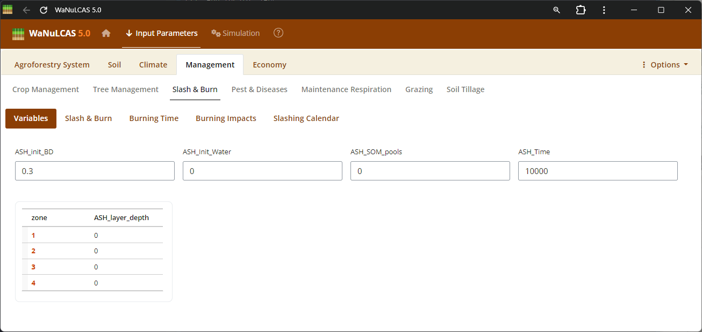
*Slash and Burn Operations - Slashburn. Detail burning operations by applying events (`S&B_BurnYear`, `S&B_BurnDoY`). WaNuLCAS simulates the short- and long-term consequences of fire by translating the fraction of necromass burned (`S&B_NecroBurnFrac`, `S&B_DeadWoodBurnFrac`) into sudden surface temperates, volatilizing nitrogen (`S&B_NvolatFrac`), inducing heat-related mortality of weed seedbanks (`S&B_FirMortSeedBank`), and depositing mobilizing mineral nutrients like P into the topsoil layer.*

Figure 2.4.4b: Slashburn 2
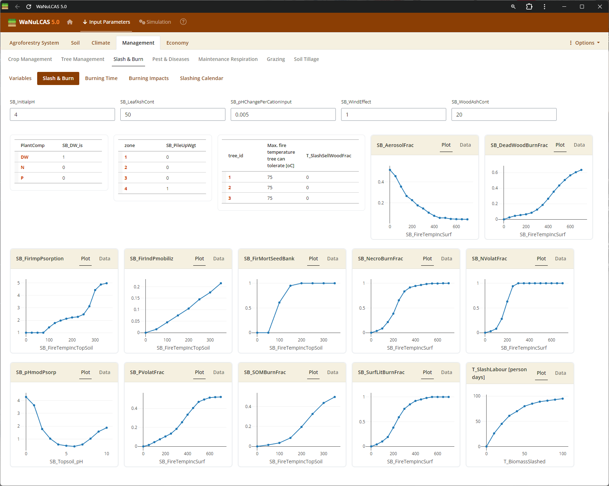
*Slash and Burn Operations - Slashburn 2. Detail burning operations by applying events (`S&B_BurnYear`, `S&B_BurnDoY`). WaNuLCAS simulates the short- and long-term consequences of fire by translating the fraction of necromass burned (`S&B_NecroBurnFrac`, `S&B_DeadWoodBurnFrac`) into sudden surface temperates, volatilizing nitrogen (`S&B_NvolatFrac`), inducing heat-related mortality of weed seedbanks (`S&B_FirMortSeedBank`), and depositing mobilizing mineral nutrients like P into the topsoil layer.*

Figure 2.4.4c: Burning time
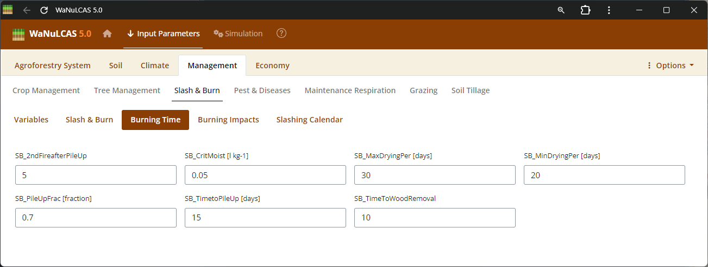
*Slash and Burn Operations - Burning time. Detail burning operations by applying events (`S&B_BurnYear`, `S&B_BurnDoY`). WaNuLCAS simulates the short- and long-term consequences of fire by translating the fraction of necromass burned (`S&B_NecroBurnFrac`, `S&B_DeadWoodBurnFrac`) into sudden surface temperates, volatilizing nitrogen (`S&B_NvolatFrac`), inducing heat-related mortality of weed seedbanks (`S&B_FirMortSeedBank`), and depositing mobilizing mineral nutrients like P into the topsoil layer.*

Figure 2.4.4d: Burning impacts
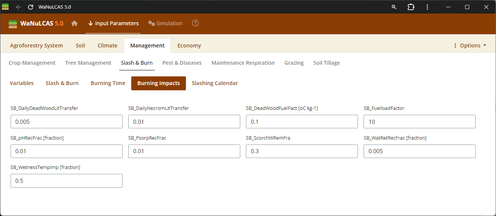
*Slash and Burn Operations - Burning impacts. Detail burning operations by applying events (`S&B_BurnYear`, `S&B_BurnDoY`). WaNuLCAS simulates the short- and long-term consequences of fire by translating the fraction of necromass burned (`S&B_NecroBurnFrac`, `S&B_DeadWoodBurnFrac`) into sudden surface temperates, volatilizing nitrogen (`S&B_NvolatFrac`), inducing heat-related mortality of weed seedbanks (`S&B_FirMortSeedBank`), and depositing mobilizing mineral nutrients like P into the topsoil layer.*

Figure 2.4.5a: Tree fertilizer
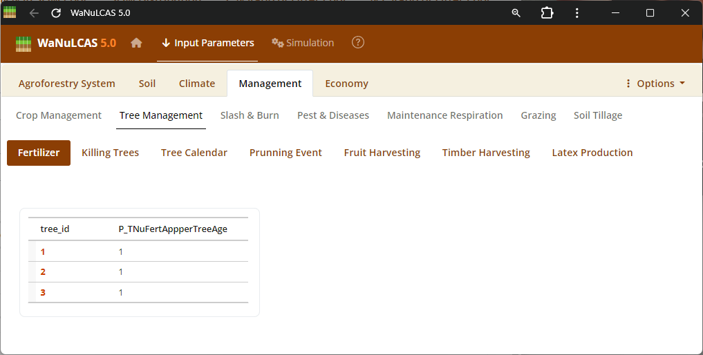
*Nutrients and Fertilizer Inputs - Tree fertilizer. Manage timing (`Ca_FertAppYear`, `Ca_FertAppDOY`) and quantity (`Ca_FertAppRate`) of inorganic fertilizers (`Ca_FertApply?[Nutrient]`) or exogenous organic inputs to specific zones.*

Figure 2.4.5b: Organic input
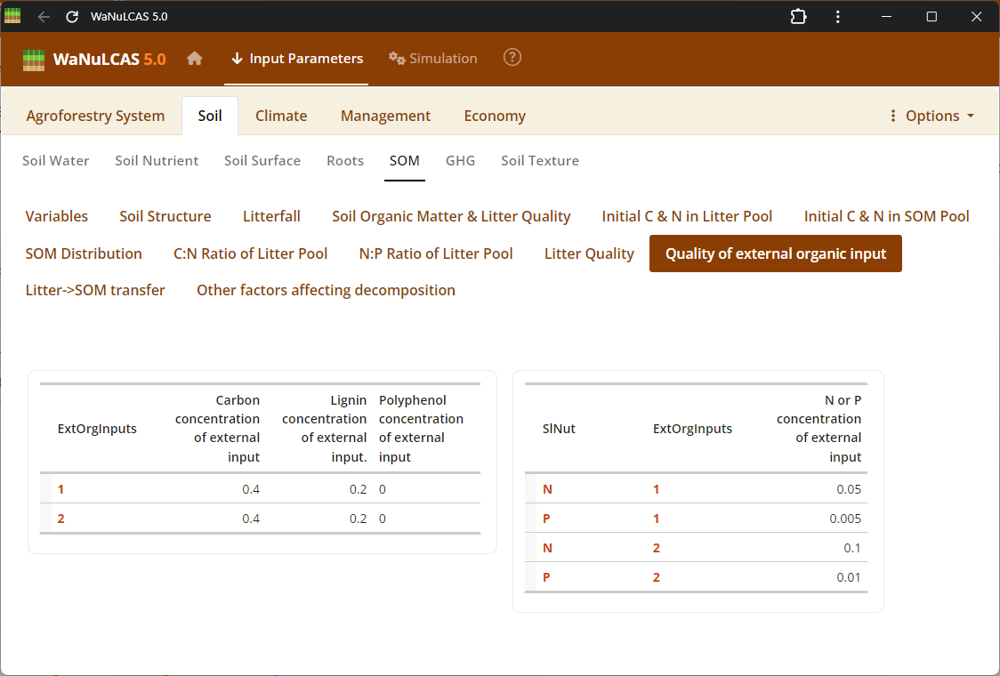
*Nutrients and Fertilizer Inputs - Organic input. Manage timing (`Ca_FertAppYear`, `Ca_FertAppDOY`) and quantity (`Ca_FertAppRate`) of inorganic fertilizers (`Ca_FertApply?[Nutrient]`) or exogenous organic inputs to specific zones.*

Figure 2.4.6a: Timber harvest
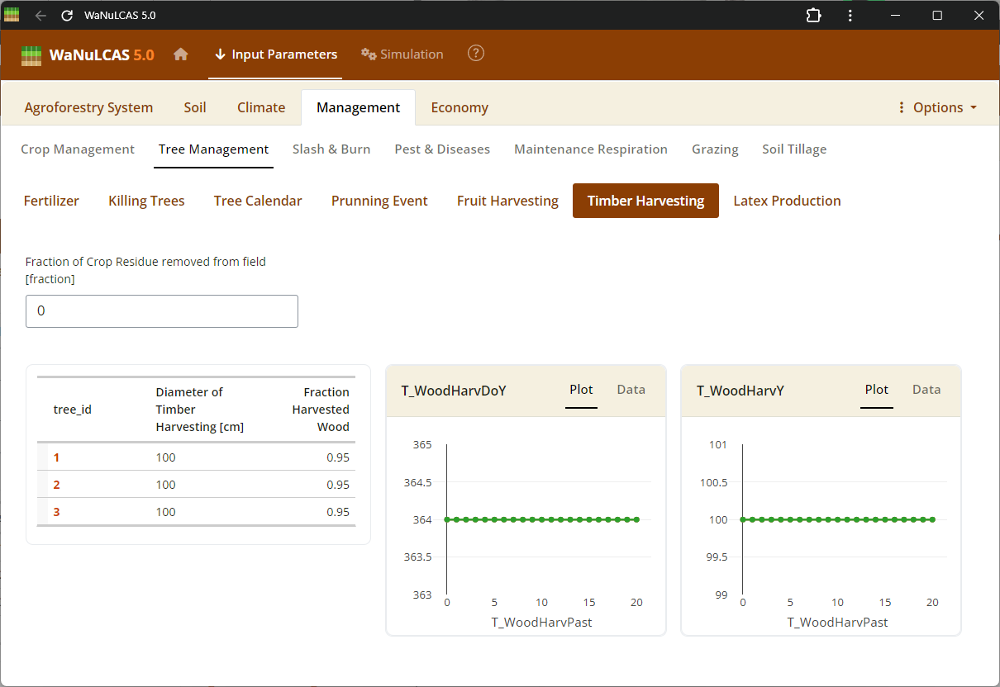
*Tree Harvesting and Pruning - Timber harvest. Specify harvest strategies for timber (`T_WoodHarvY`), specific tree products, fruit, latex, and routine tree pruning schedules (`T_PrunY`, `T_PrunDoY`), including the fraction of biomass pruned (`T_PrunFracD`) and harvested.*

Figure 2.4.6b: Tree product
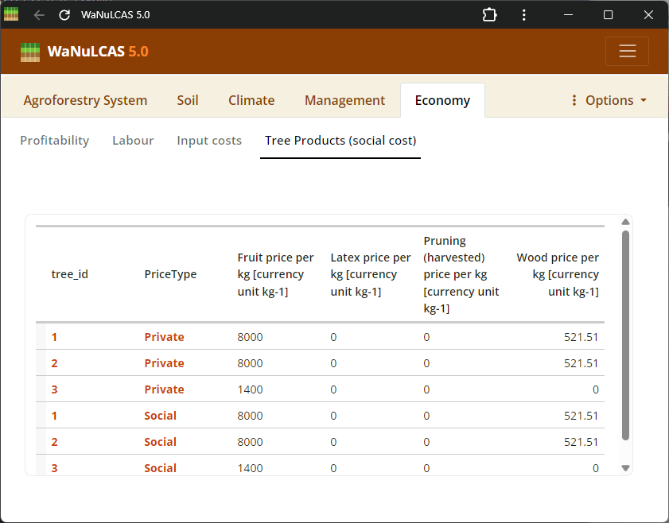
*Tree Harvesting and Pruning - Tree product. Specify harvest strategies for timber (`T_WoodHarvY`), specific tree products, fruit, latex, and routine tree pruning schedules (`T_PrunY`, `T_PrunDoY`), including the fraction of biomass pruned (`T_PrunFracD`) and harvested.*

Figure 2.4.6c: Fruit harvest
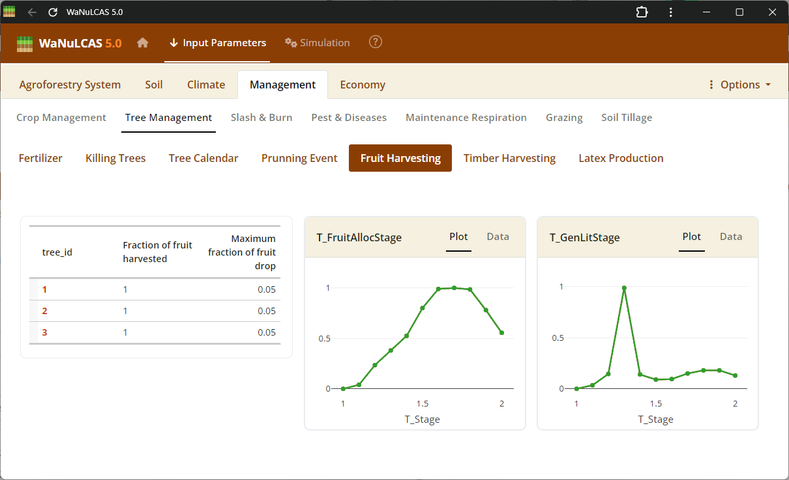
*Tree Harvesting and Pruning - Fruit harvest. Specify harvest strategies for timber (`T_WoodHarvY`), specific tree products, fruit, latex, and routine tree pruning schedules (`T_PrunY`, `T_PrunDoY`), including the fraction of biomass pruned (`T_PrunFracD`) and harvested.*

Figure 2.4.6d: Latex
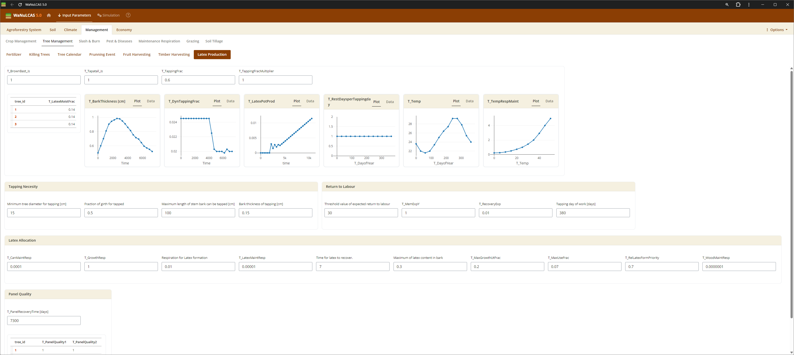
*Tree Harvesting and Pruning - Latex. Specify harvest strategies for timber (`T_WoodHarvY`), specific tree products, fruit, latex, and routine tree pruning schedules (`T_PrunY`, `T_PrunDoY`), including the fraction of biomass pruned (`T_PrunFracD`) and harvested.*

Figure 2.4.6e: Pruning
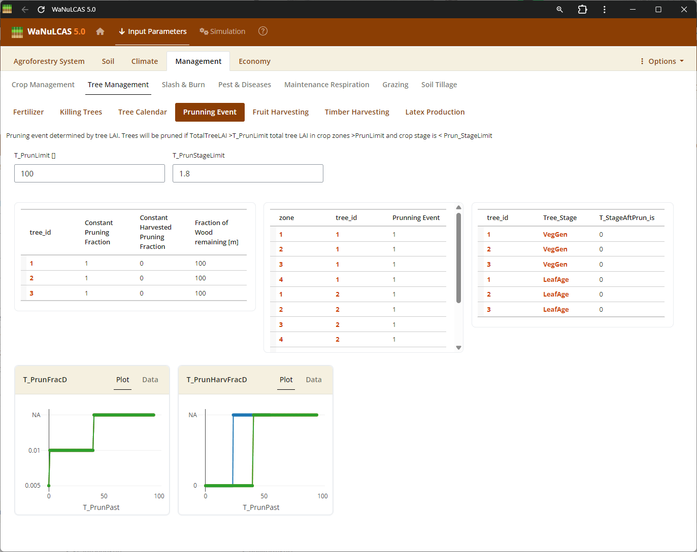
*Tree Harvesting and Pruning - Pruning. Specify harvest strategies for timber (`T_WoodHarvY`), specific tree products, fruit, latex, and routine tree pruning schedules (`T_PrunY`, `T_PrunDoY`), including the fraction of biomass pruned (`T_PrunFracD`) and harvested.*

### 2.5. Economy
Parameters to estimate the system's economic values such as costs and labor.

Figure 2.5.1a: Profitability
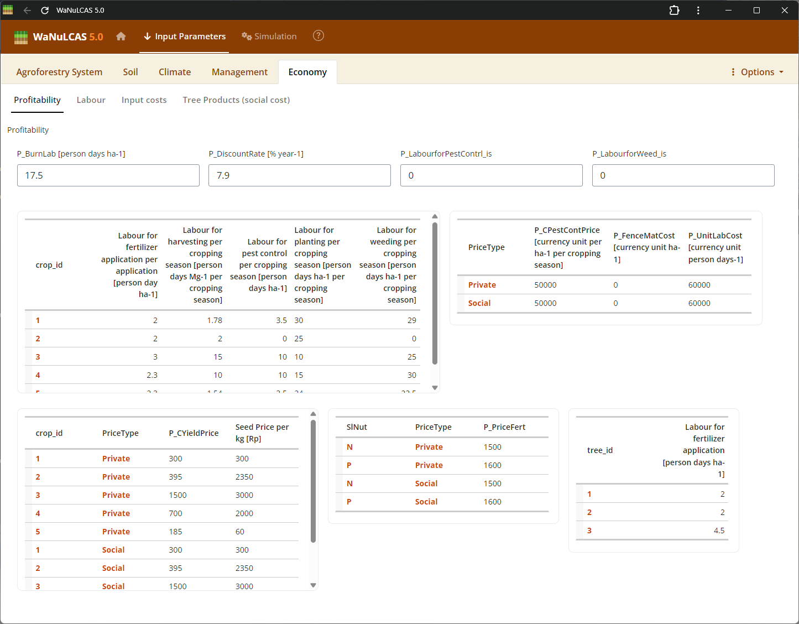
*Economics Details - Profitability. Set assumptions on market prices, material input costs, and labor requirements. The profitability module calculates the Net Present Value (NPV) and returns to labor based on inputs for the whole field, trees, and crops.*

Figure 2.5.1b: Input cost
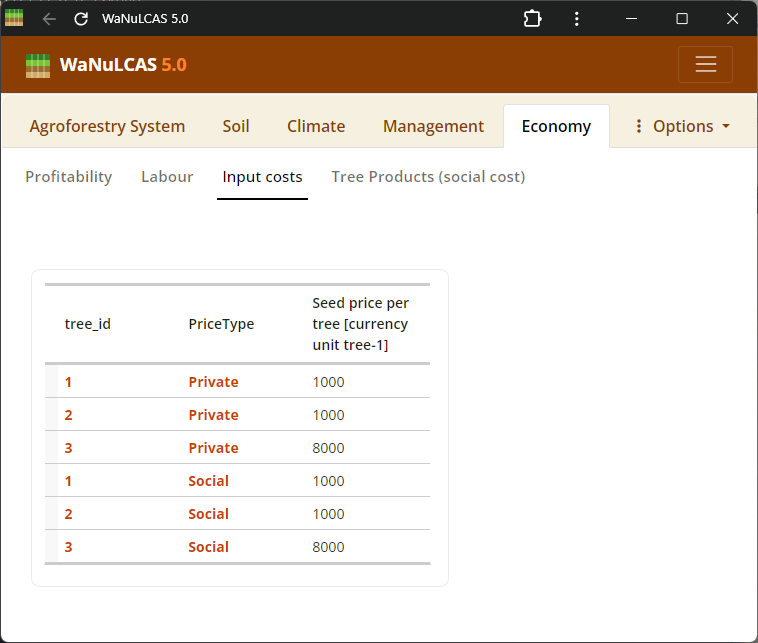
*Economics Details - Input cost. Set assumptions on market prices, material input costs, and labor requirements. The profitability module calculates the Net Present Value (NPV) and returns to labor based on inputs for the whole field, trees, and crops.*

Figure 2.5.1c: Labour
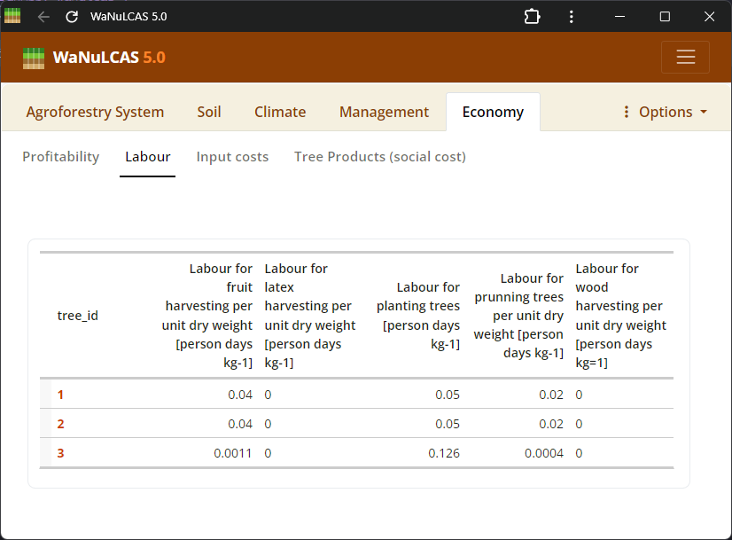
*Economics Details - Labour. Set assumptions on market prices, material input costs, and labor requirements. The profitability module calculates the Net Present Value (NPV) and returns to labor based on inputs for the whole field, trees, and crops.*

### Parameter Input Types & UI Usage
Values can be input in various ways:
* **Numeric Values**: Simple number boxes (e.g., initial values, system limits).
* **Data Tables**: Spreadsheets arrays (e.g., temporal rainfall data or depths) that can be edited cell-by-cell.
* **Graphs**: Interactive plots showing responses (e.g., crop vs. light). The plot's underlying data can also be edited in table view.

Figure 2.6.1a: Fullscreen table
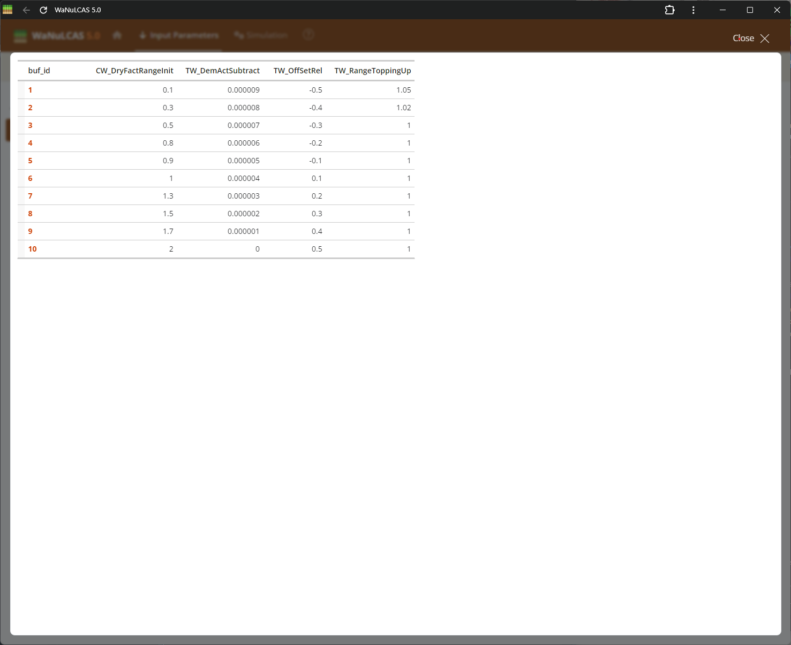
*Fullscreen Table Data Input - Fullscreen table. Expand data tables into full screen for easier bulk updates across rows and columns. This is particularly useful for grid-based temporal inputs or extensive configurations across the 4 physical soil layers and zones (e.g., initial values and depths).*

Figure 2.6.1b: Fullscreen table expand
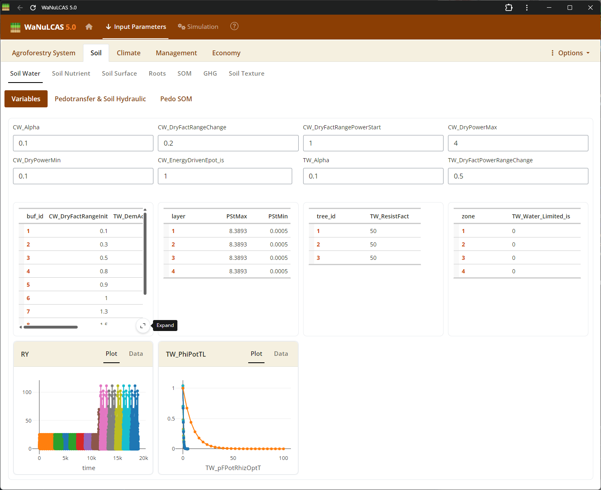
*Fullscreen Table Data Input - Fullscreen table expand. Expand data tables into full screen for easier bulk updates across rows and columns. This is particularly useful for grid-based temporal inputs or extensive configurations across the 4 physical soil layers and zones (e.g., initial values and depths).*

Figure 2.6.2a: Fullscreen graph
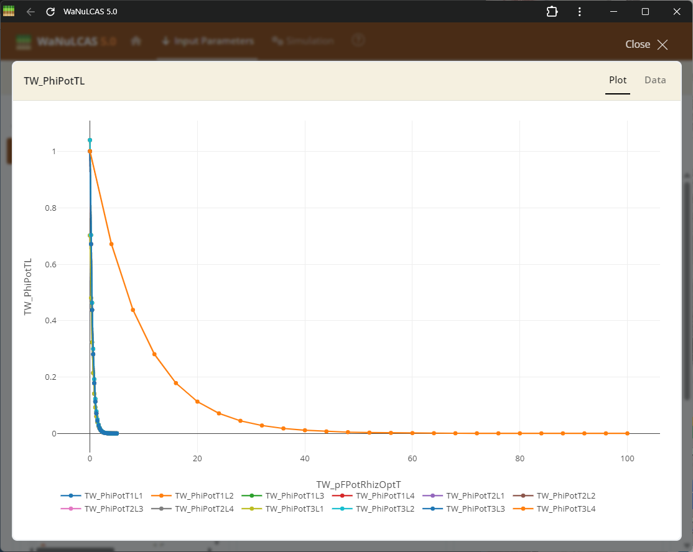
*Fullscreen Graph Data Input - Fullscreen graph. Examine plotted parameter dynamics closely and adjust underlying data directly when expanding graph inputs. The integrated graphical tools allow users to alter trajectories visually or tabularly, which instantly recalibrates the numeric data driving those model equations.*

Figure 2.6.2b: Graph data input expand
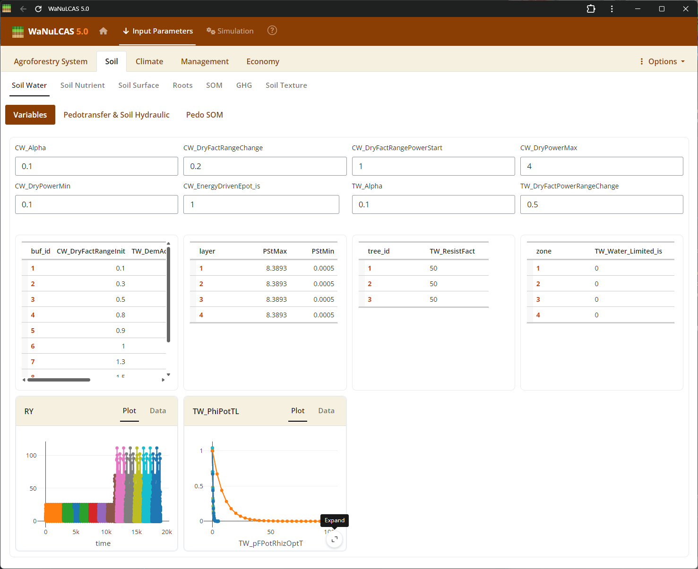
*Fullscreen Graph Data Input - Graph data input expand. Examine plotted parameter dynamics closely and adjust underlying data directly when expanding graph inputs. The integrated graphical tools allow users to alter trajectories visually or tabularly, which instantly recalibrates the numeric data driving those model equations.*

Figure 2.6.2c: Fullscreen graph table
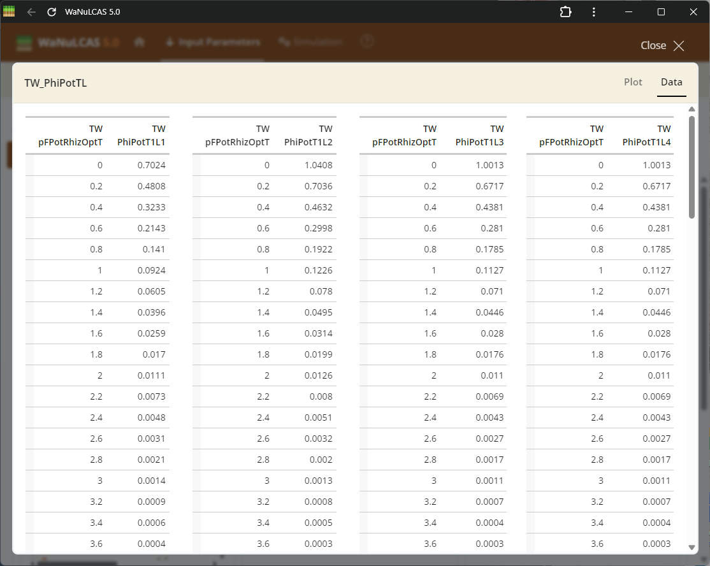
*Fullscreen Graph Data Input - Fullscreen graph table. Examine plotted parameter dynamics closely and adjust underlying data directly when expanding graph inputs. The integrated graphical tools allow users to alter trajectories visually or tabularly, which instantly recalibrates the numeric data driving those model equations.*

### Options Menu
At the top right of the Input Parameters panel, under **Options**:
* **Upload**: Load a `.yaml` parameter file from previous sessions.
* **Download**: Save all current adjustments to a `.yaml` file to your computer.


## 3. Simulation

Once all parameters are structured, navigate to the **Simulation** tab.

1. **Simulation Time (days)**: Define how many days you want to run the model scenario.
2. **Run Simulation**: Click the `Play` button to initiate the run. 

### Analyzing Outputs
After a successful run, simulation results will be displayed as interactive plots or tables. You can select specific output variables to view:
* Check out the **All Output Variables** list to find results. 
* Your choices will move to the **Selected Variables** section. 
* From **Options**, use "Clear selections" or "Reset to default" to filter down results.

Figure 3.1a: Output var
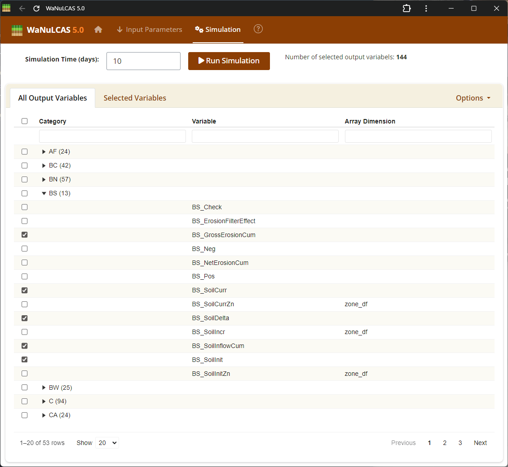
*Output Variables Setup - Output var. Navigate the category lists to select which variables to monitor and analyze. Variables are organized by their respective modules (e.g., Tree, Crop, Soil, Environment), allowing you to pinpoint specifically which parameters like plant biomass, simulated water uptake, or nitrogen balances you want to explore.*

Figure 3.1b: Select var
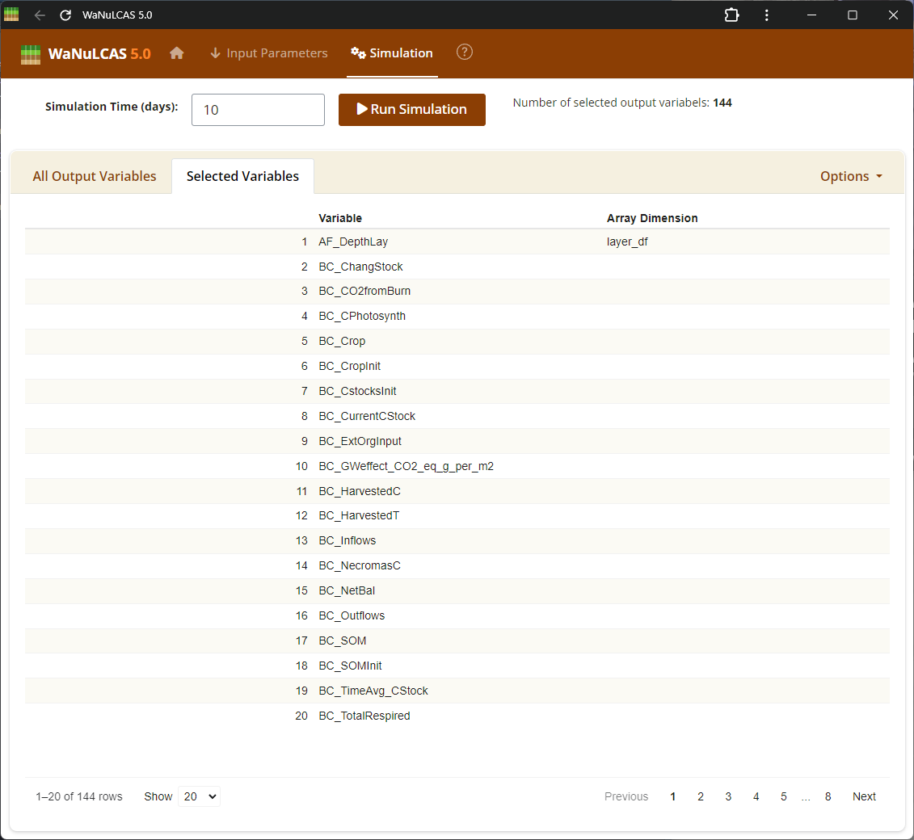
*Output Variables Setup - Select var. Navigate the category lists to select which variables to monitor and analyze. Variables are organized by their respective modules (e.g., Tree, Crop, Soil, Environment), allowing you to pinpoint specifically which parameters like plant biomass, simulated water uptake, or nitrogen balances you want to explore.*

Figure 3.2a: Output var result
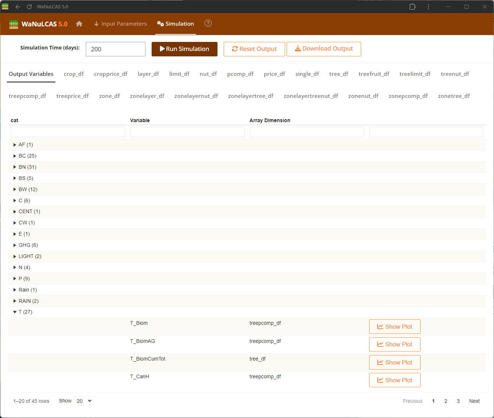
*Output Results UI - Output var result. Visualize your selected variables mapped over time to analyze the system's dynamics. The results subpanels offer dynamic plots where users can track complex trajectories, such as cumulative water drained or nutrient limitations, comparing default expectations against simulated outcomes.*

Figure 3.2b: Output graph
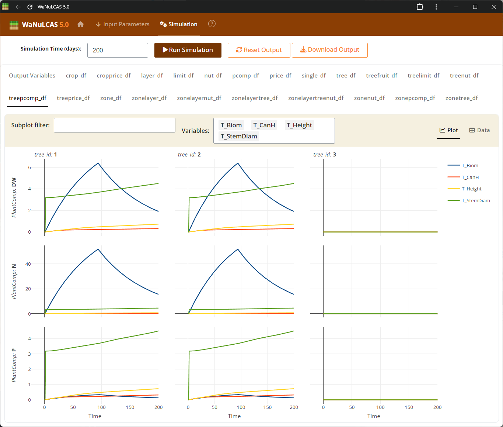
*Output Results UI - Output graph. Visualize your selected variables mapped over time to analyze the system's dynamics. The results subpanels offer dynamic plots where users can track complex trajectories, such as cumulative water drained or nutrient limitations, comparing default expectations against simulated outcomes.*

Figure 3.2c: Output water uptake
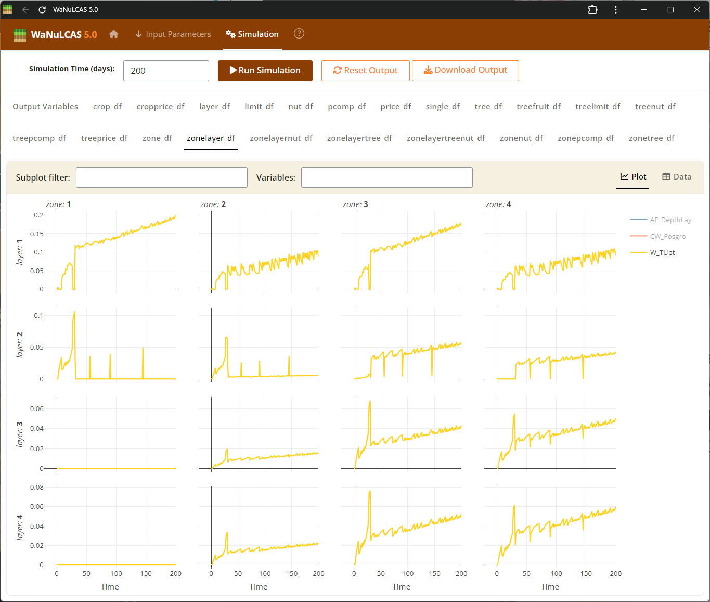
*Output Results UI - Output water uptake. Visualize your selected variables mapped over time to analyze the system's dynamics. The results subpanels offer dynamic plots where users can track complex trajectories, such as cumulative water drained or nutrient limitations, comparing default expectations against simulated outcomes.*

* **Download Output**: Export the simulated tabular data into `.csv` format for external analysis.


## 4. More Information
In the final section (identified by the `?` icon), find further assistance:
* **About**: General information regarding the tool authors and methodology.
* **Tutorial** (This page): Read the instructional manual for general UI processes.
* **References**: Academic and foundational resources tied to WaNuLCAS calculations.
* **Software Library**: Packages powering WaNuLCAS.

---
&copy; World Agroforestry (ICRAF)
