# Overview of the Model

## Model features

A key feature of the model is the description of uptake of water and
nutrients (N and P) on the basis of root length densities of the tree(s)
and the crop, plant demand factors and the effective supply by diffusion
at a given soil water content. De Willigen and Van Noordwijk (1994) and
Van Noordwijk and Van de Geijn (1996) described underlying principles.

The model was developed to emphasize the common principles underlying a
wide range of tree-crop agroforestry systems in order to maximize the
cross-fertilization between research into these various systems and
explore a wide range of management options. The model can be used for
agroforestry systems ranging from hedgerow intercropping (alley
cropping) on flat or sloping land (contour hedgerow intercropping),
taungya-type transitions into tree-crops, via (relay-planted) fallows to
isolated trees in parkland systems. Figure 2.1A and Figuer 2.1B shows
the different modules available inside WaNuLCAS model.

***Agroforestry systems.*** The model represents a four-layer soil
profile, with four spatial zones, a water, nitrogen and phosphorus
balance and uptake by a crop (or weed) and up to three (types of)
tree(s). The model can be used both for simultaneous and sequential
agroforestry systems and may help to understand the continuum of options
ranging from 'improved fallow' via relay planting of tree fallows to
rotational and simultaneous forms of 'hedgerow intercropping'. The model
explicitly incorporates management options such as tree spacing, pruning
regime and choice of species or provenance. The model includes various
tree characteristics, such as root distribution, canopy shape, litter
quality, maximum growth rate and speed of recovery after pruning.

If applied to hedgerow intercropping, the model allows for the
evaluation of different pruning regimes, hedgerow tree spacing and
fertilizer application rates. When applied to rotational fallow systems,
the 'edge' effects between currently cropped parts of a field and the
areas where a tree fallow is growing can be simulated. For isolated
trees in parkland systems, equidistant zones around individual trees can
be 'pooled' and the system as a whole can be represented by a number of
circles (of different radius) with a tree in the middle (further
explanation is given in section 3.1).

***Climate*** effects are mainly included via daily rainfall data, which
can be either read from a spreadsheet or generated on the basis of daily
probability of rainfall and a division between ‘heavy’, and 'light'
rains. Average temperature and radiation are reflected in 'potential'
growth rates. 'Thermal time' is reflected in the speed of phenological
development. Soil temperature is explicitly used as a variable
influencing decomposition and N and P mineralization.

***Soil*** is represented in four layers, the depth of which can be
chosen, with specified soil physical properties and initial water and
nitrogen contents.

### Modules

The ***Water balance*** of the system includes rainfall and canopy
interception, with the option of exchange between the four zones by
run-on and run-off as well as subsurface lateral flows, surface
evaporation, uptake by the crop and tree and leaching. Vertical as well
as horizontal transport of water is included; an option is provided to
incorporate (nighttime) ‘hydraulic equilibration’ via the tree root
system, between all cells in the model.

The ***Nitrogen and Phosphorus balance*** of the model includes inputs
from fertilizer (specified by amount and time of application),
atmospheric N fixation, mineralization of soil organic matter and fresh
residues and specific P mobilization processes. Uptake by crop and tree
is allocated over yields (exported from the field/ patch) and recycled
residues. Leaching of mineral N and P is driven by the water balance,
the N concentrations and the apparent adsorption constant in each layer,
thus allowing for a 'chemical safety net' by subsoil nutrient (incl.
nitrate) adsorption.

***Growth*** of both plants ('crop' and 'tree') is calculated on a daily
basis by multiplying potential growth (which depends on climate) with
the minimum of three 'stress' factors, one for shading, one for water
limitation, one for nitrogen and one for phosphorus. For trees a number
of allometric equations (which themselves can be derived from fractal
branching rules) is used to allocate growth over tree organs.

***Uptake*** of both water and nutrients by the tree and the crop is
driven by 'demand' in as far as such is possible by a zero-sink uptake
model on the basis of root length density and effective diffusion
constants:

$`uptake = \min(demand,\ potential\ uptake)`$ **\[2\]**

For water the potential uptake at a given root length density and soil
water content is calculated from the matric flux potential of soil
water.

***Demand*** for nitrogen uptake is calculated from empirical
relationships of nutrient uptake and dry matter production under
non-limiting conditions[^1], a 'luxury uptake'[^2] a possibility for
compensation of past uptake deficits and an option for N fixation
(driven by the Ndfa parameter, indicating the part of the N demand which
can be met from atmospheric fixation).

***Competition for water and nutrients*** is based on sharing the
potential uptake rate for both (based on the combined root length
densities) on the basis of relative root length multiplied by relative
demand:

$`PotUpt(k) = \min\left\lbrack \frac{Lrv(k)xDemand(k)xPotUpt\left( \sum_{}^{}{lrv} \right)}{\sum_{k = 1}^{n}\left( Lrv(k)xDemand(k) \right)},PotUpt\left( Lrv(k) \right) \right\rbrack`$
**\[3\]**

where PotUpt gives the potential uptake rate for a given root length
density L_(rv).

This description ensures that uptake by species *k* is:

1.  proportional to its relative root length density L_(rv) if demand
    for all components is equal,

2.  never more than the potential uptake by *i* in a monoculture with
    the same L_(rv),

3.  not reduced if companion plants with a high root length density have
    zero demand (e.g. a tree just after pruning).

At this stage we apply this procedure to four species (n=4, i.e. 3 trees
and a crop or weed in each zone), but the routine can be readily
expanded to a larger number of plants interacting.

***Root growth*** is represented for the crop by a logistic increase of
root length density in each layer up till flowering time and gradual
decline of roots after that time. A maximum root length density per
layer is given as input. The model also incorporates a 'functional
equilibrium' response in shoot/root allocation of growth, and a 'local
response' to shift root growth to favourable zones. For the tree, root
length density in all zones and layers can be assumed to be constant,
thus a representing an established tree system with equilibrium of root
growth and root decay or can follow dynamic rules roots similar to those
for crop.

The ***Soil Organic Matter*** includes litter layer and organic matter.
Both has three main pools (Active, Slow and Passive), following the
terminology and concept of the CENTURY model.

***Light capture*** is treated on the basis of the leaf area index (LAI)
of all components and their relative heights, in each zone. Potential
growth rates for conditions where water and nutrient supply are
non-limiting are used as inputs (potentially derived from other models),
and actual growth is determined by the minimum of shade, water and
nutrient stress.

## Agroforestry systems

#### Zoning of the agroforestry system into four zones. 

Normally, the first zone will be used for trees only. The other three
zones will normally be used for growing crops, but they can be shaded by
the trees in zone 1 (depending on canopy size and shape) and can harbour
tree roots, leading to belowground competition (Figure 3.1 and Table
3.1). Normally the intensity of interactions will decrease from zone 2
to 4.

|  |
|----|
| 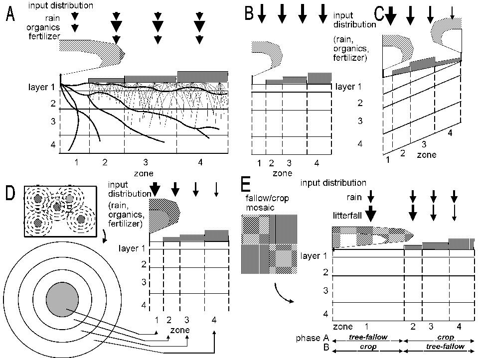 |
| **Figure 3.1.** General lay out of zones and layers in the WaNuLCAS model (A) and applications to four types of agroforestry system: B. Alley cropping, C. Contour hedgerows on slopes, with variable topsoil depth, D. Parkland systems, with a circular geometry around individual trees, E. Fallow-crop mosaics with border effects. |

In WaNuLCAS versions up to 3.2 two options were provided for tree
locations: on the left (lower) side of Zone 1 or on the right (upper)
side of Zone 4. The need for more flexible options arose when
simulations were to be made for ‘double row’ systems as practiced for
example in rubber, where the basic line of symmetry is in between tree
rows.

Revising the algorithm for tree canopy development now allows for any
position among the 4 zones to be used as the centre point of the tree
crown, via two parameters: *AF_TreeZone\[Tree\]* indicates the zone in
which each of the 3 allowable trees (of the same or different species)
is located, *AF_TreeRelPos\[Tree\]* indicates the relative position
\[0-1\] within this zone. *Note: aAdjustments to root distribution will
(for now) have to be made manually.*

### **Table 3.1.** Characteristic settings for nine types of agroforestry system.

[TABLE]

***Tests***

Two tests were used in checking the algorithm: if all zones have equal
width, the results for *Zone 1, RelPos 1* should be identical to those
for *Zone 2, RelPos 0*, while the results for *Zone 1 or 2, RelPos X*
should be a mirror image of those for for *Zone 4 or 3, RelPos (1-x).*
The current algorithm passed both tests.

***Basic concept***

The canopy can expand both towards the right and towards the left of the
tree position and will ‘spill over’ into the next zone to the left or
right when it reaches the zone boun­dary. As indicated by the arrow in
Figure 3.1, when the tree is not in the middle of the zone, it will
reach one boundary before the other, and the rate of increase of
RelCanWidth\[Zone\] will be half of what it was before at the time the
next zone starts to fill.

| 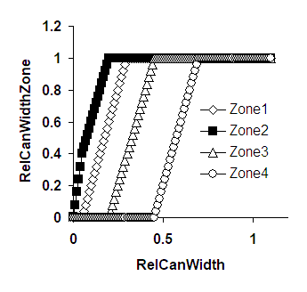 | 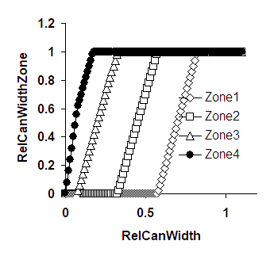 |
|-------------------------|-------------------------|

***Example of results***

**Figure 3.2.** Examples of the relationship between RelCanWidth for the
whole simulation area and RelCanWidthZone\[Zone\]; A. The tree is
positioned in Zone 2 at RelPos 0.2 ; B The tree is in Zone 4 at RelPos
0.3; arrow explained in the text

***Technical implementation***

TreeCanWidthZone\[Zone\] = IF AFZone\[Zone\] = 0 then 0 Else IF
(TreeInZone?\[Zone\] = 1 then

MIN(1,(MAX(0,MIN(RelPos\*
AfZone\[Zone\],RelCanWidth))+MAX(0,MIN((1-RelPos)\* AfZone\[Zone\],
RelCanWidth)))/ AfZone\[Zone\]), Else MAX(0,MIN(1,(RelCanWidth –
(Tree1ToTheLeft?\[Zone\] \* RelAFZoneTreeLeft\[Zone\] +
Tree2ToTheLeft?\[Zone\] \* RelAFZoneNextLeft \[Zone\] +
Tree3ToTheLeft?\[Zone\] \* RelAFZoneNxt2Left\[Zone\] +
Tree1ToTheRight?\[Zone\] \* RelAFZoneTreeRight\[Zone\] +
Tree2ToTheRight?\[Zone\] \* RelAFZoneNxtRight\[Zone\] +
Tree3ToTheRight?\[Zone\] \* RelAFZoneNext2Right\[Zone\] ))/
AfZone\[Zone\]))))

With a number of auxiliary variables:

| TreeInZone?\[Zone\] | =IF AF_TreeZone = ZoneNumber\[Zone\] Then 1 Else 0 |
|----|----|
| Tree1ToTheLeft?\[Zone\] | =IF AF_TreeZone \< ZoneNumber\[Zone\] Then 1 Else 0 |
| Tree2ToTheLeft?\[Zone\] | =IF AF_TreeZone \< ZoneNumber\[Zone\]-1 Then 1 Else 0 |
| Tree3ToTheLeft?\[Zone\] | =IF AF_TreeZone \< ZoneNumber\[Zone\]-2 Then 1 Else 0 |
| Tree1ToTheRight?\[Zone\] | =IF AF_TreeZone \> ZoneNumber\[Zone\], Then 1 Else 0 |
| Tree2ToTheRight?\[Zone\] | =IF AF_TreeZone \> ZoneNumber\[Zone\]+1, Then 1 Else 0 |
| Tree3ToTheRight?\[Zone\] | =IF AF_TreeZone \> ZoneNumber\[Zone\]+2 Then 1 Else 0 |
| RelAFZoneTreeLeft\[Zone\] | =(1-RelPos)\* (IF TreeZone=1 Then AFZoneWidth\[1\] Else If TreeZone=2 then AFZoneWidth\[2\] else if TreeZone=3 then AFZoneWidth\[3\] else if TreeZone=4 then AFZoneWidth\[4\] else 0) |
| RelAFZoneNextLeft\[Zone\] | =IF TreeZone =1-1 then AFZoneWidth\[1\] else IF TreeZone =2-1 then AFZoneWidth\[2\] else IF TreeZone =3-1 then AFZoneWidth\[3\] else IF TreeZone =4-1 then AFZoneWidth\[4\] else 0 |
| RelAFZoneNext2Left\[Zone\] | =IF TreeZone =1-2 then AFZoneWidth\[1\] else IF TreeZone =2-2 then AFZoneWidth\[2\] else IF TreeZone =3-2 then AFZoneWidth\[3\] else IF TreeZone =4-2 then AFZoneWidth\[4\] else 0 |
| RelAFZoneTreeRight\[Zone\] | =RelPos\* (IF TreeZone=1 Then AFZoneWidth\[1\] Else If TreeZone=2 then AFZoneWidth\[2\] else if TreeZone=3 then AFZoneWidth\[3\] else if TreeZone=4 then AFZoneWidth\[4\] else 0) |
| RelAFZoneNextRight\[Zone\] | =IF TreeZone =1+1 then AFZoneWidth\[1\] else IF TreeZone =2+1 then AFZoneWidth\[2\] else IF TreeZone =3+1 then AFZoneWidth\[3\] else IF TreeZone =4+1 then AFZoneWidth\[4\] else 0 |
| RelAFZoneNext2Right\[Zone\] | =IF TreeZone =1+2 then AFZoneWidth\[1\] else IF TreeZone =2+2 then AFZoneWidth\[2\] else IF TreeZone =3+2 then AFZoneWidth\[3\] else IF TreeZone =4+2 then AFZoneWidth\[4\] else 0 |

Where topsoil depth is varied between zones one should observe
constraints so that average topsoil depth over the slope remains
realistic (compare 3.2.7).

The model calculates mass balances for a basic unit of area (say 1 m²)
in each zone or as (weighted) average for the whole system simulated. A
weighted average is used, for example for expressing total yields of the
system on an area basis, when accounting for tree roots and their uptake
from the various zones. The relative weights are AF_ZoneFrac\[Zn*i*\]
and are calculated such that they add up to 1.0.

The four AF_ZoneFrac\[Zone\] values are calculated from the following
four input values: AF_Zone\[Zn1\], AF_Zone\[Zn2\], AF_Zone\[Zn3\] and
AF_Zonetot. AF_Zone\[Zn4\] is calculated by difference.

For example:
$`AF_{ZoneFrac\lbrack Zn1\rbrack} = \frac{AF\_ Zone\lbrack Zn1\rbrack}{AF\_ ZoneTot}`$
**\[4\]**

If a circular geometry is used (AF_Circ = 1), the AF_ZoneFrac\[Zone\]
values are derived from the AF_Zone\[Zone\] differently (on the basis of
circle rings, (r_(i)² - r_(i-1)²)/ r₄²), but otherwise the model can run
in the same way. The user has to specify four depths (thickness) of
layers under the parameter name AF_DepthLay*i*. The layers will be
homogeneous for four zones in each layers.

#### Input weighting factors

A number of inputs to the soil surface can be distributed homogeneously
(proportional to the respective AF_ZoneFrac values), or heterogeneously.
This way, we can for example account for. The model expects four input
values 'Rain_Weight\[Zn*i*\]' and calculates effective weights from:

$`RainWeightAct\left\lbrack {Zn}_{i} \right\rbrack = \frac{RainWeight\left\lbrack {Zn}_{1} \right\rbrack}{\sum_{1}^{4}{AFZoneFrac\left\lbrack {Zn}_{i} \right\rbrack xRainWeight\lbrack{Zn}_{i}\rbrack}}`$
**\[5\]**

This equation ensures that the average rainfall remains at the value
specified; the units for the RainWeightAct parameters are arbitrary.
Multiplied with the rainfall per unit area (overall average), we then
obtain the rainfall per unit area in each zone *i*. Similar weighting
factors are used in T_LitfallWeight, T_PrunWeight for allocating tree
litterfall and tree prunings over the various zones, while conserving
their overall mass balance. The units for these weighting factors are
arbitrary, as they are only used in a relative sense.

#### Calendar of events

The year in WaNuLCAS starts with Year 0, while the day is value from 1
to 365. Starting day of the simulation can be specified at any time
after DOY 1 of Year 0.

Before a simulation, the user can specify a number of events that will
take place at a given calendar date usually by specifying the Year and
Day-of-Year (DOY) in which they will occur. Some events will be
triggered internally, such as crop harvest when a crop is ready for it
or a burn event after the slash has dried sufficiently. It may help the
model user to design such a calendar. Figure 3.3 and Table 3.2 give an
example of calendar of events for a hedgerow systems with Gliricidia as
tree and maize - groundnut as crops. To help users in defining Julian
days, we provide a list of Julian days in **Wanulcas.xls** – sheet
‘Julian Days’.

**Figure 3.3.** A schematic diagram of management activities of a
hedgerow systems.

**\**

### **Table 3.2.** An example of management activities record of a hedgerow systems.

| No. | Activities         | Date             | Year in WaNuLCAS | Day in WaNuLCAS |
|:---:|--------------------|------------------|:----------------:|:---------------:|
| 1\. | Planting maize     | 11 December 1994 |        0         |       345       |
| 2\. | Pruning Gliricidia | 8 January 1995   |        1         |        8        |
| 3\. | Maize harvest      | 10 March 1995    |        1         |       69        |
| 4\. | Pruning Gliricidia | 20 March 1995    |        1         |       79        |
| 5\. | Planting groundnut | 27 March 1995    |        1         |       86        |
| 6\. | Pruning gliricidia | 14 June 1995     |        1         |       165       |
| 7\. | Groundnut harvest  | 2 August 1995    |        1         |       214       |
| 8\. | Pruning Gliricidia | 7 August 1995    |        1         |       219       |

#### Crops, weeds and trees

The model user can schedule a sequence of crops (of different types) to
be grown at one time for each zone, with specific fertilizer
applications. For each simulation five crop types can be pre-selected
from the database in the **Wanulcas.xls** spreadsheet. The crop type to
be planted, in a given year and day (within year) can be specified for
each zone by modifying the graphs Ca_CType, Ca_PlantYear and
Ca_PlantDoY. Similarly, subsequent fertilizer applications are specified
by the graphs Ca_FertOrExtOrgAmount, Ca_FertOrExtOrgAppYear,
Ca_FertOrExtOrgAppDoY, Ca_FertApply?, Ca_OrExtOrgApply?.

There is no limit to the number of crops or fertilizer applications
specified this way, as the x-axis of the graphs can be extended. A
sequencing routine makes sure that crops which have been planted keep
priority and new crops can only start after the current one has been
harvested (as specified by the duration of its vegetative and generative
phases set for the crop type). If a new crop should have been planted
before the previous one is harvested, it is skipped from the sequence
and the model will wait for the first new planting data specified.

Each crop has a maximum dry matter production rate per day, expressed in
kg m⁻² day⁻¹, Cq_GroMax and a graphic input of Cq_RelLUE\[cr*i*\] giving
the relative light use efficiency as a function of crop stage. These
parameters may be derived for a given location from more specific
models, such as the DSSAT family of crop growth models or WOFOST (see
section 3.7 for further details).

Annual or perennial weeds can be simulated using the 'infrastructure' of
the crop model, and a seed bank that allows weeds to regenerate whenever
there is no crop cover is included. At the moment, however, no crop-weed
interaction within a zone can be simulated (see 3.10.4).

Trees can be planted, pruned and harvested at set calendar dates, using
either of the three copies of 'tree' available. Allometric equations,
which can be derived from fractal branching rules in a separate
spreadsheet, govern the allocation of growth resources over the various
tree organs. Trees can be pruned in the model to a specified degree on
the basis of a user-specified set of dates (T_PrunY and T_PrunDoY,
similar to the crop sequence), or on the basis of one or two criteria:
concurrence with a crop on the field and when the tree biomass exceeds a
'prune limit' (see section 3.10.7 for details). Prunings can be returned
to the soil as organic input or (partially) removed from the field as
fodder.

#### Animals and soil biota

The model does not at this stage include a livestock component, but it
can be used to predict fodder production and the tree pruning rules can
be used to describe fodder harvesting or grazing. In such a case
external inputs of manure may have to be included. Soil biota are
implicitly accounted for in the parameters of the decomposition model,
in the parameters describing the degree of mixing of organic inputs
between surface litter and the various soil layers, in the creation of
soil macropores (influencing bypass flow) and in N fixation or P
mobilization.

## Soil and climate input data

####  Soil physical properties

For calculating water infiltration to the soil, a layer-specific
estimate of the 'field capacity' (soil water content one day after heavy
rain) is needed. For calculating potential water uptake a table of the
soil's 'matric flux potential' is needed, which integrates unsaturated
hydraulic conductivity over soil water content. The model also needs the
relationship between water potential and soil water content, to derive
the soil water content equivalent to a certain root water potential. As
these relationships are not generally measured for all soils where we
may want to apply the WaNuLCAS model, 'pedotransfer' functions (Arah and
Hodnett, 1997) are used. We derive parameters of the Van Genuchten
equations of soil physical properties via a 'pedotransfer' function from
soil texture, bulk density and soil organic matter content. The function
selected was developed by Wösten *et al.* (1995, 1998). As this
pedotransfer function is based on soils from temperate regions, one
should be aware of its possible poor performance on soils with a low
silt content, as the combination of clay + sand at low silt contents is
much more common in the tropics than in temperate regions.

In WaNuLCAS versions up to 3.1 Van Genuchten equation developed by
Woesten et al., (1995, 1998) is the only option to generate soil
hydraulic properties. Van Genuchten equation was developed based on
temperate soils. By adding new algorithm (Tomasella and Hodnett, 2002),
now WaNuLCAS more adaptable to generate soil hydraulic properties for
tropical soils.

The pedotransfer function is included in the Excel file Wanulcas.xls and
after the user has specified clay, silt and organic matter content and
bulk density of the soil, all the tables are generated which WaNuLCAS
needs. The user then has to copy these tables to the sheets representing
each zone, replicating them for each layer. This way different soil
physical parameters can be used for any layer and zone in the model.
Further instructions are given in the spreadsheet itself.

Soil texture =\> Van Genuchten =\> Tabulated =\> Soil by layer

Soil organic matter parameters water retention, in WaNuLCAS.STM

Soil bulk density matric flux potential

Suprayogo (2003) produced a pedotransfer database for tropical soils
containing 8915 data available worldwide. The data were then used to
asses the performance of the pedotransfer function used in WaNuLCAS
model in predicting soil physical relationships (θ-h-K). The results
appeared close to the field measurement. The largest deviations occured
on vertisols and mollisols, where bulk density and soil organic matter
content diverged.

|  |
|:--:|
| 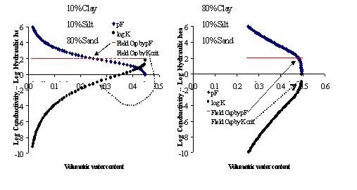 |
| **Figure 3.4.** Relations between soil water content (X-axis), hydraulic head (expressed as pF or -log(head) -- positive Y axis) and unsaturated hydraulic conductivity (negative Y axis) for a dandy (left) and a clayey (right) soil, based on the pedotransfer function used in Wanulcas.xls; two definitions of 'field capacity' are indicated: one based on a user-defined limiting hydraulic conductivity, and one based on a depth above a groundwater table, defining a pF value; in the model the highest value of the two for each layer and zone will be used to determine maximum soil water content after a heavy rain event. |

#### Temperature

Soil Temperature data are used to modify soil organic matter
transformations. They can be entered as:

A. \[Temp_AType = 1\] a constant (Temp_Cons) ,

B. \[Temp_AType = 2\] as a table with monthly average values
(Temp_MonthAvg), or

C. \[Temp_AType = 3\] as a daily values (Temp_DailyDat) linked to a
sheet 'Temperature' in the **Wanulcas.xls** spreadsheet

Air temperature data through C_Topt and C_Tmin parameters are used to
modified the length of cropping season. Current default values for air
temperature ensure the length of cropping season = Cq_TimeVeg +
Cq_TimeGen as specified on **Wanulcas.xls**.

#### Potential evapotranspiration

There are 2 options for the potential evapotranspiration rate: for
Temp_EvapPotConst? = 1 a constant value is used throughout the
simulation (Temp_EvapPotConst), while Temp_EvapPotConst? = 0 a daily
value (Temp_EvapPotDailyData) is read from the excel spreadsheet. This
can be calculated, for example from a (modified) Penman-Monteith
equation or thornthwaite equation on the basis of climatological data
for the site.

In this version 4.0, WaNuLCAS has elaborated estimation of daily
potential evapotranspiration based on thornthwaite equation with air
temperature and day length as its main inputs.

The potential rate of evapotranspiration is used to drive evaporation
from canopy interception water (whenever present), trees and crops (but
limited by plant water stress if present), dead wood piles on the soil
after a slash event and finally by the soil (if any demand is
unsatisfied as yet).

#### Rainfall

Rainfall data can be either generated within WaNuLCAS, or be obtained
from an Excel spreadsheet. Setting the ‘Rain_AType’ parameter makes the
choice:

1 = Tabulated daily rainfall records from an external file.

2 = Random generator based on monthly data using rainfall simulator

3 = Random generator based on heavy and light rainfall data

4 = Monthly average tabulated data (with given probability of daily
rainfall and normal random variation around the average values)

The four options are summarized in Table 3.3.

For choice 1, the data should be copied to sheet 'rainfall' to column 3
of a spreadsheet with name **Wanulcas.xls**. This spreadsheet has in
column 1 real dates (optional), in column 2 days {1...end} and in column
3 {rainfall in mm/day}. Alternatively, a new **STELLA** link can be
established between the 'Rain data' table in WaNuLCAS and another
relevant spreadsheet. Missing data should be addressed outside of
WaNuLCAS.

If the user would like to use a different rainfall generator, the
easiest way would be to generate rainfall data outside of WaNuLCAS copy
the results to the Wanulcas.xls spreadsheet and set Rain_AType to 1.

For choise 2, number of parameters (Appendix 7) is needed to run this
rainfall type. A help file to generate these parameters is available in
excel file. This rainfall type generating daily rainfall data based on
common ‘Markov chain’ way, which basically consists of two steps: i)
simulating rainfall occurrence, i.e. determining whether or not a day is
a rainy day or not, and ii) for rainy days, determine the amount of
rainfall (Appendix 10).

For choice 3, six parameters are needed: the probability of rainfall on
a given day RainPday), the probability that rainfall is of type 'heavy'
rather than 'light' (Rain_HeavyP), the boundary value of heavy and
lighrt rains (Rain_BounHeaLi), the average value of 'light' and 'heavy'
rains (Rain_Light and Rain_Heavy) and a coefficient of variability for
heavy rain (Rain_CoefVar). Light rain is truncated from a normal
distribution with 0.5 as minimum and Rain_BoundHeaLi (default 25 mm) as
maximum value, heavy rain is truncated with Rain_BoundHeaLi as minimum.
The standard deviation for light rains is as a standard input at 5 mm
(but can be modified inside the equation for **STELLA** users).

### **Table 3.3.** Three options for deriving daily rainfall values.

[TABLE]

For choice 4, tabulated monthly averages are entered in
'Rain_MonthlyTot’. Daily rainfall is derived from a normal distribution
around this average value, with a standard deviation defined as
coefficient of variation.

$`Rain = max(0,Rain\_ Today)xNormal\left( \frac{Rain\_ MonthTot}{30xRain\_ DayP},\frac{Rain\_ CoefVarxRain\_ MonthTot}{30xRain\_ DayP},RainSeed \right)`$
**\[6\]**

The 'Normal' function in **STELLA** has three arguments: mean, standard
deviation and seed. We protect against negative rainfall values for
obvious reasons.

The linked data for option 1 and tabulated monthly data in option 4 may
start at any 'day of year' before the simulation starts. They are read
via Day of Year' variable Rain_DOY = Mod(Time + Cq_DOYstart, 365). For
option 1 one can start at any year of the climatic data set by
specifying Cq_YearStart (one should be careful not to have the
simulation start before or extend beyond the rainfall data set in such a
case. It is possible to repeatedly use the rainfall data for a single
year for a multiyear run (RainCycle? = 1), or to read multi-year data
from the Excel spreadsheet run (RainCycle? = 0). One would normally
start reading rainfall data at year 0; if one wants to start at a later
point in the data set, the parameter Cq_YearStart has to be adjusted.
The Rain_DayP values are given as a monthly tabulated function of Day of
year.

#### 

#### Canopy interception of rainfall

Part of any rainfall event will not reach the soil surface because the
tree or crop canopy intercepts it. This interception process has been
included on the basis of a maximum water storage capacity of the tree +
crop canopy, calculated as a thickness of water film times the leaf area
index (ignoring water stored on stem surfaces). Water will evaporate
from this intercepted layer at a speed equal to the potential
evapotranspiration rate, with priority over crop and tree transpiration
or soil evaporation.

#### Soil redistribution on slopes 

Soil particles can get detached during rainfall events, move along with
surface runoff water and may get entrenched or filtered out where the
waterflow slows down on a rough surface or encounters a zone of high net
infiltration rates. Soil particles can also be moved by soil tillage
(section 3.10.8), especially by ploughing. The amount of soil particles
leaving the border of any measurement area is a balance of the amount
entering it from above, plus the amount of soil starting to move within
the area, minus the amount filtered. A process level description of such
events should consider a time scale of minutes (or less) and deal with
considerable heterogeneity in conditions at the soil surface. For
WaNuLCAS we've chosen for a more aggregated description, in line with
the daily time step, but maintain:

$`Soil\_ outflow = (1 - filterefficiency)x(soil\_ inflow + soil\_ stirredup)`$
**\[7\]**

where the filter efficiency is expressed as fraction of the soil moving.
For a typical situation with contour hedgerows (or other vegetative
filter strips), we can allocate most of the filter effect to 'Zone 1',
while soil cover in all zones modifies the amount of soil stirred up.

A further simplification, although not strictly necessary for the model
to function, is to assume that at any time the soil surface is
approximately a plane within the zones considered. The main issues then
are:

1.  how does the soil slope change over time,

2.  how much is the net outflow from one simulated land unit,

3.  how are the properties of the topsoil modified in each zone due to
    the soil movement and filter effects.

*Change of slope*

We want to derive the terrace height h_(x) and the final slope (h'/w)
from the initial_slope (h/w), the amount of soil moved and the amount
lost. We first assume that the position of point A is fixed and that
soil accumulation (terrace formation) can increase the level to point A'
but not decrease the level. From Fig. 3.5 we can see that:

|  |  |

| **Figure 3.5.** Terminology for describing change of slope: ignoring the soil below the boundary A-B which will not be affected by the changes and assuming that the bulk density of the soil is constant, the redistribution process modifies the triangle A-B-C (with a width w, a height h and a slope-length s) into the polygon A-A' -C'-B (with height h' and slope length s'), plus the soil loss which is proportional to A'A\*C\*C', or wh\*; the triangle AA\*O is equal to OCC\* | 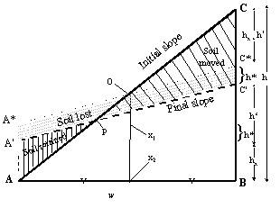 |

$`h = 2\left( h_{x} + h^{*} \right) + h'`$ **\[8\]**

$`\frac{Soil\_ lost}{bulkdensb} = ABC - {AA}'C'B = A'AxCxC' = hxw`$
**\[9\]**

$`\frac{soilretained}{bulkdensb} = \frac{(Soil\_ moved - Soil\_ lost)}{bulkdensb} = {AA}'P = \left( \frac{h_{x}}{\left( h_{x} + h^{*} \right)} \right)AA\ x\ O = \left( \frac{hh_{x}}{\left( h_{x} + h^{*} \right)} \right)\left( {AA}^{*}X_{1}X_{2} + A^{*}{OX}_{1} - {AOX}_{2} \right) = \left( \frac{h_{x}}{\left( h_{x} + h^{*} \right)} \right)\left( \frac{\left( h - h' \right)w}{4} + \frac{h'w}{8} - \frac{hw}{8} \right) = \frac{\left( \frac{h_{x}}{\left( h_{x} + h^{*} \right)} \right)w\left( h - h' \right)}{8} = \frac{wh_{x}}{4}`$
**\[10\]**

Hence,

$`Terrace\_ height = h_{x} = \frac{4(Soi\_ moved - Soil\_ lost)}{(bulkdensbw)}`$
**\[11\]**

If Soil_lost = Soil_moved and thus Soil_retained = 0, this leads to
h_(x) = 0.

Combining \[\*x4\], \[\*x3\], \[\*x2\] and \[\*x1\] we obtain:

$`Final\_ slope = Initial\_ slope - \frac{(8Soil\_ moved - 6Soil\_ lost)}{\left( Bulkdens{bw}^{2} \right)}`$
**\[12\]**

If Soil_moved and Soil_lost are expressed in Mg, w in m, the model is
applied to a breadth b of 1 m and bulkdensity in Mg m⁻³, the final slope
in indeed dimensionless.

For the time being the effect of soil movement on the soil quality of
the receiving zones (soil C, N and P contents, soil physical properties)
are ignored, i.e. we assume the incoming soil to have the same
properties as the average of the receiving zone. This may cause
inconsistencies in the total C, N and P balance and will need further
attention in a future release.

The situation where point A is not fixed, can lead (in the absence of
filter functions) to a parallel decline of topsoil height, without
change in slope angle.

#### Soil erosion 

Soil erosion module applies to sloping land situation only. WaNuLCAS
uses ROSE (physical equation) equations to estimate soil erosion.
Tillage will affect soil erosion (see 3.10.8)

## Water balance

#### Soil water storage infiltration and evaporation

For the description of the soil water balance in soil-plant models a
number of processes should be combined which act on different time
scales (Figure 3.6):

1.  rainfall or irrigation (with additional run-on) and its allocation
    to infiltration and surface run-off (and/or ponding), on a
    seconds-to-minutes time scale,

2.  infiltration into and drainage from the soil via a cascade of soil
    layers, and/or via 'bypass' flow, on a minutes-to-hours time scale,

3.  subsequent drainage and gradual approach to hydrostatic equilibrium
    on a hour-to-days time scale,

4.  transfers of solutes between soil layers with mass flow,

5.  evaporation from surface soil layers on a hour-to-day time scale,

6.  water uptake on a hour-to-days time scale, but mostly during daytime
    when stomata are open,

7.  hydrostatic equilibration via root systems on a hour-to-days time
    scale, but mostly at night when plant transpiration is negligible,

8.  hormonal controls ('drought signals') of transpiration on a
    hour-to-weeks time scale,

9.  changes in macropore volume (and connectivity) based on swelling and
    shrinking of soils closing and opening cracks, and on creation and
    destruction of macropores by soil macrofauna and roots; this acts on
    a day-to-weeks time scale. Its main effect will be on bypass flow of
    water and retardation of nutrient leaching.

|  |
|----|
| 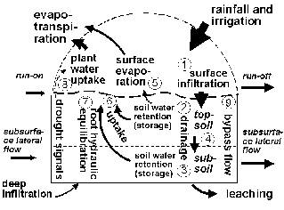 |
**Figure 3.6.** Elements of the water balance included in the WaNuLCAS model: 1. surface infiltration of rainfall, 2-4. Redistribution of water and solutes over the profile, recharging soil water content (2) and draining (leaching) excess water from the bottom of the profile, 5. surface evaporation, 6. water uptake by tree and crop roots, 7. hydraulic equilibration via tree roots, 8. drought signals influencing shoot:root allocation and 9. bypass flow of solutes. |

The WaNuLCAS model currently incorporates point 1...7 and 9 of this
list, but aggregates them to a daily time step; drainage to lower layers
is effectuated on the same day as a rainfall event occurred. An
empirical infiltration fraction (as a function of rainfall intensity,
slope and soil water deficit) can be implemented at patch scale. Between
the zones of the WaNuLCAS model, surface run-off and run-on resulting in
redistribution among zones can be simulated on the basis of a
user-specified weighing function for effective rainfall in the in the
various zones.

Upon infiltration a 'tipping bucket' model is followed for wetting
subsequent layers of soil, filling a cascade of soil layers up till
their effective 'field capacity'. Field capacity is estimated from the
water retention curve (see section SOIL above). In WaNuLCAS,
S_SeepScalar is an additional parameter (a constant value range 0 - 1)
that also control the amount of water that infiltrate to the deeper soil
layer.

Soil evaporation depends on ground cover (based on LAI of trees and
crops) and soil water content of the topsoil; soil evaporation now stops
when the top soil layer reaches a water potential of -16 000 cm.

A simple representation of by-pass flow is added, but only in its
effects on nutrient leaching (see 3.4.3). Dynamics of macropore are
described in section 3.3.7.

### **Table 3.4.** Water balance at patch level in WaNuLCAS.

| In | Out |
|----|----|
| Initial soil water content for all zones and layers | Final soil water content for all zones and layers |
| Patch-level run on | Patch-level run-off |
| Lateral inflow | Drainage from bottom of soil profile and lateral outflow |
| Rainfall | Soil evaporation |
| Irrigation (added as extra rainfall) | Evaporation of intercepted water |
|  | Transpiration by tree |
|  | Transpiration by crop |
|  | Transpiration by weed |

#### Water uptake

Water uptake by the plants is driven by their transpirational demand,
within the possibilities determined by roots length density and soil
water content in the various cells to which a plant has access.

The calculation procedure used by De Willigen and Van Noordwijk (1987,
1991) is based on an iterative procedure, solving the simultaneous
equations for soil + plant resistance as a function of flow rate, and of
flow rate as a function of the resistance’s involved. As this routine
can not be implemented as such in a **STELLA** environment, we chose for
an approximate procedure, where some of the feed-back is included on an
a-priori basis, and an other part is implemented in the next time step,
by keeping track of the plant water status inherited from the previous
day.

Plant water potential is calculated on the basis of soil water potential
(weighted average over all zones and layers on the basis of local root
length density, minus the potential to overcome root entry resistance if
full transpirational demand is to be met, and a term to cater for
expected soil resistance (estimated as 10% of soil water potential; a
more precise value is calculated in step 5 of the daily procedure – see
below)).

The sequence of events in modeling water uptake (Figure. 3.7), more
detail equations are presented in Appendix 5 and 11:

1.  Estimate potential transpirational demand E_(p) from potential dry
    matter production (an input to WaNuLCAS, derived from other models),
    diminished to account for the current shading and LAI, multiplied
    with a water use efficiency (CW_TranspRatio, again a model input,
    reflecting climate and crop type),

2.  Estimate plant water potential on the basis of the various
    resistances in the catenary process:

    1)  soil water potential as perceived by the plant (weighted average
    over all zones and layers on the basis of local root length
    density),

    2)  a term to cater for expected resistance between bulk soil in the
    voxel and the root surfaces (in the default situation initially
    estimated as 5% of soil water potential; a more precise value is
    calculated in step 5 of the daily procedure – see below)

    3)  the potential gradient needed to overcome root entry resistance if
    full transpirational demand is to be met

    4)  the potential gradient needed to overcome root axial transport
    resistance if full transpirational demand is to be met.

3.  On the basis of this plant water potential, calculate the
    transpiration reduction factor f_(p) on the basis of a function
    proposed by Campbell (De Willigen *et al.,* 2000),

4.  Use the reduced uptake demand f_(p) E_(p) to estimate the
    rhizosphere potential h_(rh) for all voxels i from the plant
    potential h_(p) minus the potential gradient needed to overcome the
    axial transport distance given the length of the pathway from voxel
    to stem base (Radersma and Ong, 2004),

5.  Calculate potential water uptake rates for all layers i on the basis
    of h_(s,i) and h_(rh) and their equivalent matric flux potentials F;
    the matrix flux potential is the integral over the unsaturated
    hydraulic conductivity and can be used to predict the maximum flow
    rates which can be maintained through a soil (De Willigen and Van
    Noordwijk, 1994), taking into account that the drier the soil the
    more difficult it is to move water through a reduced water-filled
    pore space

6.  Calculate real uptake as the minimum of demand (f_(p)\*E_(p)) and
    total supply (summed over all layers i) and allocate it to layers on
    the basis of potential uptake rates,

7.  Recalculate soil water contents in all layers i for the next time
    step.

8.  Calculate a 'water stress factor' from real uptake as fraction of
    potential transpirational demand; real growth is based on the
    minimum of the 'water stress' and 'nutrient stress' factor and
    potential growth.

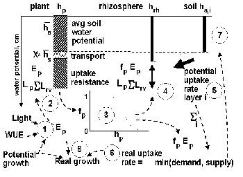

**Figure 3.7.** Steps (1…8) in daily cycle of calculations of water uptake; the interrupted arrows represent information flows. 

The procedure for water uptake is similar to that for nutrient uptake
(see below), but the transport equations are analogous in terms of
'matric flux potential' rather than soil water content. A further
complication for allocating water uptake is that plant water potential
may differ between roots of the various components in a given cell. In
the model the highest (least negative) is used first to share out
potential water uptake to all components, followed by additional uptake
potential for components with a lower water potential (Figure 3.8).

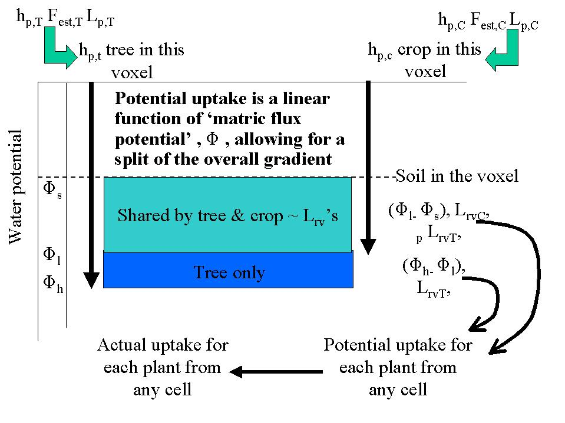

**Figure 3.8.** Diagram of sharing out available water by tree and crop.

The model in its current form does not include ‘drought signals’. It may
be possible to represent such direct effects of root-produced hormones
on stomatal closure by adding a relation between CW_PotSoil (the
averaged water potential around the roots of a crop) and the
CW_DemandRedFac, beyond their current indirect relation via
CW_PotSuctCurr.

#### Hydraulic lift and sink

An option exist to simulate hydraulic lift and hydraulic sink phenomena
in tree roots, transferring water from relatively wet to relatively dry
layers. The parameter W_Hyd? determines whether or not this is included
(0 = not, 1 = yes). Hydraulic continuity via root systems can lead to
transfers of water between soil layers, on the basis of water potential
and resistance. If the subsoil is wet and the surface layers are dry,
this process is called hydraulic lift (Dawson, 1993). The reverse
process, transfers from wet surface layers to dry subsoil is possible as
well and has recently been observed in Machakos (Kenya) (Smith *et al.*,
1998; Burgess *et al.*, 1998). Although the total quantities involved in
these water transfers may be relatively small, it can be important in
the competition between shallow and deep-rooted plants. Hydraulic lift
can re-wet nutrient-rich dry topsoil layers and thus facilitate nutrient
uptake. The reverse process, deep water storage by deep rooted plants
after moderate rainfall which only infiltrate into the topsoil, can
increase their overall resource capture vis-a-vis shallow rooted plants.

A general solution for the flux F_(i) into or out of each cell *i* is:

$`F_{i} = \frac{\sum_{j = 1}^{n}\frac{\Psi_{i} - \Psi_{2}}{r_{i}r_{j}}}{\sum_{j = 1}^{n}r_{j}^{- 1}}`$
**\[13\]**

where Ψ_(i) and Ψ_(j) refer to the root water potential in layer *i* and
*j*, respectively and r_(i) and r_(j) to the resistance to water flow
between the soil layer and stem base. This equation assumes a zero
transpiration flux at night.

A more detailed account of hydraulic equilibration through root systems
of crop or tree that connect relatively dry and relatively wet zones of
the soil was incorporated into WaNuLCAS. The process of ‘hydraulic
equilibration’ is driven by the existence of differences in water
potential among the layers (and zones) of a soil profile, and the
availability of a conductors in the form of root systems that are
connected to the soil.

Implementation requires the following steps:

1.  Estimation of equilibrium stem base water potential at zero flux,
    from the root-weighted average of the soil hydraulic potential in
    each cell; the proportionality factor consists of root length
    density and the volume of the cell as other proportionality factors
    cancel out in the equation.

2.  Derivation of the equivalent equilibrium volumetric soil water
    content in each cell on the basis of this stem base potential for
    each tree or crop type and the parameters of the pedotransfer
    function.

3.  Calculation of the amount of water involved in the difference
    between current and equilibrium soil water content (positive
    differences as ‘potential supply’ of water, negative ones as
    ‘demand’)

4.  Derivation of the potential flux as the minimum of a ‘cap’
    (‘HydEq_fraction that relates to soil transport constraints that may
    have to be calibrated to actual data -- default value is 0.1 day⁻¹)
    of the difference between target and actual volumetric soil water
    content, and a potential flux that is in accordance with the
    potential difference, the hydraulic conductivity of the roots, root
    diameter and root length density and the period of time available
    (based on the fraction of day that stomata are expected to be
    closed)

5.  Reductions on either the positive or the negative potential fluxes
    to be in accordance with a zero-sum net process, by calculating the
    minimum of the total potential supply and total potential demand,
    and scaling down the cell-specific differences such that total
    supply matches total demand.

6.  Implementing the resulting flux in or out of each cell on a daily
    time step basis and checking the consistency of the water balance
    for errors or inconsistencies.

For a ‘standard’ case of parklands (with parameterization for parkland
system in Burkina Faso as simulated by Jules Bayala) the implementation
leads to:

1.  A total hydraulic equilibration flux through tree roots that is 64%
    of the tree transpiration,

2.  Slight increases for processes that depend on topsoil water content:
    runoff, soil evaporation

3.  A 9% increase in crop water uptake

4.  A 22% decrease of tree water uptake (and 10% decrease in canopy
    interception)

5.  A 15% decrease in vertical drainage

These results are only moderately sensitive to the value (arbitrarily)
selected for the HydEq_Fraction; values above 0.5 may be unrealistic.

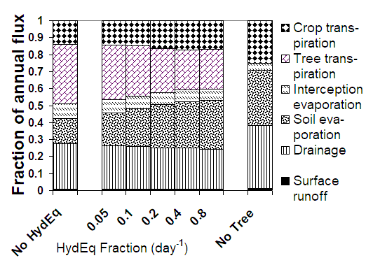

**Figure 3.9.** Impacts on the water balance of a parkland system with a
rainfall of approximately 750 mm year⁻¹ of the presence of trees and
inclusion of hydraulic equilibration in the model, for a range of values
of the (arbitrarily set) HydEq_Fraction parameter.

#### Implementing a lateral flow component into WaNuLCAS

Earlier versions of the model only considered vertical flow, but
evidence from the field experiments in Lampung indicates that even on
very mild slopes (4%) a lateral flow component is important (Suprayogo,
2000).

As the model operates at a daily time step, we can not give a detailed
account of equilibration and some simplifying assumptions are required:

1.  lateral flow is only supposed to occur when incoming water exceeds
    the 'field capacity' for a given cell in the model; during the
    lateral flow as well as vertical drainage we assume the soil to
    operate at saturated hydraulic conductivity,

2.  the amount of water leaving a cell in the model, either vertically
    or horizontally, is equal to the amount of water coming in from
    above (infiltrating rain in layer 1 and drainage from the layer
    above in other layers) + lateral inflow from the up-hill
    neighbouring cell - the amount of water it takes to recharge the
    profile to field capacity

3.  the amount of water flowing across any vertical or horizontal
    surface is the minimum of three quantities:

    - the amount available for flow (as defined above),

    - the amount that can cross the surface in a day, which depends on
      saturated hydraulic conductivity per unit area, the size of the
      surface area to be crossed, and the gradient (1 in the vertical
      direction, slope%/100 for the lateral flow), and

    - the maximum storage in, plus outflow out of the column below the
      cell (this is to avoid 'back logging' of water in a dynamic sense;
      the outflow in a lateral direction is ignored as it will normally
      be matched by incoming lateral flows)

4.  the allocation of total drainage out of a cell over vertical and
    lateral outflow is based on the relative maximum outflows, but
    lateral flow can be greater than its nominal share if another
    constraint on vertical flow so allows; if there is (still) excess
    water coming into a cell (as lateral inflow exceeds lateral
    outflow), it is allocated to the water stock in the cell, which can
    thus be above field capacity (the next day this will be reflected in
    a negative value of the potential recharge),

5.  lateral flow normally has no influence on the soil water content
    after the rain event (as the soil will return to field capacity
    everywhere), but it can have a major impact on the redistribution of
    nutrients.

Implementing sub-surface lateral flow required the following steps:

1. Splitting the excess (incoming - recharge) water for each timestep
    into a vertical and a horizontal flow component (**W1**)

  > The amount of water leaving a cell is apportioned over one horizontal
  > flow (to the left-hand neighbour) and one vertical one (to the lower
  > neighbour), on the basis of saturated hydraulic conductivity, gradient
  > in hydraulic head (difference in height of neighbouring cells divided
  > by their distance) and surface area through which the flow occurs:
  >
  > with:
  >
  > ${HydHeadHor}_{i1} = \frac{\left( {depth}_{i,1} - {depth}_{i - 1,1} \right)}{\left( {zonew}_{i} + {zonew}_{I - 1} \right)} + origslope$
  > **\[16\]**
  >
  > and for *j* \> 1 HydHeadHor_(ij) = origslope

2. Accounting for incoming water from above (rainfall in layer 1,
    vertical drainage from the layer above for the other zones), as well
    as laterally (**W2**)

> A ‘circularity’ problem arose when we tried to calculate the lateral
> flow out of zone 4 as input to zone 3 in the same soil layer. As a
> first approximation we made the assumption that the incoming lateral
> flow will **not** have an impact on the subsequent soil water content
> in a layer (which will return to field capacity if incoming rainfall
> is sufficient). This first estimate allows us to calculate an
> estimated drain volume from each cell, which is correct only for zone
> 4. In a next step, corrections are applied for zone 3, zone 2 and zone
> 1 in sequence, based on the knowledge of the real incoming lateral
> flows

3. Defining incoming lateral flow to the simulated zones for all layers
    (**W3**)

> We assume that the soil up-hill (beyond zone 4) of the simulated zones
> has similar properties to the soil in the 4 zones: it is assigned the
> average split over vertical and horizontal drainage found in the
> simulated zones (see W1), and the same rainfall per unit area. The
> total amount of water coming in is further set by the width of the
> area generating lateral flow, relative to the total width of the zones
> considered.

4. Calculating lateral flows of nutrients by multiplying amounts of
    water moving with the average concentration in soil solution, with
    an option for ‘by-pass flow’ of water without exchange with the soil
    matrix (**N1**)

> The equations followed the same logic as those for vertical leaching,
> but an option was provided that bypass flow may differ between
> nutrients already in the N stock of a cell ('matrix') and those in the
> current in-flow ('macropore'; this includes the fertilizer just added
> to the soil - if the first rain is mild it will get absorbed by the
> soil, if the first rainy day is a heavy rain, it may leach down or out
> quickly depending on the value used for the two by-pass flow
> parameters).

5.  Defining the incoming nutrient concentrations for the incoming
    subsurface flow (**N2**). The incoming nutrient concentrations for
    the incoming subsurface flow can be defined as a multiplier of the
    average concentration of drainage water within the simulated zones.

#### Run-on and run-off

Surface run-on and run-off are treated in a similar way, but here the
conductivity is supposed to be non-limiting as soon as the slope exceeds
0. A RunonFrac parameter determines which fraction of the run-off
generated uphill will actually enter the plot. The current routine
replaces the old one where the run-off fraction was directly defined
from the rainfall amount. In the new version a variable run-off fraction
can be simulated, depending on the water content of the soil profile.
Essentially two situations can lead to surface run-off:

- daily rainfall plus run-on exceed daily maximum infiltration rate (by
  setting these values one may try to compensate for typical rain
  duration per day),

- daily rainfall plus run-on exceed the potential water storage in and
  outflow from the soil column underneath the surface.

The first type of run-off is typically determined by properties of the
soil surface (such as crusting and hydro-phobic properties) and the
current infiltration capacity of the soil in the time available for
infiltration. The time available for infiltration depends on the
duration of the rainfall, the delayed delivery of rainfall to the soil
via canopy interception and dripping of leaves (+ stemflow), and the
rate at which water ponding on the surface will actually flow to a
neighbouring zone or plot. The latter depends on slope. Formally:

$`Rain\_ TimeAvForInf = Min(24,Rain\_ Duration + Rain\_ IntercDelay + Rain\_ SurfPondDelay)`$
**\[17\]**

With

$`Rain\_ Duration = \left( \frac{Rain}{Rain\_ IntensMean} \right)xmin\left( \max\left( 0,1 - 3xRain\_ INtensCoefVar,Normal(1,Rain\_ IntensCoefVar,Rain\_ GenSeed + 11250) \right),1 + 3xRain\_ IntensCoefVar \right)`$
**\[18\]**

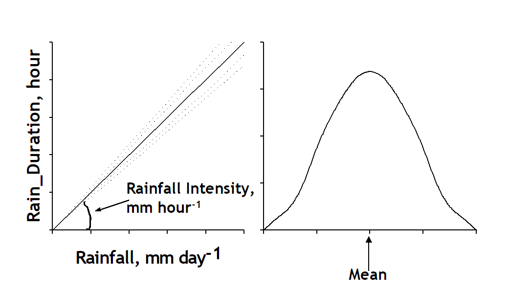

**Figure 3.10.** Rain duration that determine the time available for
water infiltrated to the soil. Rain duration calculated from rainfall
and rain intensity.

$`Rain\_ IntercDelay = min\left( Rain\_ Max\_ IntDripDur,Rain\_ IntMultx\frac{Rain\_ Interception}{Rain\_ IntercDripRt} \right)`$
**\[19\]**

where the factor IntercMultiplier indicates the maximum temporary
storage of water on interception surfaces divided by the amount left at
the end of the dripping stage, and the Drip_Rate is expresses in mm
hr⁻¹. Default assumptions are Rain_IntMult = 3, Rain_IntercdripRt = 10
mm hr⁻¹, Rain_Max_IntDripDur = 0.5 hr.

and

$`Rain\_ SurfPondDelay = \frac{Rain_{PondStoreCp}}{\left( AF_{SlopeCurr}xRain\_ PondFlwRtxAF\_ ZoneWidth \right)}`$
**\[20\]**

with default Rain_PondStoreCp = 5 mm, and Rain_FlwRt = 10 mm hr⁻¹ per m
of AF_ZoneWidth

The second type of run off is by the depth of the profile and the
saturated hydraulic conductivity of the deep subsoil.

Intermediate situations with sub-surface run-off may build up from 'top
down' (higher layers before deeper ones), or 'bottom up' (starting from
the subsoil), depending on the specific profile in saturated hydraulic
conductivities.

#### Subsurface inflows of water to plots on a sloping land

In WaNuLCAS 4.0 subsurface in-flows are derived from a ‘virtual’ soil
column uphill (Figure 3.11). This process is only functioning during
rainfall events, especially ones that saturate the soil and cause
overland or subsurface lateral flow. These are the times, however, that
the soil in the 4 zones is in similar ‘overflow’ mode. An important
additional type of lateral inflow may occur during dry periods, when
part of the horizontal groundwater flows may come within reach of the
roots in the simulated zones. A simple representation of such flows
makes use of a ‘stock’ of groundwater stored uphill, that depends on the
‘number of plots uphill’ as a scaling factor and the vertical drainage
calculated (Figure 3.12).

|  |  |

|  | **Figure 3.11.** General lay out of soil column uphill in WaNuLCAS model. |

#### Dynamics of macropore formation and decay

Formation and decay of macropores has consequences for the bulk density
of the 'soil matrix', as the mass balance of soil solids has to be
conserved. Compaction of the 'matrix' may increase the unsaturated
hydraulic conductivity of the soil, while the macropores themselves
greatly increase the saturated conductivity. If 'pedotransfer' functions
are used, the change in bulk density (and possibly soil organic matter
content) at constant texture can lead to predicted changes in water
retention and the unsaturated hydraulic conductivity in a simple way,
once the dynamics of macropores are predicted. Where macropores are
dominated by cracking, a description of the swelling and shrinking
properties is needed as function of soil water content. Where macropores
are dominated by roots, earthworms and/or other soil macrofauna their
population density and activity should be known, as well as the fraction
of macropores temporarily blocked by roots and the rates at which
macropores are back-filled by internal slaking of soils and/or
bioperturbation.

In WaNuLCAS 4.0 the option is provided for a dynamic simulation of
macropore structure. In the **Wanulcas.xls** spreadsheet, the user can
define an initial saturated hydraulic conductivity value that differs
(exceeds or is lower then) from the default value predicted by the
pedotransfer value. The pedotransfer value reflects a surface
infiltration rate in absence of soil biological activities. During the
simulation the value will tend to return to this default value, at a
rate determined by the S_BDBDRefDecay parameter. The pedotransfer value
is used as default, as it reflects measurements in small ring samples
without much effect of soil structure. Depending on the 'foodforworms'
provided by the structural and metabolic organic inputs (with
conversions set by the parameters S_WormsLikeLitStruct,
S_WormsLikeSOMStruc, S_WormsLikeLitMetab and S_WormsLikeSOMMetab,
respectively), and the relative depth impact of the worms on the given
location (the S_RelWorm_(depth) parameters determine the relative impact
for each soil layer and and S_RelWormSurf the impact on surface
infiltration), earthworms can increase saturated conductivity above the
default value, but this structure will gradually decay if not actively
maintained. With root type 2 during the simulation, anamount of root
decay allocated for ‘root channels’ by calculated root decay on a root
biomass basis converted to root volume, and multiplied by an estimate of
the fraction of roots that had formed new channels (as opposed to
following existing channels, macropores or growing over aggregate
surfaces) with conversions set by the parameters S_T_RootFormStrucFrac
and S_C\_ RootFormStrucFrac for tree and crop root respectively.

With the current structures in place the model is sensitive to
variations in saturated hydraulic conductivities (at least in certain
parameter ranges, depending on rainfall regime and soil water storage
parameters). It may be relatively easy now to make the saturated
hydraulic conductivity a dynamic property, e.g. inheriting a system of
old tree root channels from a preceding forest phase, with an
exponential decay of such channels and a rate of new formation by (tree)
root turnover and/or earthworm activity within the layers. Impacts of
soil biota on macro-structure of the soil can now be explored.

#### 3.3.8. Anaerobiosis effect

Under conditions of restricted soil drainage and/or exceptionally heavy
rainfall, temporary or medium-term water-logging of soil layers can
occur.

In Version 4 of Wanulcas, a water-logging module has been designed and a
switch to activate it has been created: **W_WaterLog? = 0 or 1.**

Where the standard description of water infiltration and drainage makes
use of the ‘field capacity’ concept for well-drained conditions, the
model can now allow soil water content in any zone and layer to exceed
field capacity, up to the total porosity of the soil. Adjustments of the
code were introduced to switch from a soil water deficit relative to
field capacity (difference between current soil water content and field
capacity of a given soil layer) as driver of soil recharge under
well-drained conditions \[21\], to a water deficit relative to water
saturated soil when the maximum outflow rate from a cell is less than
the inflow \[22\].

**W_WatDef***i* **\[Zone\]** =
W_FieldCap*i*\[Zone\]\*AF_DepthAct*i*\[Zone\]\*1000-W_Stock*i*\[Zone\]
**\[21\]**

**W_WatDefLog***i* **\[Zone\]** =
W_PoreVol\[Zone,*i*\]\*AF_DepthAct*i*\[Zone\]\*1000-W_Stock*i*\[Zone\]
**\[22\]**

Regarding the first soil layer, water inflow is due to surface
infiltration. The drainage of water from layer 1 into layer 2 \[23\] is
expressed as:

**W_EstDrain1 \[Zone\] =** if W_WaterLog? = 0 then
max(0,Rain_Infiltr\[Zone\]+AF_AccLatInFlowRatio\[Zone\]\*LF_Lat4Inflow1-W_WatDef1\[Zone\])
else
max(0,Rain_Infiltr\[Zone\]+AF_AccLatInFlowRatio\[Zone\]\*LF_Lat4Inflow1-W_WatDefLog1\[Zone\])
**\[23\]**

Changes were also made regarding the estimation of lateral flow \[24\]
and \[25\]. LF_MaxVInflow1 affects rain infiltration (Rain_Inf) in layer
1.

**LF_MaxVInflow1 =** if W_WaterLog? = 0 then
max(W_WatDef1\[Zone\]+min(LF_V1Max_DailyFlow\[Zone\],LF_MaxVInflow2\[Zone\]),0)
ELSE
max(W_WatDefLog1\[Zone\]+min(LF_V1Max_DailyFlow\[Zone\],LF_MaxVInflow2\[Zone\]),0)
**\[24\]**

**LF_AvgWatDef1 \[Zone\] =** IF W_WaterLog? = 0 then
AF_ZoneFrac\[Zn1\]\*W_WatDef1\[Zn1\]+AF_ZoneFrac\[Zn2\]\*W_WatDef1\[Zn2\]+
AF_ZoneFrac\[Zn3\]\*W_WatDef1\[Zn3\]+AF_ZoneFrac\[Zn4\]\*W_WatDef1\[Zn4\]
ELSE
AF_ZoneFrac\[Zn1\]\*W_WatDefLog1\[Zn1\]+AF_ZoneFrac\[Zn2\]\*W_WatDefLog1\[Zn2\]+n
AF_ZoneFrac\[Zn3\]\*W_WatDefLog1\[Zn3\]+AF_ZoneFrac\[Zn4\]\*W_WatDefLog1\[Zn4\]
**\[25\]**

The drainage from layer 2 \[26\] and from deeper layers takes into
account the hydraulic conductivity of the layer to allow the water to
drain below field capacity when the soil profile dries and water inflow
in the layer is less than its hydraulic conductivity at saturation
Ksat*i*:

**W_EstDrain2\[Zone\]** = if W_WaterLog? = 0 then
max(0,W_V1Drain\[Zone\]+AF_AccLatInFlowRatio\[Zone\]\*LF_Lat4Inflow2-W_WatDef2\[Zone\])
ELSE IF (W_V1Drain\[Zone\]+AF_AccLatInFlowRatio\[Zone\]\*LF_Lat4Inflow2)
\< S_KsatV2Act\[Zone\] then
max(0,W_V1Drain\[Zone\]+AF_AccLatInFlowRatio\[Zone\]\*LF_Lat4Inflow2-W_WatDef2\[Zone\])
ELSE
max(0,W_V1Drain\[Zone\]+AF_AccLatInFlowRatio\[Zone\]\*LF_Lat4Inflow2-W_WaterDefLog2\[Zone\])
**\[26\]**

These changes affect the prediction of surface runoff, as more water can
now be stored in the soil before surface runoff is triggered.

Water-logging affects soil microbial and plant-related activity
primarily through the complement ‘air-filled porosity’ which equals
total minus water-filled porosity. Empirical measures often find values
of 5-10% air-filled soil porosity as conditions where oxygen diffusion
become limiting to aerobic processes (details depend on degree of
vertical continuity of the air-filled pore space). **Soil**? processes
in WaNuLCAS that can be affected include: decomposition/mineralization
rates, nitrogen loss due to denitrification and associated N₂O
emissions, and root activity.

To quantify the intensity of anaerobiotic conditions due to
water-logging, a layer-specific anaerobiosis index \[29\] is calculated
as the ratio of the current volume of water above field capacity \[28\]
relative to the pore volume available above field capacity until
saturation \[27\].

**W_PoreVolAbFC \[Zn1,1\] =** W_PoreVol\[Zn1,1\]-W_FieldCap1\[Zn1\] +
(0\*(W_FieldCap2\[Zn1\] + W_FieldCap3\[Zn1\] + W_FieldCap4\[Zn1\]))
**\[27\]**

**W_WaterLog \[Zn1, 1\] =** if
(W_WaterfilledPoreF1\[Zn1\]\*W_PoreVol\[Zn1,1\])-W_FieldCap1\[Zn1\] \< 0
then 0 else
(W_WaterfilledPoreF1\[Zn1\]\*W_PoreVol\[Zn1,1\])-W_FieldCap1\[Zn1\] +
(0\*(W_FieldCap2\[Zn1\]+W_FieldCap3\[Zn1\]+W_FieldCap4\[Zn1\]+W_WaterfilledPoreF2\[Zn1\]+
W_WaterfilledPoreF3\[Zn1\]+W_WaterfilledPoreF4\[Zn1\])) **\[28\]**

**W_AnaerobiosisIndex =** if
W_WaterLog\[Zone,SoilLayer\]/W_PoreVolAbFC\[Zone,SoilLayer\] \< 0 then 0
else W_WaterLog\[Zone,SoilLayer\]/W_PoreVolAbFC\[Zone,SoilLayer\]
**\[29\]**

The ability of plant roots to maintain growth and uptake activity under
limited oxygen supply depends strongly on their internal aerenchyma or
air-filled porosity. Aerenchyma formation probably weakens the
mechanical penetration ability of roots and is restricted to wetland
plants; many plants, however, can create secondary air-filled porosity
of their roots when confronted with limitation in oxygen supply to their
roots. At a more detailed level, the responsiveness of root systems in
this respect depends on growth stage and exposure to low oxygen stress
in young plants can increase the likelihood that a plant survives such
stress at a later growth stage. The anaerobiotic stress causes root
mortality and therefore affects the root length density. An effective
root length density (Eq. 10) is hence calculated as the product of root
length density and the anaerobiosis index.

**Rt_TLrvEffi** = Rt_TLrvi \* W_AnaerobiosisIndexi **\[30\]**

In WaNuLCAS 4 the response of trees and crops to low values of the
air-filled soil porosity is therefore dependent on a species-specific
tolerance parameter expressed as the air-filled porosity below which
root activity become proportional.

Recovery/ time lag...

## Nutrient (nitrogen and phosphorus) balance

#### Nutrient inputs and outputs

WaNuLCAS release 1.1 only included a nitrogen balance. From release 1.2
onwards, an array 'nutrients' is used with nitrogen as first and
phosphorus as second array element.The equations originally developed
for nitrogen could be applied to the broader class nutrient, with a
number of exceptions which will be noted in the text. In the model,
interactions between N and P are only indirect, based on the interaction
of both nutrients with plant dry matter production and/or soil organic
matter transformations.

Nutrient inputs to each cell can be based on leaching from higher layers
(water flux multiplied with current concentration in soil solution,
assuming no bye-pass flow of water to occur). At the bottom of the soil
profile nutrient losses by leaching become non-recoverable. For the top
layer, inputs can consist of mineral fertilizer at specified times and
rates, and from the mineralization of organic matter (on the basis of a
process description similar to the Century model; Parton *et al.,*
1994). Total organic inputs are allocated to the various zones on the
basis of user-specified weighing functions.

### **Table 3.5.** Nutrient (nitrogen and phosphorus) balance at patch level.

| In | Out |
|----|----|
| Initial inorganic N or P stock in soil | Final inorganic N or P stock in soil |
| Initial organic N or P in SOM-pools | Final organic N or P in SOM-pools |
| N & P in lateral inflow | N & P in lateral outflow |
| Fertilizer N or P input | N or P leached from bottom of soil profile |
| N or P in external inputs or organic material | N or P in harvested crop yield |
| Atmospheric N fixation (only for N) | N or P in harvested tree components |
| N or P in crop planting material | Final N or P in crop biomass |
| Initial N or P in tree biomass | Final N or P in tree biomass |

#### Nutrient inputs

Nutrient (nitrogen or phosphorus) inputs consist of initial amounts in
mineral and organic N pools in the soil, initial stocks in the tree and
crop seeds, and inputs during the simulation from fertilizer, organic
inputs from outside and internal recycling of crop residues and tree
litterfall and pruning.

For fertilizer inputs setting the parameters Ca_FertAppYear,
Ca_FertAppDOY, Ca_FertAppRate\[Nutrient\] can specify the dates and
amounts. It is also possible to have two types of organic input as part
of management during simulation, Ca_ExtOrgInp. This would need
additional parameters to defined the lignin, pholyphenol, N and P
content.

#### Leaching

Leaching of N (and P) is driven by percolation of water through the soil
and the average concentration in soil solution. The latter is derived
from the inorganic nutrient stock, the soil water content and the
apparent adsorption constant.

An option is provided for flow of water through macropores (e.g.
earthworm or old tree root channels), bypassing the soil solution
contained in the soil matrix. A multiplier N_BypassMacro*i*\[Zone\] is
used in the leaching equation, which can get different values for each
zone and or layer, e.g. to study the effect of earthworm activity mainly
in the top layer of zone 1. Default value for N_BypassMacro*i* \[Zone\]
is 1, values less then 1 lead to bypass flow (retardation of nutrient
leaching), values above 1 to preferential flow (e.g. possible with
rainfall directly after fertilization).

#### Nutrient (N or P) uptake

The nutrient uptake procedure includes 8 steps (the numbers refer to
Figure 3.13):

***1) Target nutrient content***. The general flow of events starts with
the current biomass (dry weight). First of all a 'target N content' is
calculated from a generalized equation relating N uptake and dry matter
production under unconstrained uptake conditions (De Willigen and Van
Noordwijk, 1987; Van Noordwijk and Van der Geijn, 1996). The default
equation used assumes a 5% and 0.5% (or Cq_NconcYoung\[Nutrient\]) N and
P target in the young plant, up to a biomass of 0.2 kg m⁻² (= 2 Mg ha⁻¹)
(or Cq_ClosedCanopy) which may coincide with the closing of the crop
canopy, and a subsequent dilution of N in the plant, resulting in
additional N uptake at a concentration of 1% and 0.1%
(Cq_NConcOld\[nutrient\]). The parameters in this equation can be
modified for specific crops. Similarly, for the tree a nutrient target
is derived by multiplying the biomass in leaves, twigs, wood and root
fractions with a target N or P concentration(T_NLfConc\[nutrient\],
T_NTwigConc\[nutrient\], T_NWoodConc\[nutrient\], T_NRtConc\[nutrient\],
respectively.

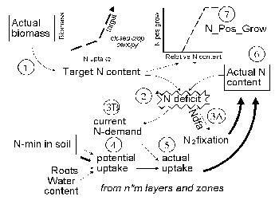

**Figure 3.13.** Major steps (explained in the text) in the daily cycle of calculating N uptake; a similar scheme applies to P uptake (without N₂ fixation, but with additional options for 'rhizosphere effects'. |

***2 & 3) Nutrient deficit***. The target N content is then contrasted
with the current nutrient content, to derive the 'Nutrient deficit'. The
N deficit can be met either by atmospheric N fixation, governed by a
fraction of the deficit on a given day (3a).

**\[31\]**

The fraction is a user-defined value NDFA (if N supply from the soil is
limiting the final percentage of N derived from fixation may be higher
then the NDFA parameter chosen - some calibration may be needed to get
realistic settings). The N-deficit not met by N fixation as well as the
P-deficit lead to Nutrient demand (3b) for uptake from the soil. To
avoid too drastic recoveries of uptake where nutrient supply increases
after a 'hunger' period, not all of the nutrient deficit can be met
within one day.

The fraction of the N deficit covered by the demand decreases with the
physiological age of the crop; at flowering (Cq_stage = 1) only 25% of a
deficit can be made up within one day and at full maturity (Cq_stage =
2) the uptake response has stopped. The parameters 0.5 and 2 used here
have no solid empirical basis, but there is sufficient evidence to
suggest that the responsiveness of uptake to past deficits does decrease
with plant development.

***4) Potential uptake***. Potential nutrient uptake U_(ijk) from each
cell ij by each component k is calculated from a general equation for
zero-sink uptake (De Willigen and Van Noordwijk, 1994) on the basis of
the total root length in that cell, and allocated to each component
proportional to its effective root length:

**\[32\]**

where L_(rv) is root length density (cm cm⁻³), D₀ is the diffusion
constant for the nutrient in water, θ is the volumetric soil water
content, a₁ and a₀ are parameters relating effective diffusion constant
to θ, H is the depth of the soil layer, N_(stock) is the current amount
of mineral N per volume of soil, K_(a) is the apparent adsorption
constant and R₀ is the root radius.

For P the same equation applies, but the apparent adsorption constant
(the ratio of the desorbable pool and P concentration in soil solution)
is not constant but depends on the concentration; parameters for a range
of soils are included in the parameter spreadsheet,

***5) Actual uptake.*** Actual uptake S_(ijk) is derived after summing
all potential uptake rates for component k for all cells *ij* in which
it has roots. Total uptake will not exceed plant demand. The effects of
crop N and P content on dry matter production are effectuated via
N_pos_grow\[nutrient\].

**\[33\]**

***6 & 7) N_Pos_Gro\[Nutrient\]***. Actual uptake and N₂ fixation are
both added to the actual N content (6) to complete the process for this
timestep. Actual N content of the plant has a feedback on plant growth
via N-PosGrow (7). The N-Pos-Grow parameter varies between 0 and 1. The
actual N content can stay 20% behind on the N target before negative
effects on dry matter production will occur (the N target thus includes
25% 'luxury consumption'); dry matter production will stop when the N
content is only 40% of the N target; between 40 and 80% of the N target
a linear function is assumed. The same function is used for tree and
crop N-Pos-Grow.

####  Effective adsorption constants for ammonium and nitrate

Two forms of mineral N occur in most soils, ammonium and nitrate, which
differ in effective adsorption to the soil and hence in leaching rate
and movement to roots. Microbial transformation of ammonium to nitrate
('nitrification') depends on pH, and relatively slow nitrification may
reduce N leaching from acid soils. Plant species differ in their
relative preference for ammonium relative to nitrate in uptake, with
only specialized plants able to survive on a pure ammonium supply; in
the current model version such effects are ignored and it is assumed
that the 'zero sink' solution for nitrate plus ammonium adequately
describes the potential N uptake rate for both crop and tree. In the
WaNuLCAS model a single pool of mineral N is simulated, but it can cover
both forms if a weighted average adsorption constant is used. The
potential uptake is inversely proportional to (K_(a) + Wtheta), while
the leaching rate is inversely proportional to (K_(a) + 1). Both
potential uptake and leaching are dirctly proportional to the Nstock, so
the sum over nitrate and ammonium forms of mineral N can be obtained by
adding N_FracNO3 times the term with K_(a) for nitrate plus (1 -
N_FracNO3) times the K_(a) for ammonium, where N_FracNO3 is the fraction
of mineral N in nitrate form.

An 'effective' apparent adsorption constant K_(a) for a nitrate +
ammonium mixture can be calculated as:

**\[34\]**

where X equals 1 for the leaching equation and WTheta for the uptake
equation.

In the current version of the model N_KaNO₃ and N_KaNH₄ are user-defined
inputs; in future they may be calculated form clay content and soil pH.
The parameter N_FracNO₃ is also treated as a user-defined constant for
each soil layer; in future it may be linked to a further description of
nitrification and be affected by the N form in incoming leachates in
each layer and selective plant uptake.

#### P sorption

In the model the sorbed + soil solution P is treated as a single pool
(Figure 3.14A), but at any time the concentration in soil solution can
be calculated on the basis of the current apparent absorption constant
K_(a); this way effects on K_(a) can be implemented separate from
effects on total labile pool size.

|  |  |
|----|:--:|
| **Figure 3.14.** A. Conceptual scheme of P pools in the soil as represented in the WaNuLCAS model and potential impacts of ash (A), heat (H) or addition of organics (O); B Example of relations between apparent P sorption and total amount of mobile P in a soil, using data from the database of P sorption isotherms for acid upland soils in Indonesia (names refer to the location, in the absence of more functional pedotransfer functions for these properties). | 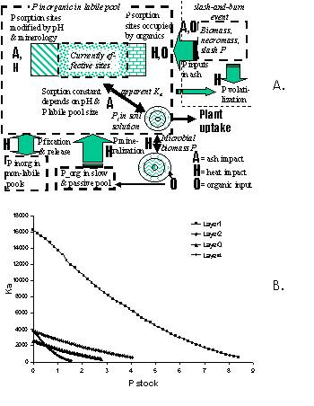 |

For P the apparent sorption constant K_(a) is a function of the amount
of mobile P in the soil. In the **Wanulcas.xls** spreadsheet examples of
P sorption isotherms are given for Indonesian upland soils (Figure.
3.14B) and Dutch soil types. The spreadsheet also gives a tentative
interpretation to soil test data, such as P_Bray, and translates them
into total amounts of mobile P, depending on the sorption
characteristics of the soil. This part of the model, however, is still
rather speculative. It is based on the assumption that during a soil
extraction (e.g. P_Bray2 or P_water) the effect of the extractant on
sorption affinity and the soil:solution ratio determine the amount of P
extracted from the soil, while non-labile pools do not interact with the
measurements. Following this assumption, the relation between a soil
test value such as P_Bray2 and the size of the labile pool does depend
on the sorption characteristics of the soil.

#### N₂ fixation from the atmosphere

The option exists for both crops and trees to represent atmospheric N₂
fixation as way of meeting the plant N requirement. The resultant
fraction of N derived from the atmopsphere (C_Ndfa or T_Ndfa) can be
obtained as model output and equals Nfix/(Nfix + N_uptake).

|  |
|:--:|
| 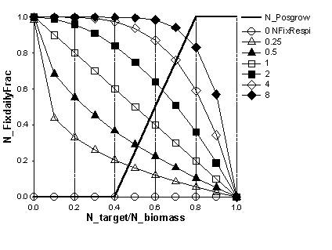 |
| **Figure 3.15.** Relation between relative N content and daily N₂ fixation as part of plant N deficit, if the N_fixVariable? parameter is set at 1. |

N₂ fixation is calculated as a fraction of the current N deficit on any
day. If the parameters C_NfixVariable? or T_NfixVariable? are set to 0
(= false), this fraction simply equals the C_NfixDailyFrac or
T_NfixDailyFrac parameters set as model input and does not depend on N
status of the plant, nor does N fixation have implications for the
energy (C) balance of the plant. The part of the N deficit not covered
by N₂ fixation drives the demand for uptake from the soil. If one wants
to obtain a certain overall NDFA result, the NfixDailyFrac parameter has
to be set at a lower (approximately half) value, depending on N supply
from the soil, as parts of the deficit not met by uptake from soil on a
given day will be included in the calculation for N₂ fixation on the
next day (in the extreme case of no N uptake possibilities from the soil
the overall NDFA will be 1 regardless of the . NfixDailyFrac parameter
setting, as long as this is \> 0).

If the parameters C_NfixVariable? or T_NfixVariable? are set to 1 (=
true), the fraction of the N deficit covered by N₂ fixation on any day
does depend on the N status of the plant and can be constrained by the
energy (C) balance of the plant via the 'growth reserves' pool (this may
implicitly lead to effects of water stress on N₂ fixation). These
parameter settings, however, are still in an experimental stage.

If the parameters C_NfixVariable? or T_NfixVariable? are set to 1, N₂
fixation will use resources from the GroRes pools and can be constrained
by the availability of these resources in the plant. A conversion factor
(DWcost for Nfix) is used to reflect the respiration costs associated
with N₂ fixation (roughly 0.01 kg DW per g N), and a maximum fraction of
the GroRes pool to be used for N₂ fixation (MaxDWUsefor Nfix) is
specified.

#### Special P mobilization mechanisms

Two further processes were added for P uptake:

- an 'immobile pool' was added to the model, reflecting the difference
  between total P and available P, and equations were added for a
  potential mobilizing effect of crop or tree roots on this pool; in the
  current version there is no (increased) reverse process when the roots
  disappear,

- roots may (temporarily) influence the adsorption constant in their
  local neighbourhood by modifying pH and/or excreting organic anions
  competing for P sorption sites; equations were added for such effects
  in proportion to the root length density of crop and tree roots; the
  benefits of a higher potential P uptake are shared over tree and crop
  on the basis of a 'root synlocation' parameter, reflecting whether the
  spatial distribution of crop roots in a soil compartment are such that
  they are mixed or occur in separate clusters. This determines the part
  of the benefits of rhizosphere modification that will accrue to the
  species directly influencing the adsorption constant.

The first process (which in principle could be used for nitrogen as well
(certain forms of root-induced N mineralization might fall under such a
description, although a further reconciliation with organic N pools
would be needed), and is governed by:

- N_Nutmob\[Nutrient\] or relative rate of transfer from the 'immobile'
  pool of nutrients to the 'mobile' or sorbed pool, due to processes
  other than root activity (day⁻¹);

- N_CNutmob\[Nutrient\] and N_TNutmob\[Nutrient\]Relative rate of
  transfer, per unit crop or tree root length density (cm cm⁻³), from
  the 'immobile' pool of nutrients to the 'mobile' or sorbed pool, due
  to root activity (day⁻¹ cm²)

The second process is governed by:

- N_CRhizEffKaP and N_TRhizEffKaP, the proportional reduction of the
  apparent adsorption constant for P due to root activity of the crop,
  expressed as fraction of N_KaPdef per unit crop root length density
  (day⁻¹ cm²).

- N_RtSynloc, the root synlocation, or degree to which roots of the crop
  and tree are co-occurring within the various soil layers, affecting
  the way in which benefits of rhizosphere modification are shared.

####  N₁₅ labeling

The standard version of WaNulCAS no longer includes the sector that
represents N₁₅ labelling (earlier used by Edwin Rowe in the context of
experiments in Lampung). On request, a new labelling sector was
constructed that allows N₁₅ in any of the 16 cells to be labelled and
that tracks the N uptake of crop and tree, plus the relocation within
the plant. The module does not yet include the vertical and lateral
transfers of labelled N in the soil, nor the soil organic matter or
litter layer pools.

#### Surface movement and incorporation of fertilizer

If there is heavy rainfall shortly after a fertilizer application,
fertilizer can move along with overland flow of water, and can leave the
plot in surface runoff. To simulate these processes (that can be
quantitatively important under specific circumstances), WaNuLCAS now
includes the process of dissolution of fertilizer grains and the lateral
flow of the remaining fertilizer grains. Dissolved fertilizer will wash
into the topsoil with rainfall, and/or can be mixed into the topsoil
with a soil tillage operation (similar to the litter -\> SOM transfer).
Runoff loss from the plot occurs out of zone 1 (and may take two days
with surface runoff if fertilizer is used in zone 2 but not in zone 1).

#### Green House Gas (GHG)

In a recent addition to the model, estimates of nitrogen oxide (N₂, N₂O,
NO) emissions are derived, on the basis of mineralization (the ‘hole in
the pipe’ conceptual model; Verchot *et al.,* 2004) and denitrification.
The form in which the gases emerge from the soil profile depends on the
water-filled pore space.

Methane (CH₄) absorption and emissions are closely linked to the
available pore space, as the entry of methane from the air into the soil
profile by diffusion tends to be the limiting step under dry conditions
and wet conditions can lead to net emission from the soil.

The basic for predicting GHG emissions or absorption in WaNuLCAS model
is:

1.  the daily value of the water-filled pore space, that depends on the
    soil structure (as influenced by the soil biological activity if we
    switch the soil structure dynamics to ‘on’), rainfall and water use
    by the vegetation,

2.  for N₂O emissions, the dynamics of net nitrogen mineralization as it
    depends on organic inputs in interaction with mineral fertilizer.

***Details for nitrogen oxides***

Nitrogen oxide (NO_(x)) emissions are estimated on the basis of the net
N mineralization according to Verchot *et al*. (1999), on the basis of
research on deep oxisols in Brasil. The partitioning over nitrous and
nitric oxide depends on water-filled pore space. To make it a complete
estimate of all gaseous N losses the N2 emissions are derived as
multiplier on the nitrogen oxide emissions, again depending on
water-filled pore space.

Verchot *et al*. (1998) derived:

NO_(x) flux (ng cm⁻² hr⁻¹) = 0.954051 \* NetMineralization - 0.093083
**\[35\]**

with NetMineralization from disturbed samples of the topsoil (10 cm) in
mg kg⁻¹ day⁻¹

The intercept in the equation creates negative estimates for net
mineralization rates less than 0.098 mg kg⁻¹ day⁻¹, or 0.0098 g m⁻²
day⁻¹ (35.8 kg ha⁻¹ year⁻¹). There were no data in this range in the
original data set, and no negative flux estimates, so we can assign a
zero value in this range, or look for an alternative model, without
intercept. Refitting the data, a power equation was derived that avoids
the intercept and may be safer for use at low mineralization rates:

NOx flux (ng cm⁻² hr⁻¹) = 0.7212\*NetMineralization^(1.1699)

(R² = 0.636 versus R² = 0.751 for the linear equation) **\[36\]**

In WaNuLCAS we have:

NetMineralization =
Mn2_SomMin1Exch\[Zone,N\]/(AF_DepthAct1\[Zone\]\*W_BDLayer\[1\])

> **\[37\]**

but this is actual; the disturbed samples during incubation may be
expected to be 1.5 times the actual.

From Verchot *et al*. (1999):

N₂O fraction =
(10^(0.030001\*100\*W_WaterfilledPoreF1\[Zone\]-1.446925)/

(1+(10^(0.030001\*100\*W_WaterfilledPoreF1\[Zone\]-1.446925))))

NO fraction = 1 – N₂O fraction **\[38\]**

At higher water-filled pore fraction a substantial part of the gaseous
emissions will occur as N₂, not measured in the GHG data set. As a first
estimate, we can assume that at 100% water-filled pore space (N₂O + NO)
form 5% of total emissions, while at 50% water-filled pore space they
are 95%. On this basis an N₂ part is added.

The Verchot equation only uses the net mineralization of the topsoil,
but was derived from whole-profile chamber measurements of emissions
regressed on top 10 cm net mineralization measurements. It thus implies
litter mineralization and deeper soil N mineralization and emission
processes for (N₂O + NO). The deeper layers may, however, contribute
substantively to the overall N₂ flux. As a first approximation we assume
that the total N₂ production from the layers below the topsoil has the
same relationship with net mineralization as specified above, but that
all comes out as N₂.

On this basis, a total gaseous N losses estimate is added to the N
balance, while data for predicted N₂O and NO emissions are available for
each of the zones in the model.

***Details for methane***

A midrange estimate for the methane oxidation rate in aerated upland
soils is 4 kg ha⁻¹ y⁻¹ (equivalent to 0.011 kg ha⁻¹ day⁻¹ or 0.0011 g
m⁻² day⁻¹), while emissions under wet conditions can reach a similar
level (Verchot *et al*., 2004). For the model we need one additional
parameter that defines the shape of the relationship between
water-filled pore space and net emission. Figure 3.16 provides examples
for a range of values of the Km parameter.

**Figure 3.16.** Methane flux (negative values indicate consumption,
positive ones emission) as a function of the water-filled pore space,
for a range of values of the GHG_CH4_Km parameter (a dimension parameter
relating to the difference in water-filled pore space (by decrease from
fully saturated soil) that causes a 50% change in net emission, within
the range defined by highest and lowest flux.

***An example***

For a simulation on a degraded soil with cassava production and a local
tree, we find the following response of gaseous N losses to
modifications of the measured rainfall (Figure 3.17):

**Figure 3.17**. Effect of total rainfall, as simulated by using
multiplier on daily rainfall amounts, on the gaseous N emissions from a
soil (specified over NO and N₂O), leaching and N export from the plot in
crop harvests over a 5 year period.

## Root distribution

####  Crop root length density

Three options exist for deriving the maximum root length density in each
cell:

**Rt_ACType = 0** user input of maximum root length density for each
layer *i* of zone *j*. Crop roots can grow and decay following a
predetermined pattern, by multiplying a tabulated function \[0,1\] with
this layer-specific maximum value. The maximum value may for example be
based on the amount of roots at time of flowering, with a tabulated
function describing root growth and decay as a function of crop stage
reaching a value of 1 for Cq_Stage = 1 and declining for 1\< Cq_Stage
\<2). Users can modify the form of the graph which (in version 1.1)
applies to all crops. Information on the relative root presence during a
crop growing season can be ontained from minirhizotron data and analysis
of sequential images.

**Rt_ACType = 1** crop root length density within each zone decreases
exponentially with depth:

 **\[39\]**

This function has two parameters:

- Rt_CLra(*i*) = total root length per unit area (cm cm⁻²), which may
  depend on zone*i* ;

- Rt_CDecDepth = parameter (m⁻¹) governing the decrease with depth of
  root length density (at a depth of 0.699/RtCDecDepth the root length
  density has half of its value at the soil surface). The RtCDecDepth
  parameter depends on the crop type, and may differ between zones*i*.

### **Table 3.6.** Options for deriving crop root distribution; in WaNuLCAS 4.0

[TABLE]

The function is evaluated for the half depth of each layer (average of
total depth of current and previous layer). The Rt_CLra(i) values as a
function of crop stage can be obtained by multiplying a maximum value
with a crop-stage dependent ratio (as for Rt_ACType = 0).

**Rt_ACType = 2** Uses the same exponential root distribution, but
involves a ‘functional equilibrium’ response (Van Noordwijk and Van de
Geijn, 1996), allowing the relative allocation of growth to roots to
increase when water and/or nitrogen limit plant growth. A simple
representation is included of ‘local response’ by which the vertical
distribution of roots is influenced by the relative success of roots in
taking up the most limiting resource in upper or lower layers of the
profile. Both responses are regulated by a parameter (Cr_RtAllocResp and
Rt_CDistResp, respectively) determining the degree of response. These
parameter are, however, not easily measured independently and the user
may have to explore a range of values. Functional as well as local
response can be ‘turned off’ by setting the responsiveness parameters at
0.

For Rt_AcType = 2, the value of Rt_CLra(*i*) is derived from root
biomass multiplied with C_SRL, the specific root length or root length
per unit dry weight (m g⁻¹). Root biomass is derived from daily
increments in plant biomass, multiplied with the root allocation
fraction Cr_RtAllocAct. The latter is calculated from a base-line value
Cr_RtAlloc, multiplied with a tabulated function of Cq_stage, and
potentially modified to account for functional equilibrium and local
response.Cr_RtAllocAct can be modified from Cr_RtAlloc by the minimum of
the current water and nitrogen stress in the plant, modified by the
parameter Cr_RtAllocResp, as indicated in Table 3.6.

Root decay is implemented by daily removing a fraction of
–0.69/Cr_RtHalfLife, where the latter is measured in days and can e.g.
be derived from sequential observations with minirhizotrons. In version
1.2 root turnover is **not** influenced by water or nitrogen stress, but
such a feedback may be included in future versions.

|  |  |

| 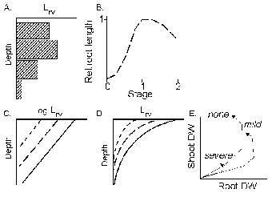 | **Figure 3.18.** Distribution and development of crop root length density; A. Arbitrarily set values of maximum L_(rv) per depth interval (Rt_ACType = 0); B. multiplier to derive daily actual L_(rv) from maximum values per layer (Rt_ACType = 0 and 1); C Exponential decrease of L_(rv) with depth (on log scale), D. *idem* (linear scale) (Rt_ACType = 1); E. Relationship between shoot and root dry weight under no, mild and severe water or N stress (Rt_ACType = 2) |

For Rt_ACType 2 it is also possible to modify the Rt_CDecDepth parameter
on the basis of current uptake distribution. The response is based on N
uptake if C_NPosGro \< CW_PosGro, and otherwise by water uptake. We
first calculated the relative depth of uptake, by the weighted sum of
depth of layer multiplied by uptake per unit root length. For relatively
high uptake success in deep layers Rt_CDecDepth will decrease, for
success of shallow roots it will increase. The degree of response is
regulated by Rt_CDistResp, as indicated in Table 3.6. When high values
of this responsiveness are chosen, the calculated change in root length
of an individual layer could exceed the total change in root length from
decay and new root growth. We prevent this, by capping off the change
based on the proportional change in total root length.

|  |  |

| 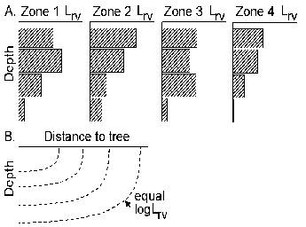 | **Figure 3.19.** Root length density distribution for tree; A. (Rt_ATType = 0) user input of root length density for each cell *ij*; B. (Rt_ATType = 1) tree roots distributed according to an elliptical function. |

#### Tree root length density

Four options exist for obtaining its value for each cell (zone \*
depth):

**Rt_ATType = 0** user input of root length density for each cell *ij*,
and

**Rt_ATType = 1** tree roots distributed according to an elliptical
function:

**\[40\]**

This function has three parameters:

- T_LraX0 = total root length per unit area (cm cm⁻²) at a distance X of
  0 from the tree stem

- Rt_TDecDepth = parameter (m⁻¹) governing the decrease with depth of
  root length density (for X = 0, at a depth of 0.699/DecWDepth the root
  length density has half of its value at the soil surface),

- Rt_TDistShape = dimensionless parameter governing the shape of the
  tree root system; values less than 1 indicate shallow-but-wide root
  systems, values of 1 give a circular symmetry, and values \> 1
  indicate deep-but-narrow root systems.

The function is evaluated for all four corners of each cell and a
logarithmic average is determined.

**\[41\]**

where the Lrv₀₀ .. Lrv₁₁ refer to the four corners. (In fact the
function is just evaluated once for an elliptically averaged position).

For **Rt_ATType = 2** a functional equilibrium and local response are
implemented, as for crop roots, regulated by T_RtAllocResp and
Rt_TDistResp. The main difference is that there is no dependence on crop
stage, and that the local response has a vertical (Rt_DecDepth) as well
as a horizontal (Rt_DistShape) component. Both are regulated by the same
Rt_TDistResp parameter.

**Rt­ATType** = **3** simulates fine and coarse roots. This option
describes the dynamics of fine tree root density in soil voxels (various
layers and zones of the soil) and the consequences for coarse roots
development to keep up with the transport demand. The dynamics of fine
roots is modelled using voxel automata rules. The allocation of fine
rootsto a voxel is based on current root length and its previous-day
uptake efficiency. A stand alone **STELLA** model is available to learn
more about this tree root dynamics option.

#### Specific root length of tree root systems

For **Rt_ATType = 2** we use (inverse) allometric equations to relate
proximal root diameters to total root biomass, and drive the specific
root length (length per unit biomass) as a function of this diameter
(compare section 3.8.4 for aboveground allometric equations.

 For a single branched root we can formulate for
biomass and length, respectively:

**\[42\]**

 **\[43\]**

For a root system consisting of a number of roots of different
diameters, we assume that the cumulative frequency distribution of
proximal root diameters can be approximated by:

**\[44\]**

where TProxGini is a parameter equivalent to a Gini coefficient as used
in studies of income distribution, and hence (using D in stead of
TProxDiam, a₁ for T_DiamRtWght1, b₁ for T_DiamSlopeRtWght, a₂ for
T_DiamRtLeng1, b₂ for T_DiamSlopeRtLeng and n for T_ProxGini):

 **\[45\]**

We can derive the total dry weight T_Root (Wt) from 42 and 44 as:

**\[46\]**

Similarly, for the sum of proximal root diameter squares, we obtain:

**\[47\]**

and the equivalent single proximal root diameter as the square root of
SumD_(r)².

Equations (36) and (37) can be used to derive the maximum proximal root
diameter D_(max):

 **\[48\]**

Relations between Wt and SumDr² can now be obtained as:

$`W_{t} = \left( \frac{\left( a_{1}n \right)}{\left( b_{1} + n \right)} \right)\left( \frac{sumD_{r}^{2}(2 + n)}{n} \right)^{b1/2}`$
**\[49\]**

and

**\[50\]**

Similarly, from (42) and (44) we obtain Rt_TLenght (L_(t)) as:

**\[51\]**

and from \[50\] and \[51\]:

**\[52\]**

Finally, the specific root length SRL is obtained as function of W_(t)

**\[53\]**

Equation (53) is used in the model.

#### Root diameter and mycorrhiza

Tree and crop are likely to differ in root diameter. As root diameter
has an effect on the potential uptake rate, an 'average' root diameter
in each layer and zone is needed for the uptake functin and a way to
estimate the equivalent effective root length of each component at such
a diameter. A simple approach is used in WaNuLCAS, based on De Willigen
and Van Noordwijk (1987) and Van Noordwijk and Brouwer (1997), comparing
roots of different diameter on the basis of the product of root length
and SQRT(root diameter); this method of averaging makes the uptake
function least sensitive to diameter (see Van Noordwijk and Brouwer,
1997; Figure 3.20)

**\[54\]**

Based on this rule for adding roots of different diameter on the basis
of the square root of their diameter, we can also get a first approach
to the effects of mycorrhizal hyphae. The total length of hyphae can be
derived from the fraction of roots that is mycorrhizal (Rt_MCInfFrac or
Rt_MTInfFrac), and the length of hyphae per unit length of mycorrhizal
root (Rt_MCHypL or Rt_MTHypL).

The effective root length then can be derived as:

**\[55\]**

which effectively converts the mycorrhizal hyphae into an equivalent
length at the diameter of the roots. This option is provided for both
crop and tree.

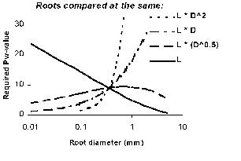 

**Figure 3.20.** Effect of root diameter on potential uptake when root systems of different diameter are compared at equal length, root surface area or volume (weight); the smallest effect of root diameter exists when root length times the square root of the root diameter is used (Van Noordwijk and Brouwer, 1997). 

## Light capture

Light capture is calculated on the basis of the leaf area index of the
tree(s) and crop (T_LAI\[tree\] and C_LAI) for each zone, and their
relative heights. In each zone the parameters T_CanLow\[tree\],
T_CanUp\[tree\], C_CanLow, C_CanUp indicate lower and upper boundaries
of crop and tree canopy, respectively. LAI is assumed to be
homogeneously distributed between these boundaries.

Light capture by the trees is separated in light captured by branches
(based on their vertical projection area in the ‘branch area index’ or
BAI) and leaves (based on leaf area index, LAI), while only the LAI part
of total capture is used by the plants. This option allows to account
for shading by trees when they are leafless, as *Faidherbia albida* is
during the crop growing season. The ratio of BAI and LAI depends on the
canopy architecture, leaf size and age of the tree. For older trees with
small leaf sizes BAI can be similar to LAI (Van Noordwijk and Ong,
1999).

The current approach has evolved from that in WaNuLCAS where only a
single tree plus crop component was simulated. In that case, three
strata were distinguished in the canopy: an upper one (with only one
type of leaves), a mixed one (with both types of leaves present) and a
lower one (with one only) (Figure 3.21).

If light capture of ***n*** plants is to be accounted for in the same
way, a total of ***2n-1*** canopy layers should be distinguished, with
all boundaries determined by either an upper or a lower boundary of one
of the components. In WaNuLCAS we chose, however, to use only ***n***
canopy layers, using only the upper bounds of the component canopies as
determinants. This choice means that for any plant type the light
capture above its canopy is correctly calculated, but in the sharing of
light within a canopy layer the calculations assume that all plant types
present in that layer have leaves spread evenly within that layer.

|  |  |

| 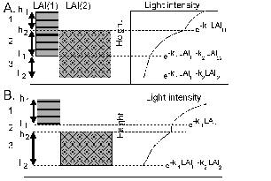 | **Figure 3.21.** Light capture in a two-component leaf canopy, as used in WaNuLCAS; three zones can be distinguished: an upper zone with only one species, a middle one with both and a lower one with only one (usually not the same as in the upper zone); total light capture in the shared zone may be apportioned relative to the leaf area index of both species in that zone (compare Kropff and Van Laar, 1993). |

|                               |
|-------------------------------|
| 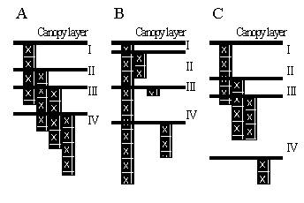 |
| 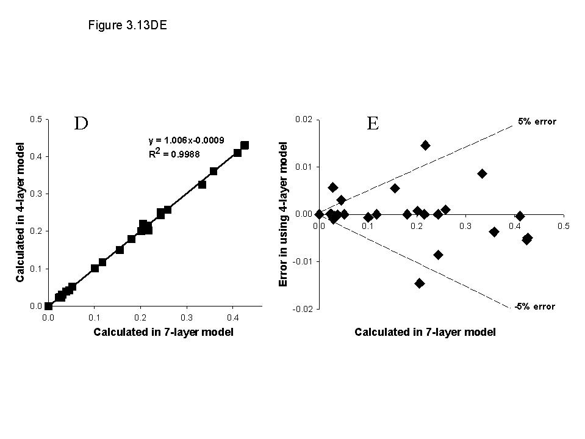 |

**Figure 3.22.** A, B and C Three examples of canopy distribution of
four plant types within a given zone and the way they are represented in
the canopy layers for calculating light capture; D and E Comparison of
light capture calculations per component (tree or crop) according to the
4-layer canopy model used in WaNuLCAS and that in a theoretically more
correct 7-layer model.

The errors made in this approximation are generally less than 1% of
incoming radiation, but under specific parameter conditions light
capture by a component can have a relative error of up to 25% (Figure
3.22)

Specifically, the following steps are taken in WaNuLCAS in the daily
calculations per zone:

1.  sort the four values (three trees plus crop) of upper canopy
    boundary (CanUp_(i)),

2.  calculate the canopy boundary values CanBound_(j) from these ranked
    values (for j = 1 take the highest, for j = 4 the lowest CanUp
    value)

3.  calculate the LAI of each plant component i in each canopy layer j
    by assuming the leaf area to be evenly distributed within its
    canopy:

> **\[56\]**

CanBound5 is assumed to be zero (any value smaller or equal to
min(CanLow*_(i)*) will give the same result).

4.  calculate total light capture in each canopy layer on the basis of
    Beer’s law for all components, starting at the top and accounting
    for light captured above the layer:

> **\[57\]**

where the kLLight_(i) and kBLight_(i) values represent the light
extinction coefficients for leaves and branches, respectively.

5.  share the light captured in a layer over the contributing
    components,

> **\[58\]**

6.  accumulate the light captured by each tree or crop over the various
    canopy layers.

Our choice for n rather than 2n-1 layers introduces an inaccuracy in
step 5 in as far as the lower canopy boundaries of the various
components within a layer do not coincide.

## Crop growth

#### Basic Relations

Major relationships in the daily cycle of calculating crop biomass
accumulation (Figure 3.23) are:

1.  calculation of crop leaf area index on the basis of shoot biomass,
    leaf weight ratio (LWR, leaf weight as fraction of total shoot
    weight) and specific leaf area\
    (SLA, m² g⁻¹),

2.  calculation of canopy height on the basis of biomass and
    physiological stage (assuming height growth to stop at flowering),

3.  calculation of the relative light capture on the basis of LAI of
    both tree and crop (see section 3.5),

4.  calculation of the potential growth rate of the crop for that day,
    by multiplying relative light capture with the light use efficiency
    (dry matter production per unit light captured) and maximum net
    growth rate (kg m⁻² day⁻¹), which is an input to the model and can
    be derived from more physiologically explicit models of potential
    crop growth under the given climate. The maximum net growth rate is
    supposed to include respiration losses for maintenance of existing
    tissues as well as for the formation of new ones. There is an option
    to specifically define maintenance respiration. This option enabled
    weed to be shaded by tree (see 3.7.3 on Maintenance Respiration)

5.  calculation of transpirational demand on the basis of this
    light-limited potential growth rate and a potential water use
    efficiency (dry matter production per unit water transpired), which
    will depend on the crop species,

6.  calculation of whether actual water uptake can meet this
    transpirational demand (see section 3.3); the factor CW_PotGro is
    determined as the ratio of actual water use and transpirational
    demand,

7.  calculation of the N limitations on growth on the basis of CN_PotGro
    (see section 3.4),

8.  calculation of real dry matter production as the product of
    C_PotGroRed and the minimum of CN_PosGro and CW_PosGro.

9.  calculation of litterfall, if the actual LAI of the crop exceeds the
    maximum (C_LAImax, which is crop type dependent), a proportional
    part of the stem and leave biomass is transferred to the litter
    layer.

|  |  |

| 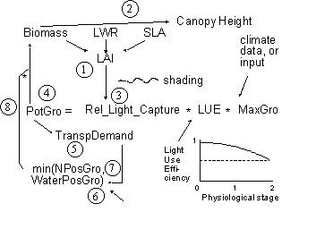 | **Figure 3.23.** Major relationships in the daily cycle of calculating crop biomass accumulation. |

The model thus assumes that under N deficiency crops keep their
potential transpiration rate, but have a reduced actual water use
efficiency (dry matter production per unit water use). Under water
stress, N uptake will be reduced as biomass accumulation slows down and
thus demand is decreasing.

#### Deriving stage-dependent potential growth rates and allocation to harvested organs for situations without shading, water or nitrogen deficiency

A number of the allocation functions depends on the 'physiological age'
of the crop. A basic length of the vegetative and generative stage is
given as model input (Cq_TimeVeg\[season\] and Cq_TimeGen\[season\],
respectively) for each crop. These values are used to re-scale time into
'crop-age'; for environments where temperature is a major variable, crop
development can be driven by a temperature sum rather than by time.

In WaNuLCAS the following allocation functions depend on crop stage:

- harvest allocation (Cq_HarvAlloc),

- specific leaf area (Cq_SLA),

- leaf weight ratio (Cq_LWR),

- relative light use efficiency (Cq_RelLUE).

These functions can be user-defined from experimental data of crops
growing in full sunlight in the local climate with adequate supply of
nitrogen and water, or from more detailed physiological models. Figure
3.24 and 3.25 give examples of basic allocation functions derived from
the Wofost model (data provided by Dr. P. de Willigen, AB-DLO Haren the
Netherlands), using climate data for Lampung (Indonesia) and 'standard'
parameter settings for cassava, (upland) rice, maize, groundnut and
cowpea. From data such as this taking the ratio of green leave and total
biomass can directly derive LWR. To obtain RelLUE the growth rate
(dW/dt) is divided by the estimated light capture (on the basis of LAI -
this calculation requires parameter values for SLA and light extinction
coefficient)

The sheet 'Deriving Crop Gowth' in the WaNHELP.xls spreadsheet takes the
following steps in converting output of a potential crop growth
simulation (daily predicted biomass in leaves, stems and storage
organ(or grain)), into the input parameters which are used in the 'Crop
Growth' spreadsheet.

**Input columns:**

DwLv\[time\]= leaves biomass in dry weight (kg ha⁻¹ day⁻¹)

DwSt\[time\]= stem biomass in dry weight (kg ha⁻¹ day⁻¹)

DwSo\[time\] = storage biomass in dry weight (kg ha⁻¹ day⁻¹)

SLA\[time\] = specific leaf area in m² g⁻¹

Cq_kLight = light extinction coefficient, as fixed value over time

**Derivations:**

DwTot\[time\] = total dry weight biomass = DwLv + DwSt + DwSo

GroMax = maximum daily increment in aboveground plant biomass =
max(DwTot) (kg ha⁻¹ day⁻¹)

LWR\[time\] = leaf weight ratio = DwLv\[time\]/(DwLv\[time\] +
DwSt\[time\])

TimeVeg = length of vegetative stage period = time of flowering or last
day before first value of DwSt is recorded

TimeGen = length of generative stage period = time to harvest - TimeVeg

Stage = Increased of plant growth stage = time/TimeVeg for time\<TimeVeg
and (1 + (time - TimeVeg)/TimeGen) for time ≥ TimeVeg

**Deriving apparent light use efficiency:**

Calculate daily increment in total dry weight (logarithmic average over
preceding and subsequentperiod):

BiomInc\[time\] = exp(0.5\*(ln (dDwTot/dt)_(preceding) + ln
(dDwTot/dt)_(subsequent))

Calculate daily relative light capture, the factor 10 000 converts from
ha to m²:

RelLightCap\[time\] = 1 - exp(-k \* DwLv \* SLA/10000)

Calculate relative daily growth per unit light capture (relative to the
maximum growth rate, which implicitly reflects the radiation level):

RelLUE\[time\] = (dDwTot/dt)/(GroMax\* RelLightCap)

**Deriving apparent remobilization from stems and leaves and allocation
to storage organs:**

Daily increment in storage organ: dDwSo/dt

Apparent remobilization from leaf and stem dry weight during generative
stage:

Remobfrac\[time\]= (dDwSo/dt - dDwTot/dt)/(DwLv + DwSt)

Value of Remobfrac which can be used for the whole growing season:
max(Remobfrac\[time\])

Daily allocation to storage organs:

HarvAlloc\[time\] = (dDwSo/dt)/((dDwTot/dt) + Remobfrac \* (DwLv +
DwSt))

|  |
|:--:|
| 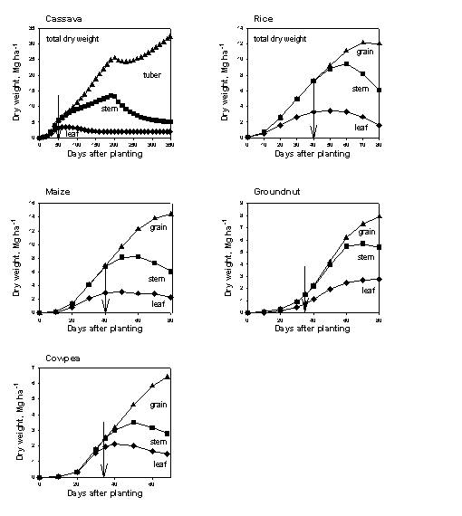 |
| **Figure 3.24.** Examples of basic allocation functions derived from the Wofost model using climate data from Lampung (Indonesia) and ‘standard’ parameter settings for cassave, (upland) rice, maize, groundnut and cowpea (data provided by Dr. P. de Willigen, AB-DLO Haren the Netherlands). Arrows denote the starts of generative stage (Cq_Stage=1). |

|  |
|:--:|
| 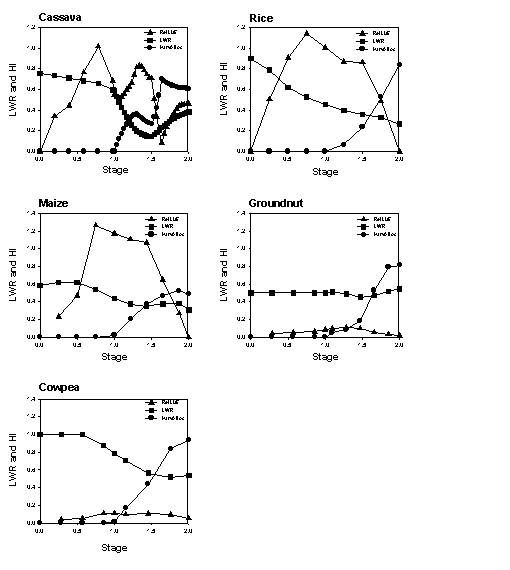 |
| **Figure 3.25.** Leaf weight ratio, harvest allocation and relative light use efficiency rate as a function of time for the model output of Figure 3.24. |

**Converting time-dependent variates into crop stage dependent ones:**

The derived parameters LWR\[time\], SLA\[time\], RelLUE\[time\] and
HarvAlloc\[time\] are now converted to crop-stage dependent equivalents:

To convert the data which may have unequal intervals into the
equal-interval format expected by **STELLA**, the stage dependent
variates are plotted in a graph with stage as X-axis. Manually we read
in values at constant intervals (helped by grid-lines in the graph) into
the columns Cq_CLWR\[stage\], Cq_CSLA\[stage\], Cq_CRelLUE\[stage\]
andCqCHarvAlloc\[stage\], respectively.

|  |
|----|
| 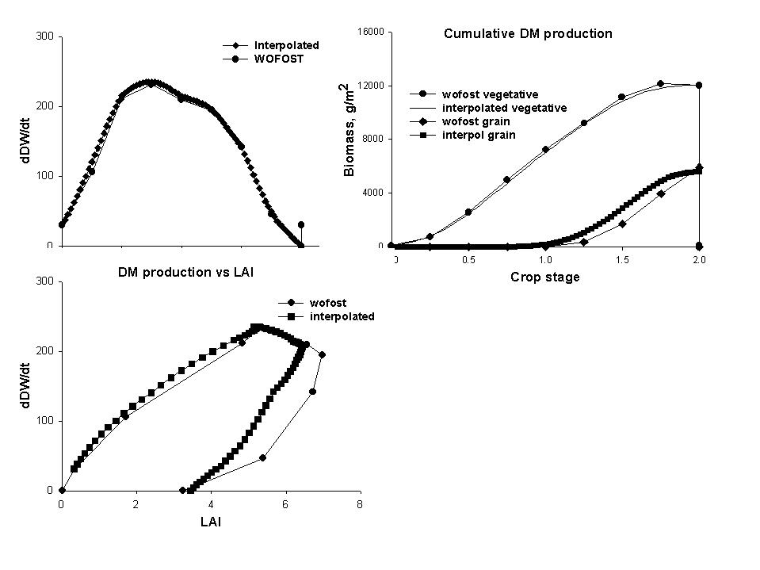 |
| **Figure 3.26.** Comparison of potential production as derived per 10-day interval from the WOFOST model, and the daily interpolated values derived in the Wanulcas.xls spreadsheet: A. daily growth rates, B. accumulative dry matter production, C. trajectory of the relation between growth rate and LAI. |

As illustrated in Figure 3.26 for maize, the daily interpolation does
not exactly match the Wofost input (based on 10 day recording
intervals), but errors in daily rates as well as cumulative amounts stay
within generally acceptable limits (5%); towards the end of the crop
development, however, the Wofost model (as well as proper field data)
show a decline in total dry weight as respiration exceeds
photosynthesis; in WaNuLCAS we do not explicitly represent respiration
losses or account for negative growth rates, but the losses are
accounted for by assuming a lower net growth rate in the preceding
period. This approach, however, leads to deviations in the harvest
index.

In WaNuLCAS a reverse procedure is used to derive the daily potential
growth rate (Cq_from the actual relative light capture (based on crop
LAI as well as shading) multiplied by Cq_RelLUE and Cq_GrowMax. \[This
assumes that potential growth rates are proportional to light capture\]

Effectively we allow the user to use this simulated data for modified
crop phenology (changes in TimeVeg and TimeGen) as well as modified
maximum growth rates, as simple ways to apply it to modified climatic
conditions. If large modifications are made it would be safer to derive
fresh inputs from a potential crop growth model for the new situation.

If no potential growth simulations are available, the user may enter
other types of estimates of the biomass of leaves, stems and storage
organs into the spreadsheet and otherwise follow the procedure outlined.

#### Maintenance respiration

Maintence repiration in WaNULCAS is specifically address the ability to
‘shading out weeds'. We use two additional concepts:

1.  maintenance respiration from the growth reserve pool, at a rate of X
    % of current biomass per day, that leads to a 'compensation point',
    or light level below which the crop will start to decrease in
    reserves,

2.  if growth reserves (dry weight) are zero the plant will die

We implement it by using the following additional parameters:

C_ApplyMaintResp? is a on/off switch for applying the maintenance
respiration; for a default value of 0 all the rest is ignored

C_RespPerBiomass is the relative use of resources for maintenance
respiration per unit biomass

C_RelRespRt is the relative weighting factor for roots as part of total
biomass as used for maintenance respiration

C_RelRespStLv is the relative weighting factor for stem&leaves as part
of total biomass as used for maintenance respiration

C_RelRespCurrHarv is the relative weighting factor for developing fruits
as part of total biomass as used for maintenance respiration

C_RelRespGroRes is the relative weighting factor for growth reserves as
part of total biomass as used for maintenance respiration

C_RespTemp is a graphical relation between temperature and maintenance
respiration

C_GroResMobFrac is the fraction of growth reserves that is used for
growth of plant organs such as stems&leaves on a daily basis

These parameters are set within the **STELLA** model and not yet part of
Crop Library in Excel.

## Tree growth

####  Tree growth stage 

For the trees a physiological growth stage is defined in the \[0 - 1\]
range for the vegetative stage up to the first flowering event, and in
the \[1 - 2\] range for flowering and fruit ripening. After fruit
ripeness the tree returns to stage 1 (rather than dies, as is the case
for 'annuals'). The parameters governing tree growth stage are:

T_TimeVeg - duration \[days\] of initial vegetative period before first
flowering

T_InitStage - tree growth stage at start of simulation

T_StageAfterPrun - growth stage to which trees are returned after a
pruning event

T_TimeGenCycle - duration \[days\] of a flowering - fruit ripeness cycle

T_FlowerDOYbeg - first day of year at which flowering can occur\
(provided stage = 1.0)

T_FlowerDOYends - last day of year at which flowering can occur

T_FruitAllocFrac - fraction of current growth resources in the tree
allocated to developing fruits

T_FruitHarvFrac - fraction of ripe fruit biomass and nutrients harvested
from the plot

When the trees are pruned, all fruit biomass is removed from the tree
and may be partly harvested from the plot, along with vegetative pruned
biomass, as governed by the T_PrunHarvFrac.

When the growth stage reaches 2.0, all fruit biomass is removed from the
tree, and the T_FruitHarvFrac part of it is harvested from the plot, the
remainder returned as mulch.

On a daily basis a fraction of the T_Fruit biomass pool can be removed
by frugivory and fruit abortion, as governed by
T_frugivory&abortionFrac, and returned to the soil as mulch.

#### Canopy and support structure

WaNuLCAS includes a simple description of canopy shape, aboveground
biomass production and litterfall; these rules are applied if the
T_ApplyFBARules? switch is put at 0. In the model, the calculated
aboveground tree biomass increment is first of all allocated to a buffer
of 'carbohydrate reserves' and is allocated from there to make:

- a canopy, consisting of leaves and small branches (\<2 cm diameter),

- a support structure, consisting of supporting branches and a trunk,

- replacement of leaves and branches transferred to 'litterfall'

**\[59\]**

The allocation over canopy and support structures depends on the size of
the tree. while litterfall is related to the development of 'bare
branches' in the support structure.

Within the canopy, the increment in leaf biomass is calculated from:

- LWR (leaf weight as fraction of total biomass in the canopy),

- SLA (specific leaf area, or leaf area per unit leaf weight).

> **\[60\]**

A half ellipse on a stick (forming an ‘umbrella’ approximates tree
canopy shapes, with as parameters:

- R, radius (half of the width),

- H, height (measured above the bare stem section); the canopy height
  consists of a green part and, above a certain total height, a bare
  section,

- S, shape, or ratio of radius and height of the half ellipse (or of
  width and total height of a full ellipse; S = R/H; S = 1 indicates a
  circle),

- LAI-canopy (leaf area index within the canopy), which can vary between
  LAI_(min) and LAI_(max).

- An alternative formulation that is activated when T_ApplyFBARules? = 1
  is described in section 3.8.4.

#### Daily cycle of calculations

The sequence of events during a pruning/regrowth cycle is illustrated in
Figure 3.27. In the first stages of regrowth after pruning, growth is
based on the carbohydrate reserves in the bare trunk which remained
after pruning and is thus dominated by the fraction which can be
converted daily. Once green leaves start to function, the carbohydrate
reserve pool can be replenished and growth rates can increase. At first
the canopy extends with a minimum LAI within the canopy, LAI_(min). Both
width and height can be calculated from the total leaf area, LAI_(min)
and the shape of the ellipse (which is assumed to be constant, but could
be made size-dependent if more specific data are available).

|                                                                      |
|:--------------------------------------------------------------------:|
|                    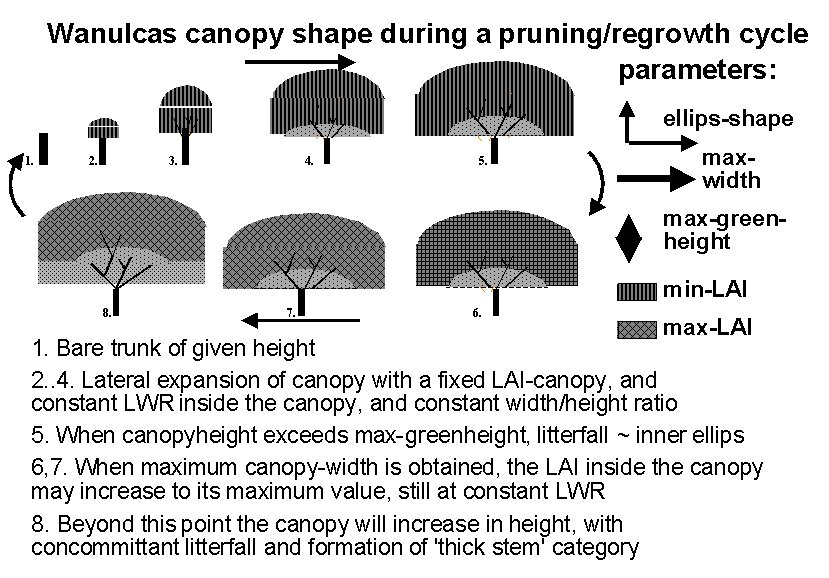                     |
| **Figure 3.27.**Tree canopy shape during a pruning - regrowth cycle. |

**\[61\]**

**\[62\]**

By the time the calculated canopy height exceeds the 'green-canopy
height', litterfall is supposed to start. New biomass production
continues to be allocated to leaves (T_LWR) and stems (1 – T_LWTR), but
only the stems is added to tree biomass and the new leaves are simply
replacing litterfall. If the maximum canopy width is reached, the canopy
can gradually increase in LAI from LAI_(min) to LAI_(max).

 **\[63\]**

If LAI_(can) reaches LAI_(max), the canopy will gradually move upwards.
All new leaf growth is offset by litterfall. The increment of
tree-height follows from:For the 'support structure' a tabulated
function can be used to allocate dry weight. Alternatively, allometric
equations based on fractal branching properties can be used (not yet)

Pruning events are described in section 3.10.7.

#### Tree diameter and allometric biomass allocation rules 

A number of allometric biomass equations (of the general form: Y =
aD^(b)) is commonly used to relate biomass in specific fractions (total
aboveground, leaves+twigs, branches, total belowground) or total root
length to the diameter of the main stem, or the equivalent diameter of
all proximal roots (for belowground application see section 3.5.3). The
spreadsheet 'Functional Branch Analsysis' (FBA) that is released as a
companion to WaNuLCAS provides a way to derive parameters of these
allometric equations on the basis of parameters that can be relatively
easily observed (without large scale destructive sampling).

In WaNuLCAS we use the general biomass - stem diameter relation in
inverse form to derive stem diameter from the total tree biomass as it
develops on the basis of the growth rules. The relation

**\[64\]**

can be inverted to obtain

**\[65\]**

Aboveground biomass of a tree may decrease, e.g. due to litterfall or
pruning, without causing a direct reduction in stem diameter. In
WaNuLCAS we therefore keep track of the stem diameter via the maximum
aboveground biomass obtained so far in the simulation. The T_StemDiam
parameter is used as indicator for the readiness for tapping latex in
rubber trees, and to drive allometric equations for other properties:

 **\[66\]**

**\[67\]**

**\[68\]**

If the T_ApplyFBARules? switch is on (value = 1), the transfer of dry
weight and nutrient resources from the canopy biomass to the T_Wood pool
is driven by the difference between T_TargetLeafTwig and current
T_CanBiom.

#### Tree phenology

In WaNuLCAS we treat the physiological water use efficiency (dry matter
production per unit water used, in situations without nutrient stress)
as a constant, to be specified for each crop type or tree species, but
not varying with plant age. The model predicts that this water use
efficiency will be reduced under nutrient stress, as such a stress
(beyond a tolerance limit) affects dry matter production but not water
use. The main differentiation in physiological water use efficiency
implemented so far is a generic difference between C3 and C4 crops.

Measurements of instantaneous water use efficiency at leaf level, e.g.
with IRGA equipment, generally show considerable variation in this
efficiency between individual leaves, partly linked to position of
leaves in the canopy and leaf age. During ‘ageing’ leaves tend to become
less efficient for a number of reasons. Where trees differ substantially
in average age of current leaves (e.g. in a comparison between trees
that are evergreen and those that regularly shed leaves in a dry or cold
season) a difference in ‘average leaf’ water use efficiency should be
expected. One step further would be to keep track of the average age of
current leaves in a canopy and assign a water use efficiency on the
basis of a generic ‘ageing’ function.

In calculating the average age of a leaves in a canopy we may simply
impose a phenological pattern on a tree based on the time of year that
leaf flush starts and litterfall is completed (either the same dates
every year, or differentiated according to weather records and e.g. a
temperature sum), or trigger these events by relations inside the model.
Since WaNuLCAS version 2.1 rules are included for a drought-induced
litterfall, with a minimum waiting period for leaf re-emergence if the
water stress disappears (e.g. as a consequence of reduced demand after
litterfall).

####  Cumulative litterfall

If the initial length of a link (section of stem or branch between two
branching points) is L_(min), and its initial diameter D_(min), a linear
increase of expected link length with diameter can be described as:

 **\[69\]**

If we may assume that the distance between branching points does not
vary with time or growth stage of the tree, an increase in distance
reflects branches being dropped. If L(D) = 2 L_(min) one branch will
have dropped, for L(D) = 3 L_(min) two branches etc.; from equation
\[59\] we can expect that for a diameter increment from D_(x) to D_(x+δ)
an additional number of branches of δa_(l) /L_(min) will be dropped
(ignoring the discrete character of these events and describing their
expected means for a population of branches). We may assume that the
branch dropped was the smaller one of the two branches at that branching
point, so it had a diameter of:

 **\[70\]**

where a and q are parameters of the fractal branching process.

The biomass of the dropped branches can be estimated from the overall
biomass equation Biom = BiomD1 D^(b) and the total biomass dropped can
now be derived by integrating from D = D_(min) to D = D_(max):

**\[71\]**

For any D_(max) value more then 2.4 D_(min) the error made when ignoring
the D_(min) term in the equation is ignored is less than 5% and for
D_(max) \> 3.7 D_(min) it is less than 1%. For cumulative litter fall
based on dropped branches with the leaves they originally carried, we
thus derive an approximate allometric equation with power b+1, if the
D_(min) term can be ignored. As the power of the cumulative litterfall
equation is higher that that for standing biomass, cumulative litterfall
will exceed standing biomass beyond a certain stem diameter (Figure
3.29A); the position of the cross-over point is (again, if the D_(min)
term can be ignored):

**\[72\]**

and is this independent of BiomD1 and decreases with increasing slope of
the link length diameter relationship a_(l) (if a_(l) = 0 there is no
litterfall).

From equation \[62\] we can derive the current litterfall for a small
diameter increment above D₀ as:

**\[73\]**

while allocation to the Biomass pool will be:

**\[74\]**

Thus, the relative allocation of new photosynthate to litterfall will
increase with D₀ according to the relative allocation to litterfall thus
approaches 1, posing a limit to the maximum size of a tree (Figure
3.29B).

 **\[75\]**

In the actual implementation of litterfall according to these allometric
rules, we take into account that actual litterfall e.g. due to drought
stress, can be ahead of the amount due according to equation \[62\]. If
so, new leaves and twigs can grow unimpeded until the former canopy
biomass is regained.

|  |
|----|
|  |
| **Figure 3.29.** A. Comparison of biomass and cumulative litterfall as a function of stem diameter comparing a numerical integration with results of eq.\[54\]; B. Relative allocation of current biomass production to litterfall as a function of stem diameter for a default parameter set and in situations where the slope of the biomass allometric equation is increased or decreased by 25%. |

#### Tree products

A number of tree products can be harvested and removed from the plot:

- tree prunings (e.g. for use as fodder), governed by T_PrunHarvestFrac

- fruits, governed by d T_FruitHarvIndex, fruiting itself governed by
  tree stage (see Tree Growth Stage)

- latex, coming directly from the T_GroRes pool; the model user can
  define a minimum tree diameter required for tapping and the fraction
  of growth resources harvested on a tapping day

- wood, governed by T_WoodHarvestFrac and T_WoodHarvDay

#### Oil palm growth 

A new option is available to simulate fruiting mechanism in oil-palm
(Figure 3.29). Palms differ from most dicotyledonous trees in a number
of ways that are relevant for the current model: they have a much more
rigid development pattern in which leaves are formed and emerge
continuously (rather than with the seasonality or flushing of many
trees), gradually forming a stem which normally does not branch and that
does not show secondary growth in diameter (as the leaf area supported
by the stem is virtually constant over time there is no need for more
transport or support tissue, but inversely, the lack of secondary
meristems in the existing stem can be a constraint on branch
development). Flowers are formed in axillary buds, one for every leaf
and have a long development trajectory that starts much before the
adjacent leaf emerges, and that includes phases where the sex of the
flowers is determined, in response to physiological conditions in the
palm. The long development phases from bud to flower to ripe fruit
causes a large number of developing bunches to be present on the same
palm, interacting in their demand for growth resources.

This general pattern applies to oil palm, coconut, peach palm and date
palm. For the sago and sugar palm, however, flower development is
delayed and the palm stores large amounts of internal resources; in sago
these are directly harvested (and the palms loose all their value in
years that the climate-related trigger for flowering is expressed), for
sugar palm the stored resources are intercepted on their way to the
developing flowers, once the palm starts to flower (and flowers develop
in a top-down sequence, opposite to their age).

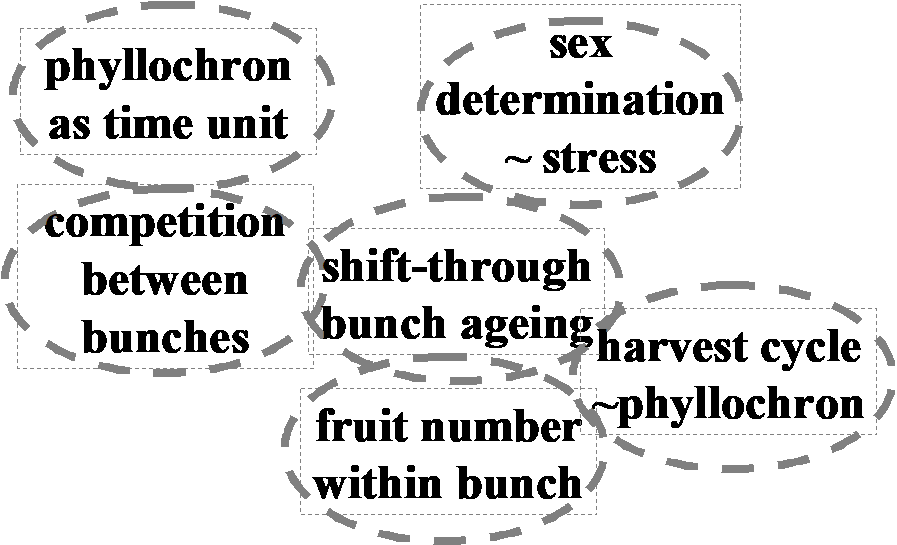

**Figure 3.30.** schematic map of the new tree fruit module developed to
represent palm fruit development in the various bunch stages.

Focussing on oil palm and leaving further model adaptations to other
palms for a later treatment, the following model elements were
identified for the model:

- ***phyllochron*** time keeping: the time interval between the
  emergence of two leaves, or phyllochron, determines the basic unit of
  time for floral and fruit development as well. For current oil palm
  germplasm a phyllochron unit is about 14 days.

- ***sex determination*** of flowers is related to the internal
  condition of the palm, based on its internal growth reserves, as well
  as in response to current water stress; as in the model the switch
  between male and female bunches is set at a single day, we do it on
  the basis of a moving average of the past water stress levels; because
  of the link with internal growth reserves the module can account for
  the tendency to male flowers caused by tapping for palm wine, as is
  common practice in W. Africa.

- ***simultaneous development and resource competition*** between the
  various male and female flowers and bunches present at any point in
  time, with an age-dependent relative sink strength,

- ***abortion*** of individual fruits in a bunch, in response to water
  stress,

- ***book keeping*** of the dry weight and fruit number individual
  bunches as they shift through the stages from flower to ripe bunches,

- ***harvest of one (potential) bunch at the end of each phyllochron
  unit.***

Figure 3.30 shows the palm oil module in WaNuLCAS, sink strength for
male and female bunches and the sensitivity to drought stress leading to
fruit abortion depend on bunch development stage.

#### Harvesting latex or resin from tress

Tapping rubber (*Hevea brasiliensis*) or jelutung (*Dyera costulata*)
trees for their latex, or *Acacia senegalensis* for its gum-arabic or
any other tree for its resin, implies a direct drain on the Growth
Reserves in the tree. WaNuLCAS can simulate the consequences for tree
growth and yield of products in the short and longer time frames, of
various intensities and frequencies of tapping. As implemented in
WaNuLCAS 4.0, the assumption is made that all N and P stay behind in the
tree and only dry matter is affected. The description is given here in
terms of tapping rubber, but the same routines could be used for other
tree products after adjustment of parameter values.

The conversion of Tree Growth Reserves (T_GroRes) into harvested product
is described as a two-step process: formation of latex and building up a
stock of latex, and the actual tapping (Figure 3.31). The first
conversion is controlled by inherent properties of the trees (T_Rubber?,
an on/off switch that is part of the tree library), and a dynamic
allocation fraction (T_LatexFormAlloc) that depends on a number of tree
parameters (than can be differentiated for rubber clones) such as a
maximum mobilization fraction, bark thickness and a saturation feedback
if the latex stock (T_LatexStock) approaches its maximum capacity
(Figure 3.32).

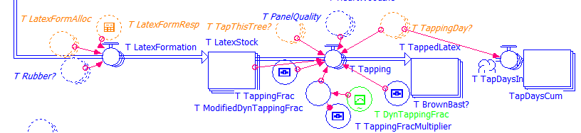

**Figure 3.31.** Latex formation diagram in WaNuLCAS model.

The second step, tapping into the actual tapping (T_TappedLatex) pool
can influence the rate of latex formation. There are a number of
controls here:

- Whether the tree has reached the minimum girth at which tapping starts
  (T_GirthMinforTappingcm),

- Whether the date matches the annual tapping period (e.g. avoid dry
  season and wettest period),

- Whether it is a ‘tapping day’, depending on the tapping schedule
  selected (T_TappingDay?) (Figure 3.33),

- Whether there is sufficient ‘tapping panel’ left (bark below the
  maximum tapping height that has not been tapped before, or has
  sufficiently recovered since an earlier tapping cycle, governed by a
  recovery rate) (T_PanelQuality) (Figure 3.34),

- Whether the panel is affected by the ‘BrownBast’ condition (a fungal
  infection) (T_BrownBast?),

Whether recent tapping events provided economically attractive returns
to labour (this is based on a comparison of labour investment, dry
weight of latex obtained and prices for a day of labour and a kg or dry
rubber). This function reflects farmer decisions to selectively tap as
long as it gives adequate yield or otherwise rest a tree and focus on
others in the same stand (T_TapThisTree?) (Figure 3.32).

| 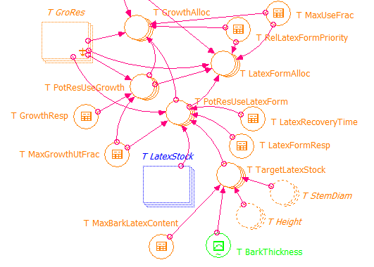 |
|----|
| **Figure 3.32.** Diagram that show number of tree parameter controls a dynamic of latex allocation fraction (T_LatexAllocForm). |

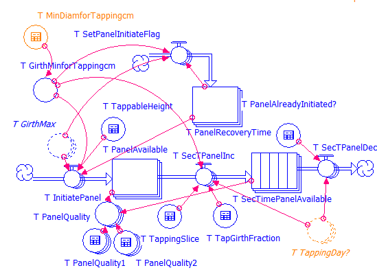

**Figure 3.33.** Diagram that show dynamic of available tapping panel
and its influence factors

The latter ratio is derived in a section of the model that also converts
the latex yield per tree to a dry weight of rubber per ha, using the
appropriate area scaling factor.

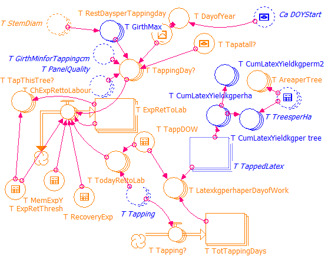

**Figure 3.34.** Diagram that show influence factors for tapping
schedule selected and farmer decisions to tap the tree.

This module has been developed as part of the PhD research of Dr. Yahya
Abdul Karim, and was paramaterized by him for rubber clone comparisons
in Malaysia.

## Carbon balance

#### Soil organic matter 

Total soil organic matter is supposed to consist of 'metabolic' and
'structural' pools in the recently added organic materials, an 'active'
(= microbial biomass), 'slow' and 'passive' pool. This terminology is
derived from the Century model. This part of the model was developed in
discussions with Dr. Georg Cadisch (Wye College, UK) and Dr. Andy
Whitmore (AB-DLO, the Netherlands).

In agro-ecosystems without soil tillage, a distinct litter layer
develops where much of the organic inputs decompose with little contact
with the mineral soil layers. The dynamics of C and N here can differ
substantially from that in the soil layers, as the 'physical protection'
mechanisms based on soil texture are absent, and temperature and water
dynamics differ. Incorporation of surface litter into the soil can be
the result of specific groups of the soil fauna, as well as of
mechanical tillage operations. Starting from version 2, WaNuLCAS
therefore represents the C, N & P pool dynamics for the litter layer
separate from SOM dynamics, using the Century pool descriptions for both
(all parameter names MC\_... and MN\_... refer to the litter layer,
names MC2\_.. and MN2\_... to the SOM pools). The texture, water and
(potentially) temperature controls differ between these layers. For N
immobilisation the litter layer has limited access to soil layer 1,
while all mineralization products arte delivered to layer 1. For the SOM
pools, a weighted averaged is made of layer 1...4 for all its relations
with soil water and N pools (including immobilization and
mineralization). The weighing factors for the soil layers are set at the
start of the model (but can be made dynamic if one wants).

An option is introduced to initialize on the basis of the Corg/Cref
ratio, where Cref is either derived from a pedotransfer function (Type =
2) or specified by the model user (Type = 3). The relative allocation of
Corg to the slow, active and passive pool is driven by the Corg/Cref
ratio for Types 2 and 3.

1.  for MC_SOMInitType = 1 the user can specify all pool sizes for all
    zones,

&nbsp;

2.  for MC_SOMInitType = 2 the user can specify the size of all pools
    relative to those for a forest soil (Cref) that is calculated from
    soil texture data,

3.  for MC_SOMInitType = 3 the user specifies the Corg and Cref
    directly, but otherwise follows the procedure of Type 2

Input streams of organic matter from crop residues, tree litterfall,
prunings and/or external organic sources supply 'metabolic' and
'structural' pools, by adding all C, N, lignin and polyphenolic contents
of all inputs on a given day. Century's distribution equation is then
applied to allocate these streams to metabolic and structural litter
pools. This represents a 'simple mixing' algorithm, without specific
interactions between residues.

Before the Century equations are applied, however, the total
polyphenolic content is supposed to immobilize N from the current
organic inputs and (if necessary) soil Nmin pool, into the 'slow' pool
of C and N. This equation can account for some of the non-linear effects
when residues with low and high polyphenolic content are mixed.

Immobilization of mineral N can occur where metabolic and especially
structural SOM pools are utilized by microbial biomass to make 'active
SOM', with a low C/N ratio and (for structural litter) 'slow SOM'.
Modifications were made here to the model (if we understand what the
Century handles this situation). The flow of C is driven by the
preceding C pool size and the relevant decomposition parameter k. This C
flow induces a parallel N flow on the basis of the C/N ratio of the
preceding and subsequent SOM pool.

If there is sufficient Nmin in the soil layer, this will be used to meet
the 'target' C/N ratio of the subsequent pool. If there is not enough
mineral N, however, to (fully) meet this demand the C/N ratio of the
subsequent pool will increase. This will have two effects:

1.  further transformations of SOM will slow down, and reach a halt
    where the microbial biomass has a CN ratio of 1.75 times the
    'target' value. The value 1.75 was suggested by Dr. Georg Cadisch.

2.  the SOM pools remain 'hungry' for mineral N and will re-stock their
    N content to meet the 'target' whenever mineral N becomes available
    in the soil again.

These modifications to the Century model are mainly relevant at
relatively small time scales (less than the yearly time steps for which
Century was designed). The model can now potentially account for the
rapid disappearance of mineral N into the soil after fertilizer N
additions, while such fertilizer may become available to subsequent
crops.

Apart from the freedom to set parameters, a number of options on model
structure was built into WaNuLCAS:

The k values driving the SOM-C and SOM-N transformations are a function
of clay content and soil temperature as in the Century model, and an
additional reduction based on soil water content. For example, for the
active pool the k value is calculated as:

 **\[76\]**

where the 0.14 and 0.75 are the parameter values for the active pool
(other pools use different values but the same reduction factors). Make
sure that the value of silt and clay content used should be consistent
with the value used in deriving soil hydraulic properties.

|  |
|:--:|
| 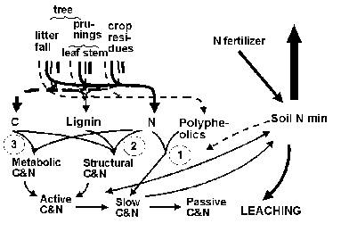 |
| **Figure 3.35.** Major relationships in N immobilization and N mineralization from organic residues; the basic C and N pools are similar to the Century model, but plant polyphenolics are added as litter quality parameter. |

#### Carbon stocks

An output table is provided which summarizes the carbon balance, similar
to the water, nitrogen and phosphorus balance sheets.

On the left hand side it includes all initial carbon stocks in soil,
crop and tree (with plant biomass converted into carbon units) and all
net daily photosynthesis by crop and tree. On the right hand side it
lists all final carbon stocks in soil, crop and tree, all carbon in
products removed from the plot and all carbon lost as CO₂ in soil
organic matter transformations. Plant respiration is implicit in the net
photosysnthesis and thus does not appear on the C balance sheet.

## Management options

#### Options for strategic and tactic management 

The WaNuLCAS model can evaluate a number of farmer management options.
These can be grouped in strategic decisions, to be made by a farmer
before crops are planted and by a modeler at the start of a simulation
and tactic management during a growing season, in response to actual
crop performance.

Strategic options include:

- Plot size and tree spacing,

- Choice of tree species as reflected in their functional parameters of
  canopy shape and branch allocation, root distribution under given soil
  conditions),

- Cropping cycle: crop types and planting dates.

- Predetermined pruning events

- Pre-determined tree final harvest and/or tree mortality

- Slash-and-burn events, including options to remove part of the wood
  before the burn,

- Building a fence around the plot

Tactical options represented in the model are:

- Tree pruning based on current tree and crop status,

- Use of fertilizer and organic inputs and their distribution over the
  zones,

- Crop residue removal,

- Maintaining the fence.

At this stage only two types of plants are considered and thus we imply
that there are no weeds. The equations for resource sharing and
competition are set up in such a way that the model can be extended to
an n-plant interaction and different plants can share a zone in the
model, above as well as belowground.

#### Slash-and-burn events 

A number of 'Slash' events can be defined in the event calendar, by
specifying the S&B_SlashYear and S&B_SlashDOY tables. Slash events
transfer all current aboveground biomass in tree, weed or crop pools to
the S&B_Necromass pool. This refers to the dryweight, N and P contents
of these pools. From the S&B_Necromass a fraction can be transferred
daily to the surface litter pool, as set by the
S&B_DailyNecromLittTransf parameter, where it will follow century-model
based transformations of C, N and P pools. The S&B_Necromass pool will
intercept part of any rainfall events, replacing the role played
previously by tree and crop biomass, and the subsequent evaporation from
the 'Rain_CanopyWater' pool will determine the moisture content of the
necromass. When this is below a set value ('S&B_CritWatContent') the
switch 'S&B_IsSlashDry?' will be turned on, allowing burn events to take
place, otherwise it is turned off.

Burn events are defined by specifying a minimum and maximum number of
days after the most recent 'slash' event. A fire event will be
implemented on the first day in this period that the signal
'S&B_IsSlashDry?' is on. During a burn event, the temperature increase
at the soil surface is calculated from the necromass + structural part
of surface litter, with corrections for their respective moisture
contents based on 'Rain_CanopyWater' and 'W_Theta1\[Zone\]'. Temperature
calculations need two parameters: 'S&B\_ FuelLoadFactor' and
'S&B_TempWetnessCorr'. The temperature increase in the topsoil is
derived from the temperature increase at the soil surface, modified by
soil water content of the topsoil.

Burn events can have impacts on a number of pools in the model, either
via the temperature at the soil surface or that in the top soil:

- reduction of surface necromass, surface litter and SOM pools, by
  S&B_NecromassBurnFrac, S&B_SurfLitBurnFrac and S&B_SOMBurnFrac,
  respectively,

- allocating all C of the burnt necromass to CO2, and 1 -
  S&B_NutVolatFrac of its N and P content to mineral nutrients at the
  soil surface,

- induce a (one-off) transfer from the immobile P fraction in the
  topsoil via S&B_FirIndPMobiliz

- induce a semi-permanent relative change of the effective P sorption
  via S&B_FirImpPSorption; a gradual return to the original P sorption
  value will be governed by S&B_PsorpRecFrac

- release cations into the topsoil from burnt necromass, leading to an
  increase of topsoil pH; this change of pH will modify the P sorption
  properties as well, with the overall effect obtained by multiplying
  the two factors,

- evaporate all soil water from the topsoil if the temperature exceeds
  100oC via S&B_FireWEvap

- modify soil water retention properties via S&B_FireImpactonWatRet,
  with a gradual return to the original values governed by
  S&B_WatRetRecFrac.

- induce tree mortality switch S&B_FireTreeMort? if the temperature
  exceeds the S&B_TreeTempTol\[tree\]

- induce mortality in the weed seed bank via S&B_FireMortSeedBank

Most of the above impacts is related to temperature via a graphical
input; impacts can be set to zero by modifying these graphs.

#### Tree mortality 

Trees can die due to fire (see 3.10.2) or at a set date (T_KillYear and
T_KillDOY). Currently, we can kill, replant then kill of any tree on
acertain zone up to 3 times on 1 length of simulation.

If Rt_ATType = 2 is used, any remaining root biomass at that time is
treated as input to the soil organic matter module.

#### Weed growth

An option is provided to include weed growth in the simulations, outside
of the cropping periods. If the switch C_SimulateWeeds? is set at 1 (in
stead of 0), weeds will start growing whenever crops are absent, based
on a fraction C_WeedGermFrac of the current seedbank of live weed seeds.
The seed bank (dry weight) is initialized at C-WeedSeedBankInit kg m-2
for all zones, with nutrient contents based on C_SeedConc. Daily influx
of weed seeds from outside of the plot equals C_WeedExtInflux, while a
fraction C_DailyWeedSeedDecay is transferred to the litter layer. During
fire, additional decay of viable seeds will be accounted for, depending
on the temperature on the topsoil.

Growth of the weed biomass follows the rules for crop growth, with a
parameter set chosen on the basis of Cq_WeedType (default = 10). The
weed can have a perennial or annual growth habit, depending on the value
of Cq_SingleCycle? for crop type 10.

#### Pests and diseases

Leaves, roots, fruits and wood of crops and trees can be eaten by
herbivores, rhizovores, frugivores and lignivores, respectively. The
user can define a constant daily fraction to be removed from each plant
organ types by such events. This is a skeleton on whicg the user can
build, e.g. by making the impacts dependent on crop stage and/or the
amount of alternative food for the organims involoved. A simple version
of a pest population dynamics module is included, that allows pest
organisms (nasties) to enter the plot from the surroundings of the
simulated area. A fence can be build around the plot and the various
categories of pest can either jump the fence or be deterred by the fence
if it is in a good enough condition (PD_FenceQ \>= 1). Again, this is a
skeleton of a module only, and the user who is interested in this type
of interactions and lateral flows will have to provide more detail.

#### Fence

Fence quality is supposed to be related to initial labour time
investment according to Q = M \* L/(K + L), where M is the maximum
quality (PD_FenceFullQuality) and K the amount of labour to reach half
of this maximum (PD_HalfFenceTime). To calculate the change in fence
quality due to subsequent labour investment, we can first express the
current condition in an equivalent time (t = K Q/(M - Q) and then
calculate the new quality based on this time t plus the new labour time
investment. The change in fence quality due to a new time investment
Lcurr becomes:

**\[77\]**

In WaNuLCAS two options are provided for fence building and maintenance:
if PD_FenceMaint? = 1 a certain amount of labour is spent (PD_FenceMUnit
\* PD_HalfFenceTime) whenever there is a crop on the field (in any of
the zones) and the current quality of the fence is below the threshold
(PD_FenceQThresh. If PD_FenceMaint? = 0, fence building responds to a
calendar of events specified by PDFeceBuildY, PD_FenceBuildDOY and
PD_FenceBuildLabSeq (the latter in units relative to PD_HalfFenceTime).

Fence quality decays by a fraction PD_FenceDecK per day. Costs for fence
building and maintenance are taken to be proportional to the amount of
labour spent, and the P_FenceMatCost\[PriceType\] value is supposed to
be spent when the amount of labour used equals PD_HalfFenceTime.

#### Tree pruning

For tree pruning the following options are provided:

- **T_PrunY** and **T_PrunDoY** allow the user to specify pruning dates,
  similar to the cropping calendar. This option may be especially useful
  if simulations are to be compared to actual data sets. If the user
  does not want this type of pruning events, the T_PrunY for the first
  event should be after the simulation run ends.

- **T_PrunPlant?** Determines whether or not the tree will be pruned
  every time a new crop is planted (0 = not, 1 = yes)

- **T_PrunLimit** specifies a critical total LAI of tree canopy above
  which trees will be pruned, if and only if there is a crop in one of
  the zones

- **T_PrunStageLimit** will ensure that no tree pruning is implemented
  in the later part of the crop (after this stage in crop development),
  to avoid tree pruning just before crop harvest.

- For each pruning event, the parameter **T_PrunFrac** specifies the
  fraction of tree canopy biomass removed. This can be specified as
  constant for every pruning event or changes for every event.

- **T_PrunHarvFrac** specifies the fraction of prunings that is removed
  (harvested) from the field, e.g. for use as fodder. This can also be
  specified as constant or dynamic.

#### Tillage 

This option relates to Soil Erosion and transfer of litter to SOM pools.
Tilling can be specified from a calendar, or be automatically
implemented at X days before planting a new crop.

#### Timber Harvesting

Timber can be harvested, specified in Excel sheet Tree Management. When
timber is harvested all canopy biomass and fruit are removed from plot.
T_WoodHeight will decreased depending on fraction of timber removed.

#### 3.10.10 Grazing 

Grazing will affect crop/grass only and 2 types of grazing pressure can
occur, field and patch level.

Field-level grazing pressure depends on two factors:

1.  stocking rate in standard livestock units as a function of
    simulation time.

2.  daily intake requirement per animal.

Patch-level grazing pressure depends on field-level grazing pressure,
relative attractiveness of grass/crop in the patch and total fodder
availability in the field. Relative attractiveness of grass is a
function of standing biomass, N concentration and growth stage. Input
parameters related to this module are:

1.  Graphical inputs specifying the attractiveness on the basis of
    biomass (G_BiomDep), N concentration (G_Ndep) and growth stage of
    the grass (G_StageDep).

2.  A graphical input defining the stocking rate as a function of time
    (G_StockrateperHa)

3.  Daily requirement per standard livestock unit=SLU (G_DayDempDayKg,
    default value 2.5% per dry weight SLU)

4.  Standard live stock unit (G_SLU, default value 450 kg)

The possible output are cumulative biomass grazed, G_GrazedBiomCum(in
dry weight) and its nutrient content). For future modifications, we plan
to have rule for relating stocking rate to standing biomass as result of
actual grazing success. This would reflect farmer decision making in
managing the system.

## Model output

#### General

A number of graphs and tables is provided for viewing output of a
WaNuLCAS simulation, but the **STELLA** environment allows a user to
interrogate the model for the value of any parameter at any time step
desired.

On the 'Output menu' one has a choice between viewing graphs of biomass
and elements of water and nutrient balance for the system as a whole, or
specific by zone. An overview of the balance of inputs and outputs is
given for N, P, C, water and money. The 'yields' screen translates the
dry weights of the model to the moisture contents conventionally used
for agronomic yields (as governed by the .C_AgronYMoistFrac parameter in
crop type).

#### Financial analysis

The WaNuLCAS model can predict the outcome of patch-level performance of
agroforestry systems under a range of management choices. In version 2 a
simple financial analysis is provided in the form of a Net Present Value
calculation. Dr. Thomas P. Tomich and Mr. Suseno Budidarsono (ICRAF SE
Asia) advised on the development of this section. The basic equation is:

**\[78\]**

Two types of prices can be used simultaneously, social and private, so
as to allow an analysis of the impacts of economic policies and market
imperfections on the profitability of the agroforestry system simulated.
As we do a daily accounting of costs and returns, no separate category
of 'working capital' is needed as one would use for an annual accounting
system. Costs and returns included in WaNuLCAS are listed in Table 3.7.

### **Table 3.7.** Costs and returns included in the calculation of net present value in WaNuLCAS

| Costs | Returns |
|:---|:---|
| Planting material for crop and tree | Harvested crop yields |
| N and P fertilizer or pesticides used | Harvested tree products (wood, fruit, latex, prunings used as fodder) |
| Organic inputs |  |
| Labour for tree planting, management and harvesting |  |
| Labour for crop planting, management and harvesting |  |
| Labour and input costs for field protection (incl. fence building and maintenance) |  |

#### Filter functions

Tree and crop roots can exert 'safety-net' or 'filter' functions by
intercepting nutrients from various depths of the soil, and thus
preventing them from losses by vertical leaching or horizontal lateral
flow. The ratio of uptake to (uptake + loss) can be used to indicated
the local filter function (Cadisch *et al*. 1997, Rowe *et al*., 1999):

 **\[79\]**

**\[80\]**

**\[81\]**

where the TotLoss is accounted for at the boundary of the system,
ignoring internal transfers within the system. The total filter function
by this definition is not equal to the sum (or average) of the local
filter functions, as the divisors of the ratio differ. The total filter
efficiency can, however, be split into the contributions of each cell:

**\[82\]**

The N_TotFF_(ij) values can be added up to obtain the total filter
function of a certain layer or column. Of particular interest may be the
filter function of the bottom layer and that of the lowermost column. A
third type of filter function can be defined for the 'edge' of the
system., i.e. layer 4 + zone 1 (but avoiding a double count of cell
1.4):

> **\[83\]**

This edge filter function can be partitioned in a horizontal (zone 1)
N_EdgeFFH\[Nut\] and vertical (layer 4) N_EdgeFFV\[Nut\] component, by
sharing the uptake from cell 1.4 over the two in proportion to the
cumulative loss in horizontal and vertical direction from this cell.

|  |
|----|
| 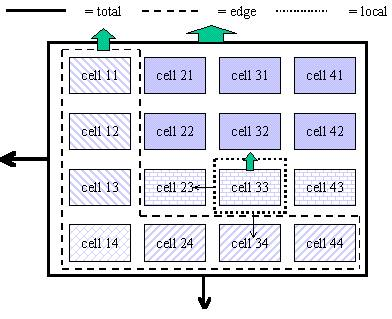 |
| **Figure 3.36.** Filter functions (or safetynet functions) are defined as uptake/(uptake +loss) at three scales: local (as example here for cell 3.3), edge (uptake from zone1+layer4, net losses from the edge equal net losses from system as a whole) or system as a whole. |

#### Number of days plants has growth limitation

We defined this as fraction of days (out of the length of simulation
days) tree or crop is limited by water, nitrogen or phosphorous.

[^1]: *^(The assumptions are 5% N in dry matter up to a closed crop canopy (s reached at an aboveground biomass of about 2 Mg ha-1) and 1%N in new dry matter after that point with target N:P ratio = 10)*

[^2]: *^(An assumption that growth will not be reduced until N content falls below 80% of demand)*
